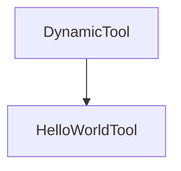

# Chapter 4: TypeScript Server Framework and UI Widgets

Welcome to **Chapter 4: TypeScript Server Framework and UI Widgets**. In this part of **MCP Use Tutorial: Full-Stack MCP Development Across Agents, Clients, Servers, and Inspector**, you will build an intuitive mental model first, then move into concrete implementation details and practical production tradeoffs.


TypeScript server workflows in mcp-use emphasize developer speed, UI integration, and inspector-first iteration.

## Learning Goals

- scaffold server projects with `create-mcp-use-app`
- implement tools/resources with typed schemas
- expose UI widgets for richer chat/app experiences
- use dev-mode inspector and hot reload effectively

## Build Loop

1. scaffold project
2. define first tools and resources
3. add UI widgets for high-value interactions
4. run inspector-driven test loop before deploy

## Source References

- [TypeScript Quickstart](https://github.com/mcp-use/mcp-use/blob/main/docs/typescript/getting-started/quickstart.mdx)
- [TypeScript Server Configuration](https://github.com/mcp-use/mcp-use/blob/main/docs/typescript/server/configuration.mdx)
- [TypeScript Library README](https://github.com/mcp-use/mcp-use/blob/main/libraries/typescript/README.md)
- [create-mcp-use-app README](https://github.com/mcp-use/mcp-use/blob/main/libraries/typescript/packages/create-mcp-use-app/README.md)

## Summary

You now have a complete TypeScript server workflow, from scaffold to interactive UI surfaces.

Next: [Chapter 5: Python Server Framework and Debug Endpoints](05-python-server-framework-and-debug-endpoints.md)

## Depth Expansion Playbook

## Source Code Walkthrough

### `libraries/python/examples/simple_server_manager_use.py`

The `DynamicTool` class in [`libraries/python/examples/simple_server_manager_use.py`](https://github.com/mcp-use/mcp-use/blob/HEAD/libraries/python/examples/simple_server_manager_use.py) handles a key part of this chapter's functionality:

```py


class DynamicTool(BaseTool):
    """A tool that is created dynamically."""

    name: str
    description: str
    args_schema: type[BaseModel] | None = None

    def _run(self) -> str:
        return f"Hello from {self.name}!"

    async def _arun(self) -> str:
        return f"Hello from {self.name}!"


class HelloWorldTool(BaseTool):
    """A simple tool that returns a greeting and adds a new tool."""

    name: str = "hello_world"
    description: str = "Returns the string 'Hello, World!' and adds a new dynamic tool."
    args_schema: type[BaseModel] | None = None
    server_manager: "SimpleServerManager"

    def _run(self) -> str:
        new_tool = DynamicTool(
            name=f"dynamic_tool_{len(self.server_manager.tools)}", description="A dynamically created tool."
        )
        self.server_manager.add_tool(new_tool)
        return "Hello, World! I've added a new tool. You can use it now."

    async def _arun(self) -> str:
```

This class is important because it defines how MCP Use Tutorial: Full-Stack MCP Development Across Agents, Clients, Servers, and Inspector implements the patterns covered in this chapter.

### `libraries/python/examples/simple_server_manager_use.py`

The `HelloWorldTool` class in [`libraries/python/examples/simple_server_manager_use.py`](https://github.com/mcp-use/mcp-use/blob/HEAD/libraries/python/examples/simple_server_manager_use.py) handles a key part of this chapter's functionality:

```py


class HelloWorldTool(BaseTool):
    """A simple tool that returns a greeting and adds a new tool."""

    name: str = "hello_world"
    description: str = "Returns the string 'Hello, World!' and adds a new dynamic tool."
    args_schema: type[BaseModel] | None = None
    server_manager: "SimpleServerManager"

    def _run(self) -> str:
        new_tool = DynamicTool(
            name=f"dynamic_tool_{len(self.server_manager.tools)}", description="A dynamically created tool."
        )
        self.server_manager.add_tool(new_tool)
        return "Hello, World! I've added a new tool. You can use it now."

    async def _arun(self) -> str:
        new_tool = DynamicTool(
            name=f"dynamic_tool_{len(self.server_manager.tools)}", description="A dynamically created tool."
        )
        self.server_manager.add_tool(new_tool)
        return "Hello, World! I've added a new tool. You can use it now."


class SimpleServerManager(BaseServerManager):
    """A simple server manager that provides a HelloWorldTool."""

    def __init__(self):
        self._tools: list[BaseTool] = []
        self._initialized = False
        # Pass a reference to the server manager to the tool
```

This class is important because it defines how MCP Use Tutorial: Full-Stack MCP Development Across Agents, Clients, Servers, and Inspector implements the patterns covered in this chapter.


## How These Components Connect


