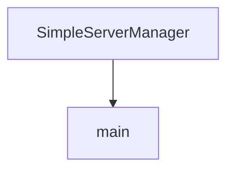

# Chapter 5: Python Server Framework and Debug Endpoints

Welcome to **Chapter 5: Python Server Framework and Debug Endpoints**. In this part of **MCP Use Tutorial: Full-Stack MCP Development Across Agents, Clients, Servers, and Inspector**, you will build an intuitive mental model first, then move into concrete implementation details and practical production tradeoffs.


mcp-use Python server flows prioritize compatibility with official SDK behavior while adding stronger developer diagnostics.

## Learning Goals

- create MCP servers with tool decorators and transport selection
- use debug endpoints (`/inspector`, `/docs`, `/openmcp.json`) during development
- separate stdio vs streamable-http modes by deployment needs
- keep migration paths clear for existing official SDK users

## Python Server Pattern

- use stdio for local host-client integrations
- use streamable-http for remote or shared environments
- enable debug mode in development only
- validate tool behavior via inspector before production rollout

## Source References

- [Python Server Intro](https://github.com/mcp-use/mcp-use/blob/main/docs/python/server/index.mdx)
- [Python Quickstart](https://github.com/mcp-use/mcp-use/blob/main/docs/python/getting-started/quickstart.mdx)
- [Python README](https://github.com/mcp-use/mcp-use/blob/main/libraries/python/README.md)

## Summary

You now have a practical Python server development and debugging baseline.

Next: [Chapter 6: Inspector Debugging and Chat App Workflows](06-inspector-debugging-and-chat-app-workflows.md)

## Depth Expansion Playbook

## Source Code Walkthrough

### `libraries/python/examples/simple_server_manager_use.py`

The `SimpleServerManager` class in [`libraries/python/examples/simple_server_manager_use.py`](https://github.com/mcp-use/mcp-use/blob/HEAD/libraries/python/examples/simple_server_manager_use.py) handles a key part of this chapter's functionality:

```py
    description: str = "Returns the string 'Hello, World!' and adds a new dynamic tool."
    args_schema: type[BaseModel] | None = None
    server_manager: "SimpleServerManager"

    def _run(self) -> str:
        new_tool = DynamicTool(
            name=f"dynamic_tool_{len(self.server_manager.tools)}", description="A dynamically created tool."
        )
        self.server_manager.add_tool(new_tool)
        return "Hello, World! I've added a new tool. You can use it now."

    async def _arun(self) -> str:
        new_tool = DynamicTool(
            name=f"dynamic_tool_{len(self.server_manager.tools)}", description="A dynamically created tool."
        )
        self.server_manager.add_tool(new_tool)
        return "Hello, World! I've added a new tool. You can use it now."


class SimpleServerManager(BaseServerManager):
    """A simple server manager that provides a HelloWorldTool."""

    def __init__(self):
        self._tools: list[BaseTool] = []
        self._initialized = False
        # Pass a reference to the server manager to the tool
        self._tools.append(HelloWorldTool(server_manager=self))

    def add_tool(self, tool: BaseTool):
        self._tools.append(tool)

    async def initialize(self) -> None:
```

This class is important because it defines how MCP Use Tutorial: Full-Stack MCP Development Across Agents, Clients, Servers, and Inspector implements the patterns covered in this chapter.

### `libraries/python/examples/simple_server_manager_use.py`

The `main` function in [`libraries/python/examples/simple_server_manager_use.py`](https://github.com/mcp-use/mcp-use/blob/HEAD/libraries/python/examples/simple_server_manager_use.py) handles a key part of this chapter's functionality:

```py


async def main():
    # Initialize the LLM
    llm = ChatOpenAI(model="gpt-5")

    # Instantiate the custom server manager
    simple_server_manager = SimpleServerManager()

    # Create an MCPAgent with the custom server manager
    agent = MCPAgent(
        llm=llm,
        use_server_manager=True,
        server_manager=simple_server_manager,
        pretty_print=True,
    )

    # Manually initialize the agent
    await agent.initialize()

    # Run the agent with a query that uses the custom tool
    print("--- First run: calling hello_world ---")
    result = await agent.run("Use the hello_world tool", manage_connector=False)
    print(result)

    # Clear the conversation history to avoid confusion
    agent.clear_conversation_history()

    # Run the agent again to show that the new tool is available
    print("\n--- Second run: calling the new dynamic tool ---")
    result = await agent.run("Use the dynamic_tool_1", manage_connector=False)
    print(result)
```

This function is important because it defines how MCP Use Tutorial: Full-Stack MCP Development Across Agents, Clients, Servers, and Inspector implements the patterns covered in this chapter.


## How These Components Connect


