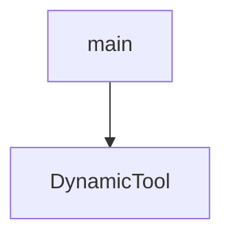

# Chapter 5: Python Server Framework and Debug Endpoints

Welcome to **Chapter 5: Python Server Framework and Debug Endpoints**. In this part of **MCP Use Tutorial: Full-Stack MCP Development Across Agents, Clients, Servers, and Inspector**, you will build an intuitive mental model first, then move into concrete implementation details and practical production tradeoffs.


mcp-use Python server flows prioritize compatibility with official SDK behavior while adding stronger developer diagnostics.

## Learning Goals

- create MCP servers with tool decorators and transport selection
- use debug endpoints (`/inspector`, `/docs`, `/openmcp.json`) during development
- separate stdio vs streamable-http modes by deployment needs
- keep migration paths clear for existing official SDK users

## Python Server Pattern

- use stdio for local host-client integrations
- use streamable-http for remote or shared environments
- enable debug mode in development only
- validate tool behavior via inspector before production rollout

## Source References

- [Python Server Intro](https://github.com/mcp-use/mcp-use/blob/main/docs/python/server/index.mdx)
- [Python Quickstart](https://github.com/mcp-use/mcp-use/blob/main/docs/python/getting-started/quickstart.mdx)
- [Python README](https://github.com/mcp-use/mcp-use/blob/main/libraries/python/README.md)

## Summary

You now have a practical Python server development and debugging baseline.

Next: [Chapter 6: Inspector Debugging and Chat App Workflows](06-inspector-debugging-and-chat-app-workflows.md)

## Source Code Walkthrough

### `libraries/python/examples/openai_integration_example.py`

The `main` function in [`libraries/python/examples/openai_integration_example.py`](https://github.com/mcp-use/mcp-use/blob/HEAD/libraries/python/examples/openai_integration_example.py) handles a key part of this chapter's functionality:

```py


async def main():
    config = {
        "mcpServers": {
            "airbnb": {"command": "npx", "args": ["-y", "@openbnb/mcp-server-airbnb", "--ignore-robots-txt"]},
        }
    }

    try:
        client = MCPClient(config=config)

        # Creates the adapter for OpenAI's format
        adapter = OpenAIMCPAdapter()

        # Convert tools from active connectors to the OpenAI's format
        # this will populates the list of tools, resources and prompts
        await adapter.create_all(client)

        # If you don't want to create all tools, you can call single functions
        # await adapter.create_tools(client)
        # await adapter.create_resources(client)
        # await adapter.create_prompts(client)

        # If you decided to create all tools (list concatenation)
        openai_tools = adapter.tools + adapter.resources + adapter.prompts

        # Use tools with OpenAI's SDK (not agent in this case)
        openai = OpenAI()
        messages = [{"role": "user", "content": "Please tell me the cheapest hotel for two people in Trapani."}]
        response = openai.chat.completions.create(model="gpt-4o", messages=messages, tools=openai_tools)

```

This function is important because it defines how MCP Use Tutorial: Full-Stack MCP Development Across Agents, Clients, Servers, and Inspector implements the patterns covered in this chapter.

### `libraries/python/examples/simple_server_manager_use.py`

The `DynamicTool` class in [`libraries/python/examples/simple_server_manager_use.py`](https://github.com/mcp-use/mcp-use/blob/HEAD/libraries/python/examples/simple_server_manager_use.py) handles a key part of this chapter's functionality:

```py


class DynamicTool(BaseTool):
    """A tool that is created dynamically."""

    name: str
    description: str
    args_schema: type[BaseModel] | None = None

    def _run(self) -> str:
        return f"Hello from {self.name}!"

    async def _arun(self) -> str:
        return f"Hello from {self.name}!"


class HelloWorldTool(BaseTool):
    """A simple tool that returns a greeting and adds a new tool."""

    name: str = "hello_world"
    description: str = "Returns the string 'Hello, World!' and adds a new dynamic tool."
    args_schema: type[BaseModel] | None = None
    server_manager: "SimpleServerManager"

    def _run(self) -> str:
        new_tool = DynamicTool(
            name=f"dynamic_tool_{len(self.server_manager.tools)}", description="A dynamically created tool."
        )
        self.server_manager.add_tool(new_tool)
        return "Hello, World! I've added a new tool. You can use it now."

    async def _arun(self) -> str:
```

This class is important because it defines how MCP Use Tutorial: Full-Stack MCP Development Across Agents, Clients, Servers, and Inspector implements the patterns covered in this chapter.


## How These Components Connect


