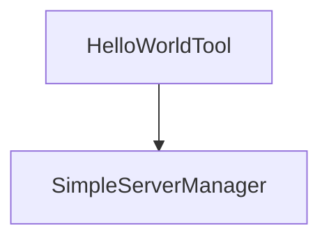

# Chapter 6: Inspector Debugging and Chat App Workflows

Welcome to **Chapter 6: Inspector Debugging and Chat App Workflows**. In this part of **MCP Use Tutorial: Full-Stack MCP Development Across Agents, Clients, Servers, and Inspector**, you will build an intuitive mental model first, then move into concrete implementation details and practical production tradeoffs.


Inspector is a central QA surface for validating tool contracts, prompts, and conversational behavior.

## Learning Goals

- connect and manage multiple servers in inspector sessions
- validate tools/resources/prompts before embedding in products
- test chat and prompt flows with BYOK model configuration
- use local persistence and command-palette workflows for faster iteration

## Inspector Usage Pattern

1. connect target server(s)
2. validate schema and execution for top tools
3. run prompt/chat flow checks
4. export client config and handoff to product integrations

## Source References

- [Inspector Docs](https://github.com/mcp-use/mcp-use/blob/main/docs/inspector/index.mdx)
- [Inspector Package README](https://github.com/mcp-use/mcp-use/blob/main/libraries/typescript/packages/inspector/README.md)

## Summary

You now have a repeatable inspector workflow for debugging and quality validation.

Next: [Chapter 7: Security, Runtime Controls, and Production Hardening](07-security-runtime-controls-and-production-hardening.md)

## Source Code Walkthrough

### `libraries/python/examples/simple_server_manager_use.py`

The `HelloWorldTool` class in [`libraries/python/examples/simple_server_manager_use.py`](https://github.com/mcp-use/mcp-use/blob/HEAD/libraries/python/examples/simple_server_manager_use.py) handles a key part of this chapter's functionality:

```py


class HelloWorldTool(BaseTool):
    """A simple tool that returns a greeting and adds a new tool."""

    name: str = "hello_world"
    description: str = "Returns the string 'Hello, World!' and adds a new dynamic tool."
    args_schema: type[BaseModel] | None = None
    server_manager: "SimpleServerManager"

    def _run(self) -> str:
        new_tool = DynamicTool(
            name=f"dynamic_tool_{len(self.server_manager.tools)}", description="A dynamically created tool."
        )
        self.server_manager.add_tool(new_tool)
        return "Hello, World! I've added a new tool. You can use it now."

    async def _arun(self) -> str:
        new_tool = DynamicTool(
            name=f"dynamic_tool_{len(self.server_manager.tools)}", description="A dynamically created tool."
        )
        self.server_manager.add_tool(new_tool)
        return "Hello, World! I've added a new tool. You can use it now."


class SimpleServerManager(BaseServerManager):
    """A simple server manager that provides a HelloWorldTool."""

    def __init__(self):
        self._tools: list[BaseTool] = []
        self._initialized = False
        # Pass a reference to the server manager to the tool
```

This class is important because it defines how MCP Use Tutorial: Full-Stack MCP Development Across Agents, Clients, Servers, and Inspector implements the patterns covered in this chapter.

### `libraries/python/examples/simple_server_manager_use.py`

The `SimpleServerManager` class in [`libraries/python/examples/simple_server_manager_use.py`](https://github.com/mcp-use/mcp-use/blob/HEAD/libraries/python/examples/simple_server_manager_use.py) handles a key part of this chapter's functionality:

```py
    description: str = "Returns the string 'Hello, World!' and adds a new dynamic tool."
    args_schema: type[BaseModel] | None = None
    server_manager: "SimpleServerManager"

    def _run(self) -> str:
        new_tool = DynamicTool(
            name=f"dynamic_tool_{len(self.server_manager.tools)}", description="A dynamically created tool."
        )
        self.server_manager.add_tool(new_tool)
        return "Hello, World! I've added a new tool. You can use it now."

    async def _arun(self) -> str:
        new_tool = DynamicTool(
            name=f"dynamic_tool_{len(self.server_manager.tools)}", description="A dynamically created tool."
        )
        self.server_manager.add_tool(new_tool)
        return "Hello, World! I've added a new tool. You can use it now."


class SimpleServerManager(BaseServerManager):
    """A simple server manager that provides a HelloWorldTool."""

    def __init__(self):
        self._tools: list[BaseTool] = []
        self._initialized = False
        # Pass a reference to the server manager to the tool
        self._tools.append(HelloWorldTool(server_manager=self))

    def add_tool(self, tool: BaseTool):
        self._tools.append(tool)

    async def initialize(self) -> None:
```

This class is important because it defines how MCP Use Tutorial: Full-Stack MCP Development Across Agents, Clients, Servers, and Inspector implements the patterns covered in this chapter.


## How These Components Connect


