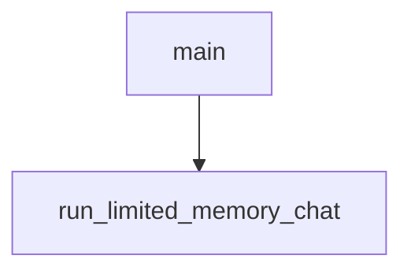

# Chapter 6: Inspector Debugging and Chat App Workflows

Welcome to **Chapter 6: Inspector Debugging and Chat App Workflows**. In this part of **MCP Use Tutorial: Full-Stack MCP Development Across Agents, Clients, Servers, and Inspector**, you will build an intuitive mental model first, then move into concrete implementation details and practical production tradeoffs.


Inspector is a central QA surface for validating tool contracts, prompts, and conversational behavior.

## Learning Goals

- connect and manage multiple servers in inspector sessions
- validate tools/resources/prompts before embedding in products
- test chat and prompt flows with BYOK model configuration
- use local persistence and command-palette workflows for faster iteration

## Inspector Usage Pattern

1. connect target server(s)
2. validate schema and execution for top tools
3. run prompt/chat flow checks
4. export client config and handoff to product integrations

## Source References

- [Inspector Docs](https://github.com/mcp-use/mcp-use/blob/main/docs/inspector/index.mdx)
- [Inspector Package README](https://github.com/mcp-use/mcp-use/blob/main/libraries/typescript/packages/inspector/README.md)

## Summary

You now have a repeatable inspector workflow for debugging and quality validation.

Next: [Chapter 7: Security, Runtime Controls, and Production Hardening](07-security-runtime-controls-and-production-hardening.md)

## Depth Expansion Playbook

## Source Code Walkthrough

### `libraries/python/examples/anthropic_integration_example.py`

The `main` function in [`libraries/python/examples/anthropic_integration_example.py`](https://github.com/mcp-use/mcp-use/blob/HEAD/libraries/python/examples/anthropic_integration_example.py) handles a key part of this chapter's functionality:

```py


async def main():
    config = {
        "mcpServers": {
            "airbnb": {"command": "npx", "args": ["-y", "@openbnb/mcp-server-airbnb", "--ignore-robots-txt"]},
        }
    }

    try:
        client = MCPClient(config=config)

        # Creates the adapter for Anthropic's format
        adapter = AnthropicMCPAdapter()

        # Convert tools from active connectors to the Anthropic's format
        await adapter.create_all(client)

        # List concatenation (if you loaded all tools)
        anthropic_tools = adapter.tools + adapter.resources + adapter.prompts

        # If you don't want to create all tools, you can call single functions
        # await adapter.create_tools(client)
        # await adapter.create_resources(client)
        # await adapter.create_prompts(client)

        # Use tools with Anthropic's SDK (not agent in this case)
        anthropic = Anthropic()

        # Initial request
        messages = [{"role": "user", "content": "Please tell me the cheapest hotel for two people in Trapani."}]
        response = anthropic.messages.create(
```

This function is important because it defines how MCP Use Tutorial: Full-Stack MCP Development Across Agents, Clients, Servers, and Inspector implements the patterns covered in this chapter.

### `libraries/python/examples/limited_memory_chat.py`

The `run_limited_memory_chat` function in [`libraries/python/examples/limited_memory_chat.py`](https://github.com/mcp-use/mcp-use/blob/HEAD/libraries/python/examples/limited_memory_chat.py) handles a key part of this chapter's functionality:

```py


async def run_limited_memory_chat():
    """Run a chat using MCPAgent with limited conversation memory."""
    # Load environment variables for API keys
    load_dotenv()

    config = {
        "mcpServers": {"playwright": {"command": "npx", "args": ["@playwright/mcp@latest"], "env": {"DISPLAY": ":1"}}}
    }
    # Create MCPClient from config file
    client = MCPClient(config=config)
    llm = ChatOpenAI(model="gpt-5")
    # Create agent with memory_enabled=False but pass external history
    agent = MCPAgent(
        llm=llm,
        client=client,
        max_steps=15,
        memory_enabled=True,  # Disable built-in memory, use external history
        pretty_print=True,
    )

    # Configuration: Limited history mode
    MAX_HISTORY_MESSAGES = 5

    print("\n===== Interactive MCP Chat (Limited Memory) =====")
    print("Type 'exit' or 'quit' to end the conversation")
    print("Type 'clear' to clear conversation history")
    print("==================================\n")

    try:
        # Main chat loop with limited history
```

This function is important because it defines how MCP Use Tutorial: Full-Stack MCP Development Across Agents, Clients, Servers, and Inspector implements the patterns covered in this chapter.


## How These Components Connect


