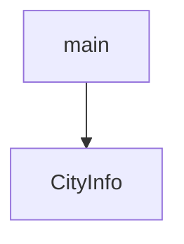

# Chapter 7: Security, Runtime Controls, and Production Hardening

Welcome to **Chapter 7: Security, Runtime Controls, and Production Hardening**. In this part of **MCP Use Tutorial: Full-Stack MCP Development Across Agents, Clients, Servers, and Inspector**, you will build an intuitive mental model first, then move into concrete implementation details and practical production tradeoffs.


MCP systems are high-power by nature, so production readiness depends on hard runtime boundaries.

## Learning Goals

- apply API key and secret management best practices
- constrain agent tool and network reach by design
- configure allowed origins and environment-aware security defaults
- define production deployment controls for server runtimes

## Hardening Checklist

| Area | Control |
|:-----|:--------|
| Secrets | environment variables or managed secret stores |
| Tool scope | disallow dangerous tools by default |
| Origin/network | explicit allowlists in production |
| Runtime | non-root containers, rate limits, auth middleware |

## Source References

- [TypeScript Security Best Practices](https://github.com/mcp-use/mcp-use/blob/main/docs/typescript/development/security.mdx)
- [TypeScript Server Configuration](https://github.com/mcp-use/mcp-use/blob/main/docs/typescript/server/configuration.mdx)
- [Python Development Security](https://github.com/mcp-use/mcp-use/blob/main/docs/python/development/security.mdx)

## Summary

You now have a pragmatic hardening baseline for mcp-use deployments.

Next: [Chapter 8: Operations, Observability, and Contribution Model](08-operations-observability-and-contribution-model.md)

## Source Code Walkthrough

### `libraries/python/examples/simple_server_manager_use.py`

The `main` function in [`libraries/python/examples/simple_server_manager_use.py`](https://github.com/mcp-use/mcp-use/blob/HEAD/libraries/python/examples/simple_server_manager_use.py) handles a key part of this chapter's functionality:

```py


async def main():
    # Initialize the LLM
    llm = ChatOpenAI(model="gpt-5")

    # Instantiate the custom server manager
    simple_server_manager = SimpleServerManager()

    # Create an MCPAgent with the custom server manager
    agent = MCPAgent(
        llm=llm,
        use_server_manager=True,
        server_manager=simple_server_manager,
        pretty_print=True,
    )

    # Manually initialize the agent
    await agent.initialize()

    # Run the agent with a query that uses the custom tool
    print("--- First run: calling hello_world ---")
    result = await agent.run("Use the hello_world tool", manage_connector=False)
    print(result)

    # Clear the conversation history to avoid confusion
    agent.clear_conversation_history()

    # Run the agent again to show that the new tool is available
    print("\n--- Second run: calling the new dynamic tool ---")
    result = await agent.run("Use the dynamic_tool_1", manage_connector=False)
    print(result)
```

This function is important because it defines how MCP Use Tutorial: Full-Stack MCP Development Across Agents, Clients, Servers, and Inspector implements the patterns covered in this chapter.

### `libraries/python/examples/structured_output.py`

The `CityInfo` class in [`libraries/python/examples/structured_output.py`](https://github.com/mcp-use/mcp-use/blob/HEAD/libraries/python/examples/structured_output.py) handles a key part of this chapter's functionality:

```py


class CityInfo(BaseModel):
    """Comprehensive information about a city"""

    name: str = Field(description="Official name of the city")
    country: str = Field(description="Country where the city is located")
    region: str = Field(description="Region or state within the country")
    population: int = Field(description="Current population count")
    area_km2: float = Field(description="Area in square kilometers")
    foundation_date: str = Field(description="When the city was founded (approximate year or period)")
    mayor: str = Field(description="Current mayor or city leader")
    famous_landmarks: list[str] = Field(description="List of famous landmarks, monuments, or attractions")
    universities: list[str] = Field(description="List of major universities or educational institutions")
    economy_sectors: list[str] = Field(description="Main economic sectors or industries")
    sister_cities: list[str] = Field(description="Twin cities or sister cities partnerships")
    historical_significance: str = Field(description="Brief description of historical importance")
    climate_type: str | None = Field(description="Type of climate (e.g., Mediterranean, Continental)", default=None)
    elevation_meters: int | None = Field(description="Elevation above sea level in meters", default=None)


async def main():
    """Research Padova using intelligent structured output."""
    load_dotenv()

    config = {
        "mcpServers": {"playwright": {"command": "npx", "args": ["@playwright/mcp@latest"], "env": {"DISPLAY": ":1"}}}
    }

    client = MCPClient(config=config)
    llm = ChatOpenAI(model="gpt-5")
    agent = MCPAgent(llm=llm, client=client, max_steps=50, pretty_print=True)
```

This class is important because it defines how MCP Use Tutorial: Full-Stack MCP Development Across Agents, Clients, Servers, and Inspector implements the patterns covered in this chapter.


## How These Components Connect


