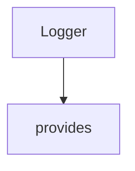

# Chapter 7: Security, Runtime Controls, and Production Hardening

Welcome to **Chapter 7: Security, Runtime Controls, and Production Hardening**. In this part of **MCP Use Tutorial: Full-Stack MCP Development Across Agents, Clients, Servers, and Inspector**, you will build an intuitive mental model first, then move into concrete implementation details and practical production tradeoffs.


MCP systems are high-power by nature, so production readiness depends on hard runtime boundaries.

## Learning Goals

- apply API key and secret management best practices
- constrain agent tool and network reach by design
- configure allowed origins and environment-aware security defaults
- define production deployment controls for server runtimes

## Hardening Checklist

| Area | Control |
|:-----|:--------|
| Secrets | environment variables or managed secret stores |
| Tool scope | disallow dangerous tools by default |
| Origin/network | explicit allowlists in production |
| Runtime | non-root containers, rate limits, auth middleware |

## Source References

- [TypeScript Security Best Practices](https://github.com/mcp-use/mcp-use/blob/main/docs/typescript/development/security.mdx)
- [TypeScript Server Configuration](https://github.com/mcp-use/mcp-use/blob/main/docs/typescript/server/configuration.mdx)
- [Python Development Security](https://github.com/mcp-use/mcp-use/blob/main/docs/python/development/security.mdx)

## Summary

You now have a pragmatic hardening baseline for mcp-use deployments.

Next: [Chapter 8: Operations, Observability, and Contribution Model](08-operations-observability-and-contribution-model.md)

## Depth Expansion Playbook

## Source Code Walkthrough

### `libraries/python/mcp_use/logging.py`

The `Logger` class in [`libraries/python/mcp_use/logging.py`](https://github.com/mcp-use/mcp-use/blob/HEAD/libraries/python/mcp_use/logging.py) handles a key part of this chapter's functionality:

```py
"""
Logger module for mcp_use.

This module provides a centralized logging configuration for the mcp_use library,
with customizable log levels and formatters.
"""

import logging
import os
import sys

from langchain_core.globals import set_debug as langchain_set_debug

# Global debug flag - can be set programmatically or from environment
MCP_USE_DEBUG = 1


class Logger:
    """Centralized logger for mcp_use.

    This class provides logging functionality with configurable levels,
    formatters, and handlers.
    """

    # Default log format
    DEFAULT_FORMAT = "%(asctime)s - %(name)s - %(levelname)s - %(message)s"

    # Module-specific loggers
    _loggers = {}

    @classmethod
```

This class is important because it defines how MCP Use Tutorial: Full-Stack MCP Development Across Agents, Clients, Servers, and Inspector implements the patterns covered in this chapter.

### `libraries/python/mcp_use/logging.py`

The `provides` class in [`libraries/python/mcp_use/logging.py`](https://github.com/mcp-use/mcp-use/blob/HEAD/libraries/python/mcp_use/logging.py) handles a key part of this chapter's functionality:

```py
Logger module for mcp_use.

This module provides a centralized logging configuration for the mcp_use library,
with customizable log levels and formatters.
"""

import logging
import os
import sys

from langchain_core.globals import set_debug as langchain_set_debug

# Global debug flag - can be set programmatically or from environment
MCP_USE_DEBUG = 1


class Logger:
    """Centralized logger for mcp_use.

    This class provides logging functionality with configurable levels,
    formatters, and handlers.
    """

    # Default log format
    DEFAULT_FORMAT = "%(asctime)s - %(name)s - %(levelname)s - %(message)s"

    # Module-specific loggers
    _loggers = {}

    @classmethod
    def get_logger(cls, name: str = "mcp_use") -> logging.Logger:
        """Get a logger instance for the specified name.
```

This class is important because it defines how MCP Use Tutorial: Full-Stack MCP Development Across Agents, Clients, Servers, and Inspector implements the patterns covered in this chapter.


## How These Components Connect


