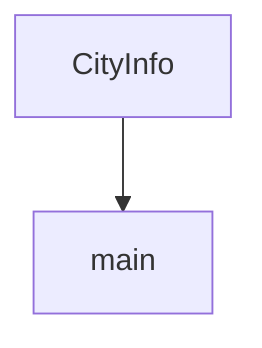

# Chapter 8: Operations, Observability, and Contribution Model

Welcome to **Chapter 8: Operations, Observability, and Contribution Model**. In this part of **MCP Use Tutorial: Full-Stack MCP Development Across Agents, Clients, Servers, and Inspector**, you will build an intuitive mental model first, then move into concrete implementation details and practical production tradeoffs.


Sustained mcp-use adoption requires explicit operational standards, observability paths, and contribution workflows.

## Learning Goals

- structure CI and runtime observability around tool-calling behavior
- separate Python and TypeScript release/testing responsibilities
- align contribution workflow with monorepo boundaries
- keep docs and examples synchronized with runtime behavior changes

## Operating Model

- keep package-level ownership clear (Python vs TypeScript)
- run focused integration tests per transport and primitive area
- centralize configuration examples to avoid copy drift
- enforce issue-first + small-PR contribution discipline

## Source References

- [Contributing Guide](https://github.com/mcp-use/mcp-use/blob/main/CONTRIBUTING.md)
- [Main README](https://github.com/mcp-use/mcp-use/blob/main/README.md)
- [TypeScript README](https://github.com/mcp-use/mcp-use/blob/main/libraries/typescript/README.md)
- [Python README](https://github.com/mcp-use/mcp-use/blob/main/libraries/python/README.md)

## Summary

You now have an end-to-end operational model for running and evolving mcp-use based systems.

Next: Continue with [MCP TypeScript SDK Tutorial](../mcp-typescript-sdk-tutorial/)

## Depth Expansion Playbook

## Source Code Walkthrough

### `libraries/python/examples/structured_output.py`

The `CityInfo` class in [`libraries/python/examples/structured_output.py`](https://github.com/mcp-use/mcp-use/blob/HEAD/libraries/python/examples/structured_output.py) handles a key part of this chapter's functionality:

```py


class CityInfo(BaseModel):
    """Comprehensive information about a city"""

    name: str = Field(description="Official name of the city")
    country: str = Field(description="Country where the city is located")
    region: str = Field(description="Region or state within the country")
    population: int = Field(description="Current population count")
    area_km2: float = Field(description="Area in square kilometers")
    foundation_date: str = Field(description="When the city was founded (approximate year or period)")
    mayor: str = Field(description="Current mayor or city leader")
    famous_landmarks: list[str] = Field(description="List of famous landmarks, monuments, or attractions")
    universities: list[str] = Field(description="List of major universities or educational institutions")
    economy_sectors: list[str] = Field(description="Main economic sectors or industries")
    sister_cities: list[str] = Field(description="Twin cities or sister cities partnerships")
    historical_significance: str = Field(description="Brief description of historical importance")
    climate_type: str | None = Field(description="Type of climate (e.g., Mediterranean, Continental)", default=None)
    elevation_meters: int | None = Field(description="Elevation above sea level in meters", default=None)


async def main():
    """Research Padova using intelligent structured output."""
    load_dotenv()

    config = {
        "mcpServers": {"playwright": {"command": "npx", "args": ["@playwright/mcp@latest"], "env": {"DISPLAY": ":1"}}}
    }

    client = MCPClient(config=config)
    llm = ChatOpenAI(model="gpt-5")
    agent = MCPAgent(llm=llm, client=client, max_steps=50, pretty_print=True)
```

This class is important because it defines how MCP Use Tutorial: Full-Stack MCP Development Across Agents, Clients, Servers, and Inspector implements the patterns covered in this chapter.

### `libraries/python/examples/structured_output.py`

The `main` function in [`libraries/python/examples/structured_output.py`](https://github.com/mcp-use/mcp-use/blob/HEAD/libraries/python/examples/structured_output.py) handles a key part of this chapter's functionality:

```py


async def main():
    """Research Padova using intelligent structured output."""
    load_dotenv()

    config = {
        "mcpServers": {"playwright": {"command": "npx", "args": ["@playwright/mcp@latest"], "env": {"DISPLAY": ":1"}}}
    }

    client = MCPClient(config=config)
    llm = ChatOpenAI(model="gpt-5")
    agent = MCPAgent(llm=llm, client=client, max_steps=50, pretty_print=True)

    result: CityInfo = await agent.run(
        """
        Research comprehensive information about the city of Padova (also known as Padua) in Italy.

        Visit multiple reliable sources like Wikipedia, official city websites, tourism sites,
        and university websites to gather detailed information including demographics, history,
        governance, education, economy, landmarks, and international relationships.
        """,
        output_schema=CityInfo,
        max_steps=50,
    )

    print(f"Name: {result.name}")
    print(f"Country: {result.country}")
    print(f"Region: {result.region}")
    print(f"Population: {result.population:,}")
    print(f"Area: {result.area_km2} km²")
    print(f"Foundation: {result.foundation_date}")
```

This function is important because it defines how MCP Use Tutorial: Full-Stack MCP Development Across Agents, Clients, Servers, and Inspector implements the patterns covered in this chapter.


## How These Components Connect


