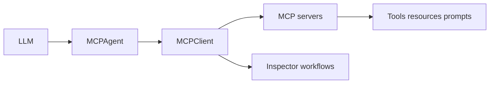

# MCP Use Tutorial: Full-Stack MCP Development Across Agents, Clients, Servers, and Inspector

> Learn how `mcp-use/mcp-use` composes agent, client, server, and inspector workflows across Python and TypeScript with practical security and operations patterns.

## Why This Track Matters

mcp-use is one of the most comprehensive open-source MCP ecosystems, covering agent orchestration, client transport handling, server frameworks, and web-based inspection in one stack.

This track focuses on:

- selecting Python or TypeScript workflows based on team context
- configuring multi-server clients and agent guardrails
- building server-side capabilities with inspector-first feedback loops
- hardening security and production behavior for real deployments

## Current Snapshot (auto-updated)

- repository: [`mcp-use/mcp-use`](https://github.com/mcp-use/mcp-use)
- stars: about **9.1k**
- latest release: [`python-v1.6.0`](https://github.com/mcp-use/mcp-use/releases/tag/python-v1.6.0) (**January 22, 2026**)
- recent activity: updated on **February 12, 2026**
- ecosystem shape: Python + TypeScript implementations, inspector, CLI, and scaffolding tools
- license: MIT

## Mental Model

## Chapter Guide

| Chapter | Key Question | Outcome |
|:--------|:-------------|:--------|
| [01 - Getting Started and Stack Selection](01-getting-started-and-stack-selection.md) | Should I start with Python or TypeScript and how fast can I ship? | Faster onboarding |
| [02 - Client Configuration, Sessions, and Transport Choices](02-client-configuration-sessions-and-transport-choices.md) | How do I configure robust client connectivity across servers? | Reliable client baseline |
| [03 - Agent Configuration, Tool Governance, and Memory](03-agent-configuration-tool-governance-and-memory.md) | How do I keep agent behavior useful and controlled? | Better agent discipline |
| [04 - TypeScript Server Framework and UI Widgets](04-typescript-server-framework-and-ui-widgets.md) | How do I build rich MCP servers with TypeScript + UI resources? | Strong TS server workflow |
| [05 - Python Server Framework and Debug Endpoints](05-python-server-framework-and-debug-endpoints.md) | How do I build and inspect MCP servers in Python? | Strong Python server workflow |
| [06 - Inspector Debugging and Chat App Workflows](06-inspector-debugging-and-chat-app-workflows.md) | How does inspector improve developer and QA loops? | Faster issue isolation |
| [07 - Security, Runtime Controls, and Production Hardening](07-security-runtime-controls-and-production-hardening.md) | How do I reduce risk when agents can access powerful tools? | Safer production posture |
| [08 - Operations, Observability, and Contribution Model](08-operations-observability-and-contribution-model.md) | How do teams sustain and evolve mcp-use usage? | Long-term execution plan |

## What You Will Learn

- how to use mcp-use as a full-stack MCP platform, not just a thin client
- how to configure multi-server, multi-language workflows with clearer boundaries
- how to apply security and access control patterns to high-power tool chains
- how to run contribution and operational loops that keep behavior predictable

## Source References

- [mcp-use Main README](https://github.com/mcp-use/mcp-use/blob/main/README.md)
- [TypeScript README](https://github.com/mcp-use/mcp-use/blob/main/libraries/typescript/README.md)
- [Python README](https://github.com/mcp-use/mcp-use/blob/main/libraries/python/README.md)
- [TypeScript Quickstart](https://github.com/mcp-use/mcp-use/blob/main/docs/typescript/getting-started/quickstart.mdx)
- [Python Quickstart](https://github.com/mcp-use/mcp-use/blob/main/docs/python/getting-started/quickstart.mdx)
- [TypeScript Client Config](https://github.com/mcp-use/mcp-use/blob/main/docs/typescript/client/client-configuration.mdx)
- [TypeScript Server Config](https://github.com/mcp-use/mcp-use/blob/main/docs/typescript/server/configuration.mdx)
- [Python Server Intro](https://github.com/mcp-use/mcp-use/blob/main/docs/python/server/index.mdx)
- [Inspector Docs](https://github.com/mcp-use/mcp-use/blob/main/docs/inspector/index.mdx)

## Related Tutorials

- [MCP TypeScript SDK Tutorial](../mcp-typescript-sdk-tutorial/)
- [MCP Python SDK Tutorial](../mcp-python-sdk-tutorial/)
- [MCP Inspector Tutorial](../mcp-inspector-tutorial/)
- [FastMCP Tutorial](../fastmcp-tutorial/)

---

Start with [Chapter 1: Getting Started and Stack Selection](01-getting-started-and-stack-selection.md).

## Navigation & Backlinks

- [Start Here: Chapter 1: Getting Started and Stack Selection](01-getting-started-and-stack-selection.md)
- [Back to Main Catalog](../../README.md#-tutorial-catalog)
- [Browse A-Z Tutorial Directory](../../discoverability/tutorial-directory.md)
- [Search by Intent](../../discoverability/query-hub.md)
- [Explore Category Hubs](../../README.md#category-hubs)

## Full Chapter Map

1. [Chapter 1: Getting Started and Stack Selection](01-getting-started-and-stack-selection.md)
2. [Chapter 2: Client Configuration, Sessions, and Transport Choices](02-client-configuration-sessions-and-transport-choices.md)
3. [Chapter 3: Agent Configuration, Tool Governance, and Memory](03-agent-configuration-tool-governance-and-memory.md)
4. [Chapter 4: TypeScript Server Framework and UI Widgets](04-typescript-server-framework-and-ui-widgets.md)
5. [Chapter 5: Python Server Framework and Debug Endpoints](05-python-server-framework-and-debug-endpoints.md)
6. [Chapter 6: Inspector Debugging and Chat App Workflows](06-inspector-debugging-and-chat-app-workflows.md)
7. [Chapter 7: Security, Runtime Controls, and Production Hardening](07-security-runtime-controls-and-production-hardening.md)
8. [Chapter 8: Operations, Observability, and Contribution Model](08-operations-observability-and-contribution-model.md)

*Generated by [AI Codebase Knowledge Builder](https://github.com/The-Pocket/Tutorial-Codebase-Knowledge)*
