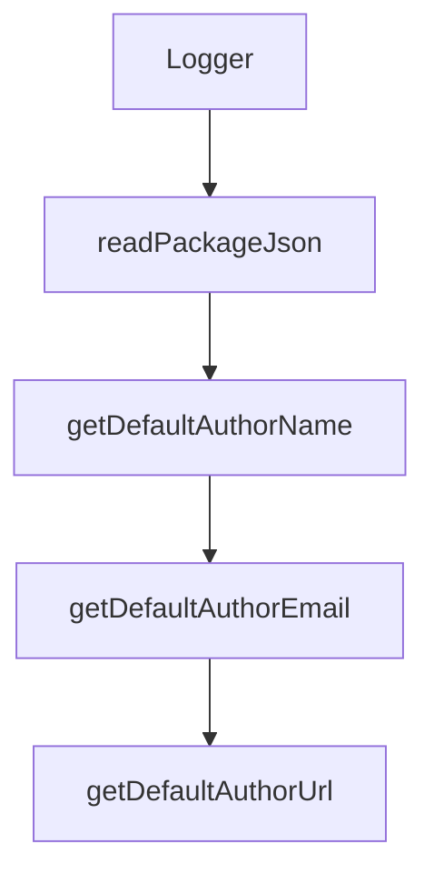

# Chapter 1: Getting Started and Bundle Fundamentals

Welcome to **Chapter 1: Getting Started and Bundle Fundamentals**. In this part of **MCPB Tutorial: Packaging and Distributing Local MCP Servers as Bundles**, you will build an intuitive mental model first, then move into concrete implementation details and practical production tradeoffs.


This chapter introduces MCPB purpose, terminology, and first-run setup.

## Learning Goals

- understand the MCPB package format and distribution model
- account for DXT-to-MCPB naming migration in tooling/docs
- install CLI and run first bundle scaffolding workflow
- align local server packaging expectations before implementation

## Baseline Setup

```bash
npm install -g @anthropic-ai/mcpb
```

Then initialize a bundle directory with `mcpb init`, define `manifest.json`, and produce a first archive via `mcpb pack`.

## Source References

- [MCPB README](https://github.com/modelcontextprotocol/mcpb/blob/main/README.md)
- [MCPB CLI - Installation](https://github.com/modelcontextprotocol/mcpb/blob/main/CLI.md#installation)

## Summary

You now have a baseline model for creating MCP bundles from local server projects.

Next: [Chapter 2: Manifest Model, Metadata, and Compatibility](02-manifest-model-metadata-and-compatibility.md)

## Source Code Walkthrough

### `src/types.ts`

The `Logger` interface in [`src/types.ts`](https://github.com/modelcontextprotocol/mcpb/blob/HEAD/src/types.ts) handles a key part of this chapter's functionality:

```ts
export type McpbManifestAny = z.infer<typeof McpbManifestSchemaAny>;

export interface Logger {
  log: (...args: unknown[]) => void;
  error: (...args: unknown[]) => void;
  warn: (...args: unknown[]) => void;
}

```

This interface is important because it defines how MCPB Tutorial: Packaging and Distributing Local MCP Servers as Bundles implements the patterns covered in this chapter.

### `src/cli/init.ts`

The `readPackageJson` function in [`src/cli/init.ts`](https://github.com/modelcontextprotocol/mcpb/blob/HEAD/src/cli/init.ts) handles a key part of this chapter's functionality:

```ts
}

export function readPackageJson(dirPath: string): PackageJson {
  const packageJsonPath = join(dirPath, "package.json");
  if (existsSync(packageJsonPath)) {
    try {
      return JSON.parse(readFileSync(packageJsonPath, "utf-8"));
    } catch (e) {
      // Ignore package.json parsing errors
    }
  }
  return {};
}

export function getDefaultAuthorName(packageData: PackageJson): string {
  if (typeof packageData.author === "string") {
    return packageData.author;
  }
  return packageData.author?.name || "";
}

export function getDefaultAuthorEmail(packageData: PackageJson): string {
  if (typeof packageData.author === "object") {
    return packageData.author?.email || "";
  }
  return "";
}

export function getDefaultAuthorUrl(packageData: PackageJson): string {
  if (typeof packageData.author === "object") {
    return packageData.author?.url || "";
  }
```

This function is important because it defines how MCPB Tutorial: Packaging and Distributing Local MCP Servers as Bundles implements the patterns covered in this chapter.

### `src/cli/init.ts`

The `getDefaultAuthorName` function in [`src/cli/init.ts`](https://github.com/modelcontextprotocol/mcpb/blob/HEAD/src/cli/init.ts) handles a key part of this chapter's functionality:

```ts
}

export function getDefaultAuthorName(packageData: PackageJson): string {
  if (typeof packageData.author === "string") {
    return packageData.author;
  }
  return packageData.author?.name || "";
}

export function getDefaultAuthorEmail(packageData: PackageJson): string {
  if (typeof packageData.author === "object") {
    return packageData.author?.email || "";
  }
  return "";
}

export function getDefaultAuthorUrl(packageData: PackageJson): string {
  if (typeof packageData.author === "object") {
    return packageData.author?.url || "";
  }
  return "";
}

export function getDefaultRepositoryUrl(packageData: PackageJson): string {
  if (typeof packageData.repository === "string") {
    return packageData.repository;
  }
  return packageData.repository?.url || "";
}

export function getDefaultBasicInfo(
  packageData: PackageJson,
```

This function is important because it defines how MCPB Tutorial: Packaging and Distributing Local MCP Servers as Bundles implements the patterns covered in this chapter.

### `src/cli/init.ts`

The `getDefaultAuthorEmail` function in [`src/cli/init.ts`](https://github.com/modelcontextprotocol/mcpb/blob/HEAD/src/cli/init.ts) handles a key part of this chapter's functionality:

```ts
}

export function getDefaultAuthorEmail(packageData: PackageJson): string {
  if (typeof packageData.author === "object") {
    return packageData.author?.email || "";
  }
  return "";
}

export function getDefaultAuthorUrl(packageData: PackageJson): string {
  if (typeof packageData.author === "object") {
    return packageData.author?.url || "";
  }
  return "";
}

export function getDefaultRepositoryUrl(packageData: PackageJson): string {
  if (typeof packageData.repository === "string") {
    return packageData.repository;
  }
  return packageData.repository?.url || "";
}

export function getDefaultBasicInfo(
  packageData: PackageJson,
  resolvedPath: string,
) {
  const name = packageData.name || basename(resolvedPath);
  const authorName = getDefaultAuthorName(packageData) || "Unknown Author";
  const displayName = name;
  const version = packageData.version || "1.0.0";
  const description = packageData.description || "A MCPB bundle";
```

This function is important because it defines how MCPB Tutorial: Packaging and Distributing Local MCP Servers as Bundles implements the patterns covered in this chapter.


## How These Components Connect


