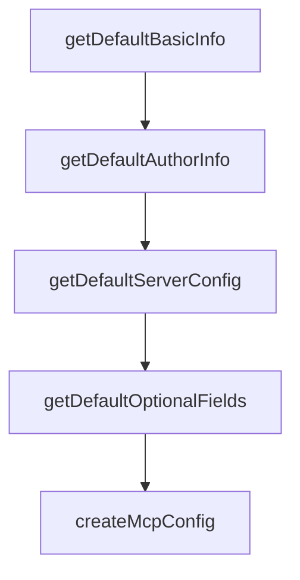

# Chapter 2: Manifest Model, Metadata, and Compatibility

Welcome to **Chapter 2: Manifest Model, Metadata, and Compatibility**. In this part of **MCPB Tutorial: Packaging and Distributing Local MCP Servers as Bundles**, you will build an intuitive mental model first, then move into concrete implementation details and practical production tradeoffs.


This chapter explains `manifest.json` as the bundle contract between server authors and host clients.

## Learning Goals

- model required fields (`manifest_version`, `name`, `version`, `author`, `server`)
- use optional metadata for discoverability, support, and governance
- define compatibility constraints for clients, platforms, and runtimes
- avoid manifest drift that breaks host installation flows

## Manifest Priority Areas

| Area | Typical Fields |
|:-----|:---------------|
| identity | name, display name, version, description |
| compatibility | platform/runtime constraints, client versions |
| governance | license, repository, support, privacy policies |
| UX | icons, screenshots, localization resources |

## Source References

- [MCPB Manifest Spec](https://github.com/modelcontextprotocol/mcpb/blob/main/MANIFEST.md)

## Summary

You now have a manifest-first strategy for bundle interoperability and lifecycle management.

Next: [Chapter 3: Server Configuration and Runtime Packaging](03-server-configuration-and-runtime-packaging.md)

## Source Code Walkthrough

### `src/cli/init.ts`

The `getDefaultBasicInfo` function in [`src/cli/init.ts`](https://github.com/modelcontextprotocol/mcpb/blob/HEAD/src/cli/init.ts) handles a key part of this chapter's functionality:

```ts
}

export function getDefaultBasicInfo(
  packageData: PackageJson,
  resolvedPath: string,
) {
  const name = packageData.name || basename(resolvedPath);
  const authorName = getDefaultAuthorName(packageData) || "Unknown Author";
  const displayName = name;
  const version = packageData.version || "1.0.0";
  const description = packageData.description || "A MCPB bundle";

  return { name, authorName, displayName, version, description };
}

export function getDefaultAuthorInfo(packageData: PackageJson) {
  return {
    authorEmail: getDefaultAuthorEmail(packageData),
    authorUrl: getDefaultAuthorUrl(packageData),
  };
}

export function getDefaultServerConfig(packageData?: PackageJson) {
  const serverType = "node" as const;
  const entryPoint = getDefaultEntryPoint(serverType, packageData);
  const mcp_config = createMcpConfig(serverType, entryPoint);

  return { serverType, entryPoint, mcp_config };
}

export function getDefaultOptionalFields(packageData: PackageJson) {
  return {
```

This function is important because it defines how MCPB Tutorial: Packaging and Distributing Local MCP Servers as Bundles implements the patterns covered in this chapter.

### `src/cli/init.ts`

The `getDefaultAuthorInfo` function in [`src/cli/init.ts`](https://github.com/modelcontextprotocol/mcpb/blob/HEAD/src/cli/init.ts) handles a key part of this chapter's functionality:

```ts
}

export function getDefaultAuthorInfo(packageData: PackageJson) {
  return {
    authorEmail: getDefaultAuthorEmail(packageData),
    authorUrl: getDefaultAuthorUrl(packageData),
  };
}

export function getDefaultServerConfig(packageData?: PackageJson) {
  const serverType = "node" as const;
  const entryPoint = getDefaultEntryPoint(serverType, packageData);
  const mcp_config = createMcpConfig(serverType, entryPoint);

  return { serverType, entryPoint, mcp_config };
}

export function getDefaultOptionalFields(packageData: PackageJson) {
  return {
    keywords: "",
    license: packageData.license || "MIT",
    repository: undefined,
  };
}

export function createMcpConfig(
  serverType: "node" | "python" | "binary",
  entryPoint: string,
): {
  command: string;
  args: string[];
  env?: Record<string, string>;
```

This function is important because it defines how MCPB Tutorial: Packaging and Distributing Local MCP Servers as Bundles implements the patterns covered in this chapter.

### `src/cli/init.ts`

The `getDefaultServerConfig` function in [`src/cli/init.ts`](https://github.com/modelcontextprotocol/mcpb/blob/HEAD/src/cli/init.ts) handles a key part of this chapter's functionality:

```ts
}

export function getDefaultServerConfig(packageData?: PackageJson) {
  const serverType = "node" as const;
  const entryPoint = getDefaultEntryPoint(serverType, packageData);
  const mcp_config = createMcpConfig(serverType, entryPoint);

  return { serverType, entryPoint, mcp_config };
}

export function getDefaultOptionalFields(packageData: PackageJson) {
  return {
    keywords: "",
    license: packageData.license || "MIT",
    repository: undefined,
  };
}

export function createMcpConfig(
  serverType: "node" | "python" | "binary",
  entryPoint: string,
): {
  command: string;
  args: string[];
  env?: Record<string, string>;
} {
  switch (serverType) {
    case "node":
      return {
        command: "node",
        args: ["${__dirname}/" + entryPoint],
        env: {},
```

This function is important because it defines how MCPB Tutorial: Packaging and Distributing Local MCP Servers as Bundles implements the patterns covered in this chapter.

### `src/cli/init.ts`

The `getDefaultOptionalFields` function in [`src/cli/init.ts`](https://github.com/modelcontextprotocol/mcpb/blob/HEAD/src/cli/init.ts) handles a key part of this chapter's functionality:

```ts
}

export function getDefaultOptionalFields(packageData: PackageJson) {
  return {
    keywords: "",
    license: packageData.license || "MIT",
    repository: undefined,
  };
}

export function createMcpConfig(
  serverType: "node" | "python" | "binary",
  entryPoint: string,
): {
  command: string;
  args: string[];
  env?: Record<string, string>;
} {
  switch (serverType) {
    case "node":
      return {
        command: "node",
        args: ["${__dirname}/" + entryPoint],
        env: {},
      };
    case "python":
      return {
        command: "python",
        args: ["${__dirname}/" + entryPoint],
        env: {
          PYTHONPATH: "${__dirname}/server/lib",
        },
```

This function is important because it defines how MCPB Tutorial: Packaging and Distributing Local MCP Servers as Bundles implements the patterns covered in this chapter.


## How These Components Connect


