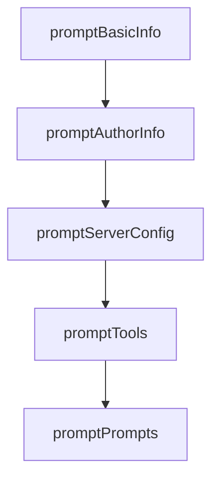

# Chapter 3: Server Configuration and Runtime Packaging

Welcome to **Chapter 3: Server Configuration and Runtime Packaging**. In this part of **MCPB Tutorial: Packaging and Distributing Local MCP Servers as Bundles**, you will build an intuitive mental model first, then move into concrete implementation details and practical production tradeoffs.


This chapter maps bundle runtime configuration to language-specific packaging realities.

## Learning Goals

- configure `server` and `mcp_config` fields correctly
- choose between Node, Python, Binary, and UV runtime paths
- understand dependency bundling tradeoffs by runtime type
- reduce install/runtime failures across host environments

## Runtime Strategy Matrix

| Server Type | Practical Guidance |
|:------------|:-------------------|
| node | easiest cross-platform baseline for many hosts |
| python | requires careful dependency/runtime packaging |
| binary | strongest portability if statically linked |
| uv | experimental path with host-managed Python/deps |

## Source References

- [MCPB README - Directory Structures](https://github.com/modelcontextprotocol/mcpb/blob/main/README.md#directory-structures)
- [Manifest Spec - Server Configuration](https://github.com/modelcontextprotocol/mcpb/blob/main/MANIFEST.md#server-configuration)
- [Hello World UV Example](https://github.com/modelcontextprotocol/mcpb/blob/main/examples/hello-world-uv/README.md)

## Summary

You now have a runtime packaging model for reliable MCPB installation and execution.

Next: [Chapter 4: Tools, Prompts, User Config, and Localization](04-tools-prompts-user-config-and-localization.md)

## Source Code Walkthrough

### `src/cli/init.ts`

The `promptBasicInfo` function in [`src/cli/init.ts`](https://github.com/modelcontextprotocol/mcpb/blob/HEAD/src/cli/init.ts) handles a key part of this chapter's functionality:

```ts
}

export async function promptBasicInfo(
  packageData: PackageJson,
  resolvedPath: string,
) {
  const defaultName = packageData.name || basename(resolvedPath);

  const name = await input({
    message: "Extension name:",
    default: defaultName,
    validate: (value) => value.trim().length > 0 || "Name is required",
  });

  const authorName = await input({
    message: "Author name:",
    default: getDefaultAuthorName(packageData),
    validate: (value) => value.trim().length > 0 || "Author name is required",
  });

  const displayName = await input({
    message: "Display name (optional):",
    default: name,
  });

  const version = await input({
    message: "Version:",
    default: packageData.version || "1.0.0",
    validate: (value) => {
      if (!value.trim()) return "Version is required";
      if (!/^\d+\.\d+\.\d+/.test(value)) {
        return "Version must follow semantic versioning (e.g., 1.0.0)";
```

This function is important because it defines how MCPB Tutorial: Packaging and Distributing Local MCP Servers as Bundles implements the patterns covered in this chapter.

### `src/cli/init.ts`

The `promptAuthorInfo` function in [`src/cli/init.ts`](https://github.com/modelcontextprotocol/mcpb/blob/HEAD/src/cli/init.ts) handles a key part of this chapter's functionality:

```ts
}

export async function promptAuthorInfo(packageData: PackageJson) {
  const authorEmail = await input({
    message: "Author email (optional):",
    default: getDefaultAuthorEmail(packageData),
  });

  const authorUrl = await input({
    message: "Author URL (optional):",
    default: getDefaultAuthorUrl(packageData),
  });

  return { authorEmail, authorUrl };
}

export async function promptServerConfig(packageData?: PackageJson) {
  const serverType = (await select({
    message: "Server type:",
    choices: [
      { name: "Node.js", value: "node" },
      { name: "Python", value: "python" },
      { name: "Binary", value: "binary" },
    ],
    default: "node",
  })) as "node" | "python" | "binary";

  const entryPoint = await input({
    message: "Entry point:",
    default: getDefaultEntryPoint(serverType, packageData),
  });

```

This function is important because it defines how MCPB Tutorial: Packaging and Distributing Local MCP Servers as Bundles implements the patterns covered in this chapter.

### `src/cli/init.ts`

The `promptServerConfig` function in [`src/cli/init.ts`](https://github.com/modelcontextprotocol/mcpb/blob/HEAD/src/cli/init.ts) handles a key part of this chapter's functionality:

```ts
}

export async function promptServerConfig(packageData?: PackageJson) {
  const serverType = (await select({
    message: "Server type:",
    choices: [
      { name: "Node.js", value: "node" },
      { name: "Python", value: "python" },
      { name: "Binary", value: "binary" },
    ],
    default: "node",
  })) as "node" | "python" | "binary";

  const entryPoint = await input({
    message: "Entry point:",
    default: getDefaultEntryPoint(serverType, packageData),
  });

  const mcp_config = createMcpConfig(serverType, entryPoint);

  return { serverType, entryPoint, mcp_config };
}

export async function promptTools() {
  const addTools = await confirm({
    message:
      "Does your MCP Server provide tools you want to advertise (optional)?",
    default: true,
  });

  const tools: Array<{ name: string; description?: string }> = [];
  let toolsGenerated = false;
```

This function is important because it defines how MCPB Tutorial: Packaging and Distributing Local MCP Servers as Bundles implements the patterns covered in this chapter.

### `src/cli/init.ts`

The `promptTools` function in [`src/cli/init.ts`](https://github.com/modelcontextprotocol/mcpb/blob/HEAD/src/cli/init.ts) handles a key part of this chapter's functionality:

```ts
}

export async function promptTools() {
  const addTools = await confirm({
    message:
      "Does your MCP Server provide tools you want to advertise (optional)?",
    default: true,
  });

  const tools: Array<{ name: string; description?: string }> = [];
  let toolsGenerated = false;

  if (addTools) {
    let addMore = true;
    while (addMore) {
      const toolName = await input({
        message: "Tool name:",
        validate: (value) => value.trim().length > 0 || "Tool name is required",
      });
      const toolDescription = await input({
        message: "Tool description (optional):",
      });

      tools.push({
        name: toolName,
        ...(toolDescription ? { description: toolDescription } : {}),
      });

      addMore = await confirm({
        message: "Add another tool?",
        default: false,
      });
```

This function is important because it defines how MCPB Tutorial: Packaging and Distributing Local MCP Servers as Bundles implements the patterns covered in this chapter.


## How These Components Connect


