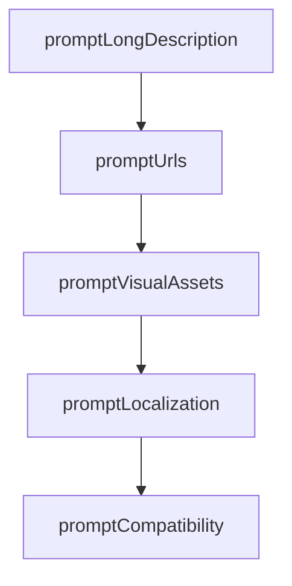

# Chapter 4: Tools, Prompts, User Config, and Localization

Welcome to **Chapter 4: Tools, Prompts, User Config, and Localization**. In this part of **MCPB Tutorial: Packaging and Distributing Local MCP Servers as Bundles**, you will build an intuitive mental model first, then move into concrete implementation details and practical production tradeoffs.


This chapter covers how bundles declare capability surfaces and user-facing configuration.

## Learning Goals

- declare static tools/prompts and generated capability flags safely
- design `user_config` schemas with validation and sensitive field handling
- apply localization resources for user-facing metadata
- keep host UX predictable across locales and environments

## Configuration Guardrails

1. define user config with explicit type and validation constraints
2. mark sensitive fields (`api_key`, tokens) appropriately
3. avoid localization gaps for primary user-facing metadata
4. keep generated capability declarations aligned with runtime behavior

## Source References

- [Manifest Spec - User Configuration](https://github.com/modelcontextprotocol/mcpb/blob/main/MANIFEST.md#user-configuration)
- [Manifest Spec - Tools and Prompts](https://github.com/modelcontextprotocol/mcpb/blob/main/MANIFEST.md#tools-and-prompts)
- [Manifest Spec - Localization](https://github.com/modelcontextprotocol/mcpb/blob/main/MANIFEST.md#localization)

## Summary

You now have a configuration and localization strategy for robust bundle UX.

Next: [Chapter 5: CLI Workflows: Init, Validate, and Pack](05-cli-workflows-init-validate-and-pack.md)

## Source Code Walkthrough

### `src/cli/init.ts`

The `promptLongDescription` function in [`src/cli/init.ts`](https://github.com/modelcontextprotocol/mcpb/blob/HEAD/src/cli/init.ts) handles a key part of this chapter's functionality:

```ts
}

export async function promptLongDescription(description: string) {
  const hasLongDescription = await confirm({
    message: "Add a detailed long description?",
    default: false,
  });

  if (hasLongDescription) {
    const longDescription = await input({
      message: "Long description (supports basic markdown):",
      default: description,
    });
    return longDescription;
  }

  return undefined;
}

export async function promptUrls() {
  const homepage = await input({
    message: "Homepage URL (optional):",
    validate: (value) => {
      if (!value.trim()) return true;
      try {
        new URL(value);
        return true;
      } catch {
        return "Must be a valid URL (e.g., https://example.com)";
      }
    },
  });
```

This function is important because it defines how MCPB Tutorial: Packaging and Distributing Local MCP Servers as Bundles implements the patterns covered in this chapter.

### `src/cli/init.ts`

The `promptUrls` function in [`src/cli/init.ts`](https://github.com/modelcontextprotocol/mcpb/blob/HEAD/src/cli/init.ts) handles a key part of this chapter's functionality:

```ts
}

export async function promptUrls() {
  const homepage = await input({
    message: "Homepage URL (optional):",
    validate: (value) => {
      if (!value.trim()) return true;
      try {
        new URL(value);
        return true;
      } catch {
        return "Must be a valid URL (e.g., https://example.com)";
      }
    },
  });

  const documentation = await input({
    message: "Documentation URL (optional):",
    validate: (value) => {
      if (!value.trim()) return true;
      try {
        new URL(value);
        return true;
      } catch {
        return "Must be a valid URL";
      }
    },
  });

  const support = await input({
    message: "Support URL (optional):",
    validate: (value) => {
```

This function is important because it defines how MCPB Tutorial: Packaging and Distributing Local MCP Servers as Bundles implements the patterns covered in this chapter.

### `src/cli/init.ts`

The `promptVisualAssets` function in [`src/cli/init.ts`](https://github.com/modelcontextprotocol/mcpb/blob/HEAD/src/cli/init.ts) handles a key part of this chapter's functionality:

```ts
}

export async function promptVisualAssets() {
  const icon = await input({
    message: "Icon file path (optional, relative to manifest):",
    validate: (value) => {
      if (!value.trim()) return true;
      if (value.includes("..")) return "Relative paths cannot include '..'";
      return true;
    },
  });

  const addIconVariants = await confirm({
    message: "Add theme/size-specific icons array?",
    default: false,
  });

  const icons: Array<{
    src: string;
    size: string;
    theme?: string;
  }> = [];

  if (addIconVariants) {
    let addMoreIcons = true;
    while (addMoreIcons) {
      const iconSrc = await input({
        message: "Icon source path (relative to manifest):",
        validate: (value) => {
          if (!value.trim()) return "Icon path is required";
          if (value.includes("..")) return "Relative paths cannot include '..'";
          return true;
```

This function is important because it defines how MCPB Tutorial: Packaging and Distributing Local MCP Servers as Bundles implements the patterns covered in this chapter.

### `src/cli/init.ts`

The `promptLocalization` function in [`src/cli/init.ts`](https://github.com/modelcontextprotocol/mcpb/blob/HEAD/src/cli/init.ts) handles a key part of this chapter's functionality:

```ts
}

export async function promptLocalization() {
  const configureLocalization = await confirm({
    message: "Configure localization resources?",
    default: false,
  });

  if (!configureLocalization) {
    return undefined;
  }

  const placeholderRegex = /\$\{locale\}/i;

  const resourcesPath = await input({
    message:
      "Localization resources path (must include ${locale} placeholder):",
    default: "resources/${locale}.json",
    validate: (value) => {
      if (!value.trim()) {
        return "Resources path is required";
      }
      if (value.includes("..")) {
        return "Relative paths cannot include '..'";
      }
      if (!placeholderRegex.test(value)) {
        return "Path must include a ${locale} placeholder";
      }
      return true;
    },
  });

```

This function is important because it defines how MCPB Tutorial: Packaging and Distributing Local MCP Servers as Bundles implements the patterns covered in this chapter.


## How These Components Connect


