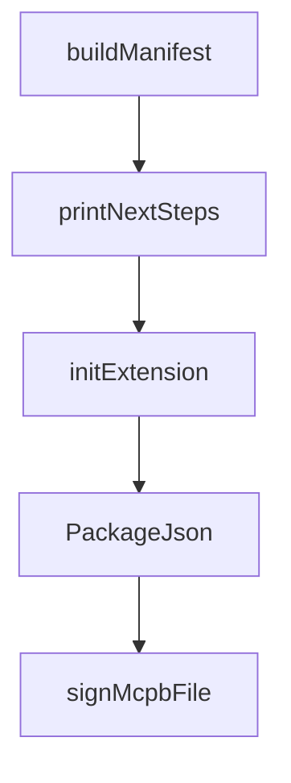

# Chapter 5: CLI Workflows: Init, Validate, and Pack

Welcome to **Chapter 5: CLI Workflows: Init, Validate, and Pack**. In this part of **MCPB Tutorial: Packaging and Distributing Local MCP Servers as Bundles**, you will build an intuitive mental model first, then move into concrete implementation details and practical production tradeoffs.


This chapter standardizes practical CLI workflows for bundle creation.

## Learning Goals

- use `mcpb init` to bootstrap valid manifests quickly
- validate manifests before packaging and distribution
- pack deterministic `.mcpb` archives with appropriate exclusions
- integrate `.mcpbignore` into repeatable build pipelines

## Core Command Flow

1. `mcpb init` to scaffold manifest
2. `mcpb validate` against schema
3. `mcpb pack` for distributable archive
4. `mcpb info` for metadata inspection

## Source References

- [MCPB CLI Documentation](https://github.com/modelcontextprotocol/mcpb/blob/main/CLI.md)
- [MCPB README - For Bundle Developers](https://github.com/modelcontextprotocol/mcpb/blob/main/README.md#for-bundle-developers)

## Summary

You now have a repeatable packaging workflow for MCPB bundle production.

Next: [Chapter 6: Signing, Verification, and Trust Controls](06-signing-verification-and-trust-controls.md)

## Source Code Walkthrough

### `src/cli/init.ts`

The `buildManifest` function in [`src/cli/init.ts`](https://github.com/modelcontextprotocol/mcpb/blob/HEAD/src/cli/init.ts) handles a key part of this chapter's functionality:

```ts
}

export function buildManifest(
  basicInfo: {
    name: string;
    displayName: string;
    version: string;
    description: string;
    authorName: string;
  },
  longDescription: string | undefined,
  authorInfo: {
    authorEmail: string;
    authorUrl: string;
  },
  urls: {
    homepage: string;
    documentation: string;
    support: string;
  },
  visualAssets: {
    icon: string;
    icons: Array<{
      src: string;
      size: string;
      theme?: string;
    }>;
    screenshots: string[];
  },
  serverConfig: {
    serverType: "node" | "python" | "binary";
    entryPoint: string;
```

This function is important because it defines how MCPB Tutorial: Packaging and Distributing Local MCP Servers as Bundles implements the patterns covered in this chapter.

### `src/cli/init.ts`

The `printNextSteps` function in [`src/cli/init.ts`](https://github.com/modelcontextprotocol/mcpb/blob/HEAD/src/cli/init.ts) handles a key part of this chapter's functionality:

```ts
}

export function printNextSteps() {
  console.log("\nNext steps:");
  console.log(
    `1. Ensure all your production dependencies are in this directory`,
  );
  console.log(`2. Run 'mcpb pack' to create your .mcpb file`);
}

export async function initExtension(
  targetPath: string = process.cwd(),
  nonInteractive = false,
  manifestVersion?: string,
): Promise<boolean> {
  const resolvedPath = resolve(targetPath);
  const manifestPath = join(resolvedPath, "manifest.json");

  // Validate manifest version if provided
  if (manifestVersion && !(manifestVersion in MANIFEST_SCHEMAS)) {
    console.error(
      `ERROR: Invalid manifest version "${manifestVersion}". Supported versions: ${Object.keys(MANIFEST_SCHEMAS).join(", ")}`,
    );
    return false;
  }
  const effectiveManifestVersion = (manifestVersion ||
    DEFAULT_MANIFEST_VERSION) as keyof typeof MANIFEST_SCHEMAS;

  if (existsSync(manifestPath)) {
    if (nonInteractive) {
      console.log(
        "manifest.json already exists. Use --force to overwrite in non-interactive mode.",
```

This function is important because it defines how MCPB Tutorial: Packaging and Distributing Local MCP Servers as Bundles implements the patterns covered in this chapter.

### `src/cli/init.ts`

The `initExtension` function in [`src/cli/init.ts`](https://github.com/modelcontextprotocol/mcpb/blob/HEAD/src/cli/init.ts) handles a key part of this chapter's functionality:

```ts
}

export async function initExtension(
  targetPath: string = process.cwd(),
  nonInteractive = false,
  manifestVersion?: string,
): Promise<boolean> {
  const resolvedPath = resolve(targetPath);
  const manifestPath = join(resolvedPath, "manifest.json");

  // Validate manifest version if provided
  if (manifestVersion && !(manifestVersion in MANIFEST_SCHEMAS)) {
    console.error(
      `ERROR: Invalid manifest version "${manifestVersion}". Supported versions: ${Object.keys(MANIFEST_SCHEMAS).join(", ")}`,
    );
    return false;
  }
  const effectiveManifestVersion = (manifestVersion ||
    DEFAULT_MANIFEST_VERSION) as keyof typeof MANIFEST_SCHEMAS;

  if (existsSync(manifestPath)) {
    if (nonInteractive) {
      console.log(
        "manifest.json already exists. Use --force to overwrite in non-interactive mode.",
      );
      return false;
    }
    const overwrite = await confirm({
      message: "manifest.json already exists. Overwrite?",
      default: false,
    });
    if (!overwrite) {
```

This function is important because it defines how MCPB Tutorial: Packaging and Distributing Local MCP Servers as Bundles implements the patterns covered in this chapter.

### `src/cli/init.ts`

The `PackageJson` interface in [`src/cli/init.ts`](https://github.com/modelcontextprotocol/mcpb/blob/HEAD/src/cli/init.ts) handles a key part of this chapter's functionality:

```ts
import type { McpbManifestAny } from "../types.js";

interface PackageJson {
  name?: string;
  version?: string;
  description?: string;
  main?: string;
  author?: string | { name?: string; email?: string; url?: string };
  repository?: string | { type?: string; url?: string };
  license?: string;
}

export function readPackageJson(dirPath: string): PackageJson {
  const packageJsonPath = join(dirPath, "package.json");
  if (existsSync(packageJsonPath)) {
    try {
      return JSON.parse(readFileSync(packageJsonPath, "utf-8"));
    } catch (e) {
      // Ignore package.json parsing errors
    }
  }
  return {};
}

export function getDefaultAuthorName(packageData: PackageJson): string {
  if (typeof packageData.author === "string") {
    return packageData.author;
  }
  return packageData.author?.name || "";
}

export function getDefaultAuthorEmail(packageData: PackageJson): string {
```

This interface is important because it defines how MCPB Tutorial: Packaging and Distributing Local MCP Servers as Bundles implements the patterns covered in this chapter.


## How These Components Connect


