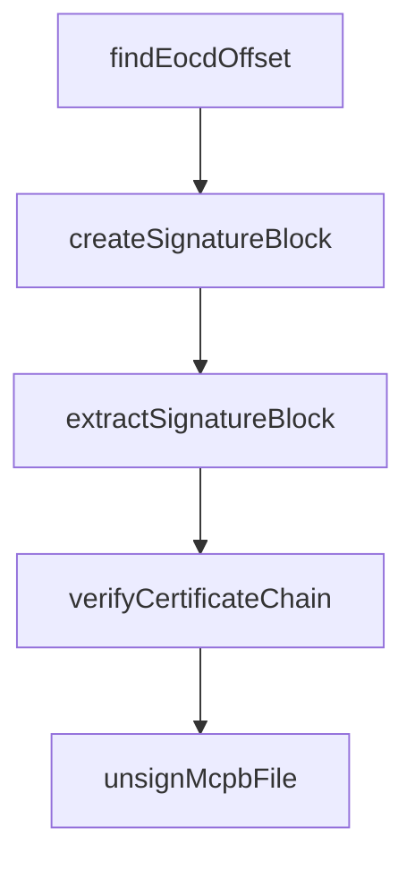

# Chapter 6: Signing, Verification, and Trust Controls

Welcome to **Chapter 6: Signing, Verification, and Trust Controls**. In this part of **MCPB Tutorial: Packaging and Distributing Local MCP Servers as Bundles**, you will build an intuitive mental model first, then move into concrete implementation details and practical production tradeoffs.


This chapter covers integrity and trust primitives in MCPB distribution.

## Learning Goals

- sign bundles with appropriate certificate chains
- verify signatures before publication and installation
- distinguish dev-time self-signed workflows from production trust models
- reduce supply-chain risk in host-side bundle acceptance

## Trust Workflow

| Step | Command |
|:-----|:--------|
| Sign | `mcpb sign` |
| Verify | `mcpb verify` |
| Inspect | `mcpb info` |
| Remove signature (dev-only) | `mcpb unsign` |

## Source References

- [MCPB CLI - Signing and Verification](https://github.com/modelcontextprotocol/mcpb/blob/main/CLI.md#mcpb-sign-mcpb-file)
- [MCPB CLI - Certificate Requirements](https://github.com/modelcontextprotocol/mcpb/blob/main/CLI.md#certificate-requirements)

## Summary

You now have a security-oriented workflow for trusted MCPB distribution.

Next: [Chapter 7: Examples, Language Patterns, and Distribution Readiness](07-examples-language-patterns-and-distribution-readiness.md)

## Source Code Walkthrough

### `src/node/sign.ts`

The `findEocdOffset` function in [`src/node/sign.ts`](https://github.com/modelcontextprotocol/mcpb/blob/HEAD/src/node/sign.ts) handles a key part of this chapter's functionality:

```ts
  // This ensures strict ZIP parsers accept the signed file
  const updatedContent = Buffer.from(mcpbContent);
  const eocdOffset = findEocdOffset(updatedContent);
  if (eocdOffset !== -1) {
    const currentCommentLength = updatedContent.readUInt16LE(eocdOffset + 20);
    updatedContent.writeUInt16LE(
      currentCommentLength + signatureBlock.length,
      eocdOffset + 20,
    );
  }

  // Append signature block to MCPB file
  const signedContent = Buffer.concat([updatedContent, signatureBlock]);
  writeFileSync(mcpbPath, signedContent);
}

/**
 * Verifies a signed MCPB file using OS certificate store
 *
 * @param mcpbPath Path to the signed MCPB file
 * @returns Signature information including verification status
 */
export async function verifyMcpbFile(
  mcpbPath: string,
): Promise<z.infer<typeof McpbSignatureInfoSchema>> {
  try {
    const fileContent = readFileSync(mcpbPath);

    // Find and extract signature block
    const { originalContent, pkcs7Signature } =
      extractSignatureBlock(fileContent);
    if (!pkcs7Signature) {
```

This function is important because it defines how MCPB Tutorial: Packaging and Distributing Local MCP Servers as Bundles implements the patterns covered in this chapter.

### `src/node/sign.ts`

The `createSignatureBlock` function in [`src/node/sign.ts`](https://github.com/modelcontextprotocol/mcpb/blob/HEAD/src/node/sign.ts) handles a key part of this chapter's functionality:

```ts

  // Create signature block with PKCS#7 data
  const signatureBlock = createSignatureBlock(pkcs7Signature);

  // Update ZIP EOCD comment_length to include signature block
  // This ensures strict ZIP parsers accept the signed file
  const updatedContent = Buffer.from(mcpbContent);
  const eocdOffset = findEocdOffset(updatedContent);
  if (eocdOffset !== -1) {
    const currentCommentLength = updatedContent.readUInt16LE(eocdOffset + 20);
    updatedContent.writeUInt16LE(
      currentCommentLength + signatureBlock.length,
      eocdOffset + 20,
    );
  }

  // Append signature block to MCPB file
  const signedContent = Buffer.concat([updatedContent, signatureBlock]);
  writeFileSync(mcpbPath, signedContent);
}

/**
 * Verifies a signed MCPB file using OS certificate store
 *
 * @param mcpbPath Path to the signed MCPB file
 * @returns Signature information including verification status
 */
export async function verifyMcpbFile(
  mcpbPath: string,
): Promise<z.infer<typeof McpbSignatureInfoSchema>> {
  try {
    const fileContent = readFileSync(mcpbPath);
```

This function is important because it defines how MCPB Tutorial: Packaging and Distributing Local MCP Servers as Bundles implements the patterns covered in this chapter.

### `src/node/sign.ts`

The `extractSignatureBlock` function in [`src/node/sign.ts`](https://github.com/modelcontextprotocol/mcpb/blob/HEAD/src/node/sign.ts) handles a key part of this chapter's functionality:

```ts
    // Find and extract signature block
    const { originalContent, pkcs7Signature } =
      extractSignatureBlock(fileContent);
    if (!pkcs7Signature) {
      return { status: "unsigned" };
    }

    // Parse PKCS#7 signature
    const asn1 = forge.asn1.fromDer(pkcs7Signature.toString("binary"));
    const p7Message = forge.pkcs7.messageFromAsn1(asn1);

    // Verify it's signed data and cast to correct type
    if (
      !("type" in p7Message) ||
      p7Message.type !== forge.pki.oids.signedData
    ) {
      return { status: "unsigned" };
    }

    // Now we know it's PkcsSignedData. The types are incorrect, so we'll
    // fix them there
    const p7 = p7Message as unknown as forge.pkcs7.PkcsSignedData & {
      signerInfos: Array<{
        authenticatedAttributes: Array<{
          type: string;
          value: unknown;
        }>;
      }>;
      verify: (options?: { authenticatedAttributes?: boolean }) => boolean;
    };

    // Extract certificates from PKCS#7
```

This function is important because it defines how MCPB Tutorial: Packaging and Distributing Local MCP Servers as Bundles implements the patterns covered in this chapter.

### `src/node/sign.ts`

The `verifyCertificateChain` function in [`src/node/sign.ts`](https://github.com/modelcontextprotocol/mcpb/blob/HEAD/src/node/sign.ts) handles a key part of this chapter's functionality:

```ts

    // Verify certificate chain against OS trust store
    const chainValid = await verifyCertificateChain(
      Buffer.from(certPem),
      intermediatePems,
    );

    if (!chainValid) {
      // Signature is valid but certificate is not trusted
      return { status: "unsigned" };
    }

    // Extract certificate info
    const isSelfSigned =
      signingCert.issuer.getField("CN")?.value ===
      signingCert.subject.getField("CN")?.value;

    return {
      status: isSelfSigned ? "self-signed" : "signed",
      publisher: signingCert.subject.getField("CN")?.value || "Unknown",
      issuer: signingCert.issuer.getField("CN")?.value || "Unknown",
      valid_from: signingCert.validity.notBefore.toISOString(),
      valid_to: signingCert.validity.notAfter.toISOString(),
      fingerprint: forge.md.sha256
        .create()
        .update(
          forge.asn1.toDer(forge.pki.certificateToAsn1(signingCert)).getBytes(),
        )
        .digest()
        .toHex(),
    };
  } catch (error) {
```

This function is important because it defines how MCPB Tutorial: Packaging and Distributing Local MCP Servers as Bundles implements the patterns covered in this chapter.


## How These Components Connect


