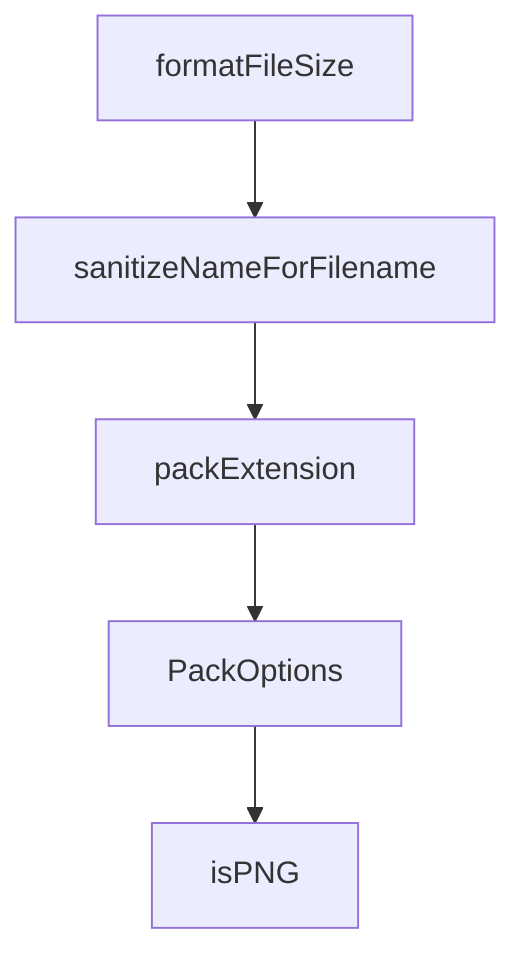

# Chapter 7: Examples, Language Patterns, and Distribution Readiness

Welcome to **Chapter 7: Examples, Language Patterns, and Distribution Readiness**. In this part of **MCPB Tutorial: Packaging and Distributing Local MCP Servers as Bundles**, you will build an intuitive mental model first, then move into concrete implementation details and practical production tradeoffs.


This chapter translates specification guidance into practical implementation templates.

## Learning Goals

- evaluate official examples for runtime and structure decisions
- understand development vs production readiness boundaries
- map example patterns to your own server architecture
- prioritize distribution hardening before publishing bundles

## Example Guidance

- use hello-world examples to validate toolchain and host install loop first.
- treat example projects as reference patterns, not production blueprints.
- add your own observability, secret management, and update policies before release.

## Source References

- [MCPB Examples](https://github.com/modelcontextprotocol/mcpb/blob/main/examples/README.md)
- [Hello World UV Example](https://github.com/modelcontextprotocol/mcpb/blob/main/examples/hello-world-uv/README.md)

## Summary

You now have an example-driven framework for taking bundles from prototype to hardened distribution.

Next: [Chapter 8: Release, Governance, and Ecosystem Operations](08-release-governance-and-ecosystem-operations.md)

## Depth Expansion Playbook

## Source Code Walkthrough

### `src/cli/pack.ts`

The `formatFileSize` function in [`src/cli/pack.ts`](https://github.com/modelcontextprotocol/mcpb/blob/HEAD/src/cli/pack.ts) handles a key part of this chapter's functionality:

```ts
}

function formatFileSize(bytes: number): string {
  if (bytes < 1024) {
    return `${bytes}B`;
  } else if (bytes < 1024 * 1024) {
    return `${(bytes / 1024).toFixed(1)}kB`;
  } else {
    return `${(bytes / (1024 * 1024)).toFixed(1)}MB`;
  }
}

function sanitizeNameForFilename(name: string): string {
  // Replace spaces with hyphens
  // Remove or replace characters that are problematic in filenames
  return name
    .toLowerCase()
    .replace(/\s+/g, "-") // Replace spaces with hyphens
    .replace(/[^a-z0-9-_.]/g, "") // Keep only alphanumeric, hyphens, underscores, and dots
    .replace(/-+/g, "-") // Replace multiple hyphens with single hyphen
    .replace(/^-+|-+$/g, "") // Remove leading/trailing hyphens
    .substring(0, 100); // Limit length to 100 characters
}

export async function packExtension({
  extensionPath,
  outputPath,
  silent,
}: PackOptions): Promise<boolean> {
  const resolvedPath = resolve(extensionPath);
  const logger = getLogger({ silent });

```

This function is important because it defines how MCPB Tutorial: Packaging and Distributing Local MCP Servers as Bundles implements the patterns covered in this chapter.

### `src/cli/pack.ts`

The `sanitizeNameForFilename` function in [`src/cli/pack.ts`](https://github.com/modelcontextprotocol/mcpb/blob/HEAD/src/cli/pack.ts) handles a key part of this chapter's functionality:

```ts
}

function sanitizeNameForFilename(name: string): string {
  // Replace spaces with hyphens
  // Remove or replace characters that are problematic in filenames
  return name
    .toLowerCase()
    .replace(/\s+/g, "-") // Replace spaces with hyphens
    .replace(/[^a-z0-9-_.]/g, "") // Keep only alphanumeric, hyphens, underscores, and dots
    .replace(/-+/g, "-") // Replace multiple hyphens with single hyphen
    .replace(/^-+|-+$/g, "") // Remove leading/trailing hyphens
    .substring(0, 100); // Limit length to 100 characters
}

export async function packExtension({
  extensionPath,
  outputPath,
  silent,
}: PackOptions): Promise<boolean> {
  const resolvedPath = resolve(extensionPath);
  const logger = getLogger({ silent });

  // Check if directory exists
  if (!existsSync(resolvedPath) || !statSync(resolvedPath).isDirectory()) {
    logger.error(`ERROR: Directory not found: ${extensionPath}`);
    return false;
  }

  // Check if manifest exists
  const manifestPath = join(resolvedPath, "manifest.json");
  if (!existsSync(manifestPath)) {
    logger.log(`No manifest.json found in ${extensionPath}`);
```

This function is important because it defines how MCPB Tutorial: Packaging and Distributing Local MCP Servers as Bundles implements the patterns covered in this chapter.

### `src/cli/pack.ts`

The `packExtension` function in [`src/cli/pack.ts`](https://github.com/modelcontextprotocol/mcpb/blob/HEAD/src/cli/pack.ts) handles a key part of this chapter's functionality:

```ts
}

export async function packExtension({
  extensionPath,
  outputPath,
  silent,
}: PackOptions): Promise<boolean> {
  const resolvedPath = resolve(extensionPath);
  const logger = getLogger({ silent });

  // Check if directory exists
  if (!existsSync(resolvedPath) || !statSync(resolvedPath).isDirectory()) {
    logger.error(`ERROR: Directory not found: ${extensionPath}`);
    return false;
  }

  // Check if manifest exists
  const manifestPath = join(resolvedPath, "manifest.json");
  if (!existsSync(manifestPath)) {
    logger.log(`No manifest.json found in ${extensionPath}`);
    const shouldInit = await confirm({
      message: "Would you like to create a manifest.json file?",
      default: true,
    });

    if (shouldInit) {
      const success = await initExtension(extensionPath);
      if (!success) {
        logger.error("ERROR: Failed to create manifest");
        return false;
      }
    } else {
```

This function is important because it defines how MCPB Tutorial: Packaging and Distributing Local MCP Servers as Bundles implements the patterns covered in this chapter.

### `src/cli/pack.ts`

The `PackOptions` interface in [`src/cli/pack.ts`](https://github.com/modelcontextprotocol/mcpb/blob/HEAD/src/cli/pack.ts) handles a key part of this chapter's functionality:

```ts
import { initExtension } from "./init.js";

interface PackOptions {
  extensionPath: string;
  outputPath?: string;
  silent?: boolean;
}

function formatFileSize(bytes: number): string {
  if (bytes < 1024) {
    return `${bytes}B`;
  } else if (bytes < 1024 * 1024) {
    return `${(bytes / 1024).toFixed(1)}kB`;
  } else {
    return `${(bytes / (1024 * 1024)).toFixed(1)}MB`;
  }
}

function sanitizeNameForFilename(name: string): string {
  // Replace spaces with hyphens
  // Remove or replace characters that are problematic in filenames
  return name
    .toLowerCase()
    .replace(/\s+/g, "-") // Replace spaces with hyphens
    .replace(/[^a-z0-9-_.]/g, "") // Keep only alphanumeric, hyphens, underscores, and dots
    .replace(/-+/g, "-") // Replace multiple hyphens with single hyphen
    .replace(/^-+|-+$/g, "") // Remove leading/trailing hyphens
    .substring(0, 100); // Limit length to 100 characters
}

export async function packExtension({
  extensionPath,
```

This interface is important because it defines how MCPB Tutorial: Packaging and Distributing Local MCP Servers as Bundles implements the patterns covered in this chapter.


## How These Components Connect


