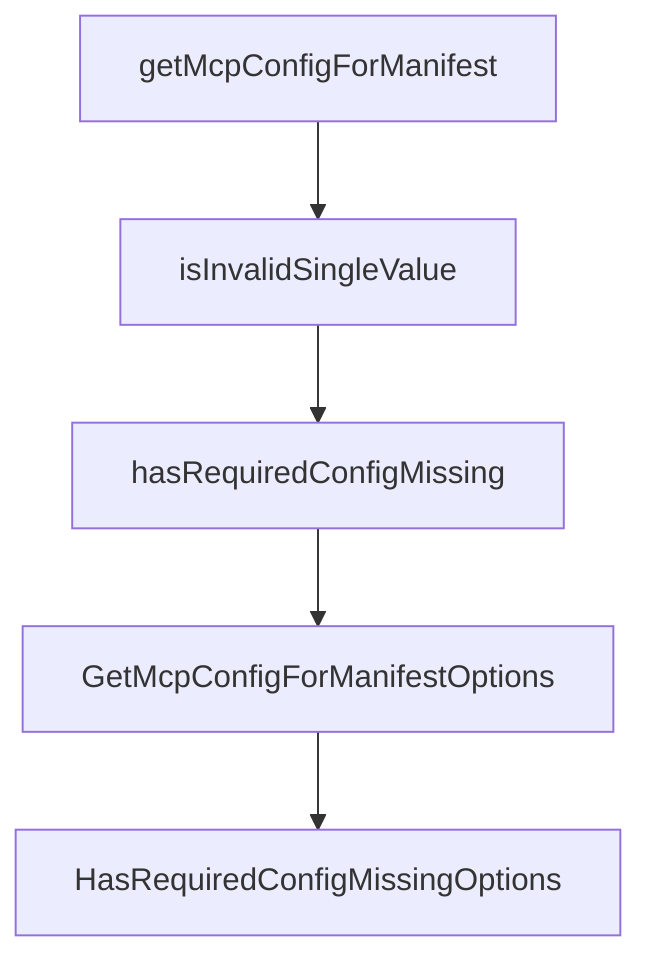

# Chapter 7: Examples, Language Patterns, and Distribution Readiness

Welcome to **Chapter 7: Examples, Language Patterns, and Distribution Readiness**. In this part of **MCPB Tutorial: Packaging and Distributing Local MCP Servers as Bundles**, you will build an intuitive mental model first, then move into concrete implementation details and practical production tradeoffs.


This chapter translates specification guidance into practical implementation templates.

## Learning Goals

- evaluate official examples for runtime and structure decisions
- understand development vs production readiness boundaries
- map example patterns to your own server architecture
- prioritize distribution hardening before publishing bundles

## Example Guidance

- use hello-world examples to validate toolchain and host install loop first.
- treat example projects as reference patterns, not production blueprints.
- add your own observability, secret management, and update policies before release.

## Source References

- [MCPB Examples](https://github.com/modelcontextprotocol/mcpb/blob/main/examples/README.md)
- [Hello World UV Example](https://github.com/modelcontextprotocol/mcpb/blob/main/examples/hello-world-uv/README.md)

## Summary

You now have an example-driven framework for taking bundles from prototype to hardened distribution.

Next: [Chapter 8: Release, Governance, and Ecosystem Operations](08-release-governance-and-ecosystem-operations.md)

## Source Code Walkthrough

### `src/shared/config.ts`

The `getMcpConfigForManifest` function in [`src/shared/config.ts`](https://github.com/modelcontextprotocol/mcpb/blob/HEAD/src/shared/config.ts) handles a key part of this chapter's functionality:

```ts
}

export async function getMcpConfigForManifest(
  options: GetMcpConfigForManifestOptions,
): Promise<McpbManifestAny["server"]["mcp_config"] | undefined> {
  const {
    manifest,
    extensionPath,
    systemDirs,
    userConfig,
    pathSeparator,
    logger,
  } = options;
  const baseConfig = manifest.server?.mcp_config;
  if (!baseConfig) {
    return undefined;
  }

  let result: McpbManifestAny["server"]["mcp_config"] = {
    ...baseConfig,
  };

  if (baseConfig.platform_overrides) {
    if (process.platform in baseConfig.platform_overrides) {
      const platformConfig = baseConfig.platform_overrides[process.platform];

      result.command = platformConfig.command || result.command;
      result.args = platformConfig.args || result.args;
      result.env = platformConfig.env || result.env;
    }
  }

```

This function is important because it defines how MCPB Tutorial: Packaging and Distributing Local MCP Servers as Bundles implements the patterns covered in this chapter.

### `src/shared/config.ts`

The `isInvalidSingleValue` function in [`src/shared/config.ts`](https://github.com/modelcontextprotocol/mcpb/blob/HEAD/src/shared/config.ts) handles a key part of this chapter's functionality:

```ts
}

function isInvalidSingleValue(value: unknown): boolean {
  return value === undefined || value === null || value === "";
}

/**
 * Check if an extension has missing required configuration
 * @param manifest The extension manifest
 * @param userConfig The user configuration
 * @returns true if required configuration is missing
 */
export function hasRequiredConfigMissing({
  manifest,
  userConfig,
}: HasRequiredConfigMissingOptions): boolean {
  if (!manifest.user_config) {
    return false;
  }

  const config = userConfig || {};

  for (const [key, configOption] of Object.entries(manifest.user_config)) {
    if (configOption.required) {
      const value = config[key];
      if (
        isInvalidSingleValue(value) ||
        (Array.isArray(value) &&
          (value.length === 0 || value.some(isInvalidSingleValue)))
      ) {
        return true;
      }
```

This function is important because it defines how MCPB Tutorial: Packaging and Distributing Local MCP Servers as Bundles implements the patterns covered in this chapter.

### `src/shared/config.ts`

The `hasRequiredConfigMissing` function in [`src/shared/config.ts`](https://github.com/modelcontextprotocol/mcpb/blob/HEAD/src/shared/config.ts) handles a key part of this chapter's functionality:

```ts

  // Check if required configuration is missing
  if (hasRequiredConfigMissing({ manifest, userConfig })) {
    logger?.warn(
      `Extension ${manifest.name} has missing required configuration, skipping MCP config`,
    );
    return undefined;
  }

  const variables: Record<string, string | string[]> = {
    __dirname: extensionPath,
    pathSeparator,
    "/": pathSeparator,
    ...systemDirs,
  };

  // Build merged configuration from defaults and user settings
  const mergedConfig: Record<string, unknown> = {};

  // First, add defaults from manifest
  if (manifest.user_config) {
    for (const [key, configOption] of Object.entries(manifest.user_config)) {
      if (configOption.default !== undefined) {
        mergedConfig[key] = configOption.default;
      }
    }
  }

  // Then, override with user settings
  if (userConfig) {
    Object.assign(mergedConfig, userConfig);
  }
```

This function is important because it defines how MCPB Tutorial: Packaging and Distributing Local MCP Servers as Bundles implements the patterns covered in this chapter.

### `src/shared/config.ts`

The `GetMcpConfigForManifestOptions` interface in [`src/shared/config.ts`](https://github.com/modelcontextprotocol/mcpb/blob/HEAD/src/shared/config.ts) handles a key part of this chapter's functionality:

```ts
}

interface GetMcpConfigForManifestOptions {
  manifest: McpbManifestAny;
  extensionPath: string;
  systemDirs: Record<string, string>;
  userConfig: z.infer<typeof McpbUserConfigValuesSchema>;
  pathSeparator: string;
  logger?: Logger;
}

export async function getMcpConfigForManifest(
  options: GetMcpConfigForManifestOptions,
): Promise<McpbManifestAny["server"]["mcp_config"] | undefined> {
  const {
    manifest,
    extensionPath,
    systemDirs,
    userConfig,
    pathSeparator,
    logger,
  } = options;
  const baseConfig = manifest.server?.mcp_config;
  if (!baseConfig) {
    return undefined;
  }

  let result: McpbManifestAny["server"]["mcp_config"] = {
    ...baseConfig,
  };

  if (baseConfig.platform_overrides) {
```

This interface is important because it defines how MCPB Tutorial: Packaging and Distributing Local MCP Servers as Bundles implements the patterns covered in this chapter.


## How These Components Connect


