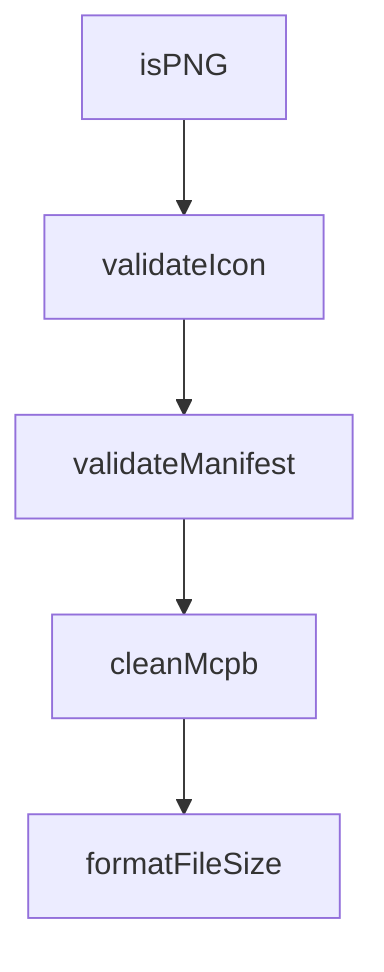

# Chapter 8: Release, Governance, and Ecosystem Operations

Welcome to **Chapter 8: Release, Governance, and Ecosystem Operations**. In this part of **MCPB Tutorial: Packaging and Distributing Local MCP Servers as Bundles**, you will build an intuitive mental model first, then move into concrete implementation details and practical production tradeoffs.


This chapter defines long-term governance controls for operating MCPB workflows across teams.

## Learning Goals

- align release practices with manifest and runtime compatibility policies
- standardize CI checks for validation/signature quality gates
- manage migration messaging and backward compatibility across bundle versions
- integrate contribution guidelines into sustainable maintenance loops

## Operations Checklist

1. enforce `validate -> pack -> sign -> verify` in CI pipelines
2. maintain compatibility matrices per target host/client
3. version manifests and server runtime contracts deliberately
4. document contributor and release procedures for maintainers

## Source References

- [MCPB README - Release Process](https://github.com/modelcontextprotocol/mcpb/blob/main/README.md#release-process)
- [MCPB Contributing Guide](https://github.com/modelcontextprotocol/mcpb/blob/main/CONTRIBUTING.md)
- [MCPB Releases](https://github.com/modelcontextprotocol/mcpb/releases)

## Summary

You now have a governance model for operating MCPB packaging and distribution at scale.

Return to the [MCPB Tutorial index](README.md).

## Source Code Walkthrough

### `src/node/validate.ts`

The `isPNG` function in [`src/node/validate.ts`](https://github.com/modelcontextprotocol/mcpb/blob/HEAD/src/node/validate.ts) handles a key part of this chapter's functionality:

```ts
 * Check if a buffer contains a valid PNG file signature
 */
function isPNG(buffer: Buffer): boolean {
  // PNG signature: 89 50 4E 47 0D 0A 1A 0A
  return (
    buffer.length >= 8 &&
    buffer[0] === 0x89 &&
    buffer[1] === 0x50 &&
    buffer[2] === 0x4e &&
    buffer[3] === 0x47 &&
    buffer[4] === 0x0d &&
    buffer[5] === 0x0a &&
    buffer[6] === 0x1a &&
    buffer[7] === 0x0a
  );
}

/**
 * Validate icon field in manifest
 * @param iconPath - The icon path from manifest.json
 * @param baseDir - The base directory containing the manifest
 * @returns Validation result with errors and warnings
 */
function validateIcon(
  iconPath: string,
  baseDir: string,
): { valid: boolean; errors: string[]; warnings: string[] } {
  const errors: string[] = [];
  const warnings: string[] = [];

  const isRemoteUrl =
    iconPath.startsWith("http://") || iconPath.startsWith("https://");
```

This function is important because it defines how MCPB Tutorial: Packaging and Distributing Local MCP Servers as Bundles implements the patterns covered in this chapter.

### `src/node/validate.ts`

The `validateIcon` function in [`src/node/validate.ts`](https://github.com/modelcontextprotocol/mcpb/blob/HEAD/src/node/validate.ts) handles a key part of this chapter's functionality:

```ts
 * @returns Validation result with errors and warnings
 */
function validateIcon(
  iconPath: string,
  baseDir: string,
): { valid: boolean; errors: string[]; warnings: string[] } {
  const errors: string[] = [];
  const warnings: string[] = [];

  const isRemoteUrl =
    iconPath.startsWith("http://") || iconPath.startsWith("https://");
  const hasVariableSubstitution = iconPath.includes("${__dirname}");
  const isAbsolutePath = isAbsolute(iconPath);

  // Warn about remote URLs (best practice: use local files)
  if (isRemoteUrl) {
    warnings.push(
      "Icon path uses a remote URL. " +
        'Best practice for local MCP servers: Use local files like "icon": "icon.png" for maximum compatibility. ' +
        "Claude Desktop currently only supports local icon files in bundles.",
    );
  }

  // Check for ${__dirname} variable (error - doesn't work)
  if (hasVariableSubstitution) {
    errors.push(
      "Icon path should not use ${__dirname} variable substitution. " +
        'Use a simple relative path like "icon.png" instead of "${__dirname}/icon.png".',
    );
  }

  // Check for absolute path (error - not portable)
```

This function is important because it defines how MCPB Tutorial: Packaging and Distributing Local MCP Servers as Bundles implements the patterns covered in this chapter.

### `src/node/validate.ts`

The `validateManifest` function in [`src/node/validate.ts`](https://github.com/modelcontextprotocol/mcpb/blob/HEAD/src/node/validate.ts) handles a key part of this chapter's functionality:

```ts
}

export function validateManifest(inputPath: string): boolean {
  try {
    const resolvedPath = resolve(inputPath);
    let manifestPath = resolvedPath;

    // If input is a directory, look for manifest.json inside it
    if (existsSync(resolvedPath) && statSync(resolvedPath).isDirectory()) {
      manifestPath = join(resolvedPath, "manifest.json");
    }

    const manifestContent = readFileSync(manifestPath, "utf-8");
    const manifestData = JSON.parse(manifestContent);
    const manifestVersion = getManifestVersionFromRawData(manifestData);
    if (!manifestVersion) {
      console.log("Unrecognized or unsupported manifest version");
      return false;
    }

    const result = MANIFEST_SCHEMAS[manifestVersion].safeParse(manifestData);

    if (result.success) {
      console.log("Manifest schema validation passes!");

      // Validate icon if present
      if (manifestData.icon) {
        const baseDir = dirname(manifestPath);
        const iconValidation = validateIcon(manifestData.icon, baseDir);

        if (iconValidation.errors.length > 0) {
          console.log("\nERROR: Icon validation failed:\n");
```

This function is important because it defines how MCPB Tutorial: Packaging and Distributing Local MCP Servers as Bundles implements the patterns covered in this chapter.

### `src/node/validate.ts`

The `cleanMcpb` function in [`src/node/validate.ts`](https://github.com/modelcontextprotocol/mcpb/blob/HEAD/src/node/validate.ts) handles a key part of this chapter's functionality:

```ts
}

export async function cleanMcpb(inputPath: string) {
  const tmpDir = await fs.mkdtemp(resolve(os.tmpdir(), "mcpb-clean-"));
  const mcpbPath = resolve(tmpDir, "in.mcpb");
  const unpackPath = resolve(tmpDir, "out");

  console.log(" -- Cleaning MCPB...");

  try {
    await fs.copyFile(inputPath, mcpbPath);
    console.log(" -- Unpacking MCPB...");
    await unpackExtension({ mcpbPath, silent: true, outputDir: unpackPath });

    const manifestPath = resolve(unpackPath, "manifest.json");
    const originalManifest = await fs.readFile(manifestPath, "utf-8");
    const manifestData = JSON.parse(originalManifest);
    const manifestVersion = getManifestVersionFromRawData(manifestData);
    if (!manifestVersion) {
      throw new Error("Unrecognized or unsupported manifest version");
    }
    const result =
      MANIFEST_SCHEMAS_LOOSE[manifestVersion].safeParse(manifestData);

    if (!result.success) {
      throw new Error(
        `Unrecoverable manifest issues, please run "mcpb validate"`,
      );
    }
    await fs.writeFile(manifestPath, JSON.stringify(result.data, null, 2));

    if (
```

This function is important because it defines how MCPB Tutorial: Packaging and Distributing Local MCP Servers as Bundles implements the patterns covered in this chapter.


## How These Components Connect


