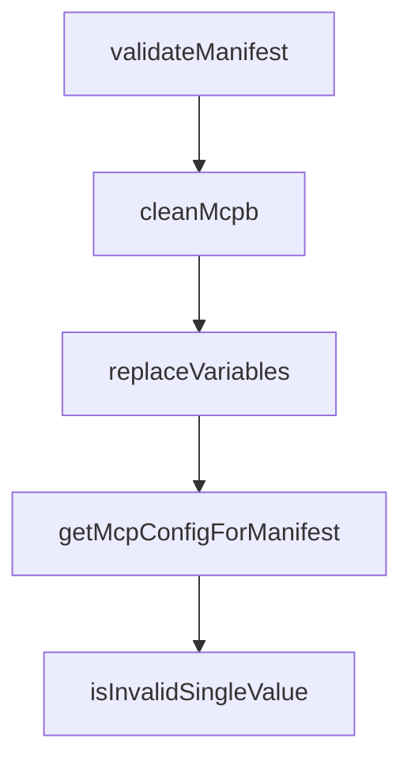

# Chapter 8: Release, Governance, and Ecosystem Operations

Welcome to **Chapter 8: Release, Governance, and Ecosystem Operations**. In this part of **MCPB Tutorial: Packaging and Distributing Local MCP Servers as Bundles**, you will build an intuitive mental model first, then move into concrete implementation details and practical production tradeoffs.


This chapter defines long-term governance controls for operating MCPB workflows across teams.

## Learning Goals

- align release practices with manifest and runtime compatibility policies
- standardize CI checks for validation/signature quality gates
- manage migration messaging and backward compatibility across bundle versions
- integrate contribution guidelines into sustainable maintenance loops

## Operations Checklist

1. enforce `validate -> pack -> sign -> verify` in CI pipelines
2. maintain compatibility matrices per target host/client
3. version manifests and server runtime contracts deliberately
4. document contributor and release procedures for maintainers

## Source References

- [MCPB README - Release Process](https://github.com/modelcontextprotocol/mcpb/blob/main/README.md#release-process)
- [MCPB Contributing Guide](https://github.com/modelcontextprotocol/mcpb/blob/main/CONTRIBUTING.md)
- [MCPB Releases](https://github.com/modelcontextprotocol/mcpb/releases)

## Summary

You now have a governance model for operating MCPB packaging and distribution at scale.

Return to the [MCPB Tutorial index](README.md).

## Depth Expansion Playbook

## Source Code Walkthrough

### `src/node/validate.ts`

The `validateManifest` function in [`src/node/validate.ts`](https://github.com/modelcontextprotocol/mcpb/blob/HEAD/src/node/validate.ts) handles a key part of this chapter's functionality:

```ts
}

export function validateManifest(inputPath: string): boolean {
  try {
    const resolvedPath = resolve(inputPath);
    let manifestPath = resolvedPath;

    // If input is a directory, look for manifest.json inside it
    if (existsSync(resolvedPath) && statSync(resolvedPath).isDirectory()) {
      manifestPath = join(resolvedPath, "manifest.json");
    }

    const manifestContent = readFileSync(manifestPath, "utf-8");
    const manifestData = JSON.parse(manifestContent);
    const manifestVersion = getManifestVersionFromRawData(manifestData);
    if (!manifestVersion) {
      console.log("Unrecognized or unsupported manifest version");
      return false;
    }

    const result = MANIFEST_SCHEMAS[manifestVersion].safeParse(manifestData);

    if (result.success) {
      console.log("Manifest schema validation passes!");

      // Validate icon if present
      if (manifestData.icon) {
        const baseDir = dirname(manifestPath);
        const iconValidation = validateIcon(manifestData.icon, baseDir);

        if (iconValidation.errors.length > 0) {
          console.log("\nERROR: Icon validation failed:\n");
```

This function is important because it defines how MCPB Tutorial: Packaging and Distributing Local MCP Servers as Bundles implements the patterns covered in this chapter.

### `src/node/validate.ts`

The `cleanMcpb` function in [`src/node/validate.ts`](https://github.com/modelcontextprotocol/mcpb/blob/HEAD/src/node/validate.ts) handles a key part of this chapter's functionality:

```ts
}

export async function cleanMcpb(inputPath: string) {
  const tmpDir = await fs.mkdtemp(resolve(os.tmpdir(), "mcpb-clean-"));
  const mcpbPath = resolve(tmpDir, "in.mcpb");
  const unpackPath = resolve(tmpDir, "out");

  console.log(" -- Cleaning MCPB...");

  try {
    await fs.copyFile(inputPath, mcpbPath);
    console.log(" -- Unpacking MCPB...");
    await unpackExtension({ mcpbPath, silent: true, outputDir: unpackPath });

    const manifestPath = resolve(unpackPath, "manifest.json");
    const originalManifest = await fs.readFile(manifestPath, "utf-8");
    const manifestData = JSON.parse(originalManifest);
    const manifestVersion = getManifestVersionFromRawData(manifestData);
    if (!manifestVersion) {
      throw new Error("Unrecognized or unsupported manifest version");
    }
    const result =
      MANIFEST_SCHEMAS_LOOSE[manifestVersion].safeParse(manifestData);

    if (!result.success) {
      throw new Error(
        `Unrecoverable manifest issues, please run "mcpb validate"`,
      );
    }
    await fs.writeFile(manifestPath, JSON.stringify(result.data, null, 2));

    if (
```

This function is important because it defines how MCPB Tutorial: Packaging and Distributing Local MCP Servers as Bundles implements the patterns covered in this chapter.

### `src/shared/config.ts`

The `replaceVariables` function in [`src/shared/config.ts`](https://github.com/modelcontextprotocol/mcpb/blob/HEAD/src/shared/config.ts) handles a key part of this chapter's functionality:

```ts
 * @returns The processed value with all variables replaced
 */
export function replaceVariables(
  value: unknown,
  variables: Record<string, string | string[]>,
): unknown {
  if (typeof value === "string") {
    let result = value;

    // Replace all variables in the string
    for (const [key, replacement] of Object.entries(variables)) {
      const pattern = new RegExp(`\\$\\{${key}\\}`, "g");

      // Check if this pattern actually exists in the string
      if (result.match(pattern)) {
        if (Array.isArray(replacement)) {
          console.warn(
            `Cannot replace ${key} with array value in string context: "${value}"`,
            { key, replacement },
          );
        } else {
          result = result.replace(pattern, replacement);
        }
      }
    }

    return result;
  } else if (Array.isArray(value)) {
    // For arrays, we need to handle special case of array expansion
    const result: unknown[] = [];

    for (const item of value) {
```

This function is important because it defines how MCPB Tutorial: Packaging and Distributing Local MCP Servers as Bundles implements the patterns covered in this chapter.

### `src/shared/config.ts`

The `getMcpConfigForManifest` function in [`src/shared/config.ts`](https://github.com/modelcontextprotocol/mcpb/blob/HEAD/src/shared/config.ts) handles a key part of this chapter's functionality:

```ts
}

export async function getMcpConfigForManifest(
  options: GetMcpConfigForManifestOptions,
): Promise<McpbManifestAny["server"]["mcp_config"] | undefined> {
  const {
    manifest,
    extensionPath,
    systemDirs,
    userConfig,
    pathSeparator,
    logger,
  } = options;
  const baseConfig = manifest.server?.mcp_config;
  if (!baseConfig) {
    return undefined;
  }

  let result: McpbManifestAny["server"]["mcp_config"] = {
    ...baseConfig,
  };

  if (baseConfig.platform_overrides) {
    if (process.platform in baseConfig.platform_overrides) {
      const platformConfig = baseConfig.platform_overrides[process.platform];

      result.command = platformConfig.command || result.command;
      result.args = platformConfig.args || result.args;
      result.env = platformConfig.env || result.env;
    }
  }

```

This function is important because it defines how MCPB Tutorial: Packaging and Distributing Local MCP Servers as Bundles implements the patterns covered in this chapter.


## How These Components Connect


