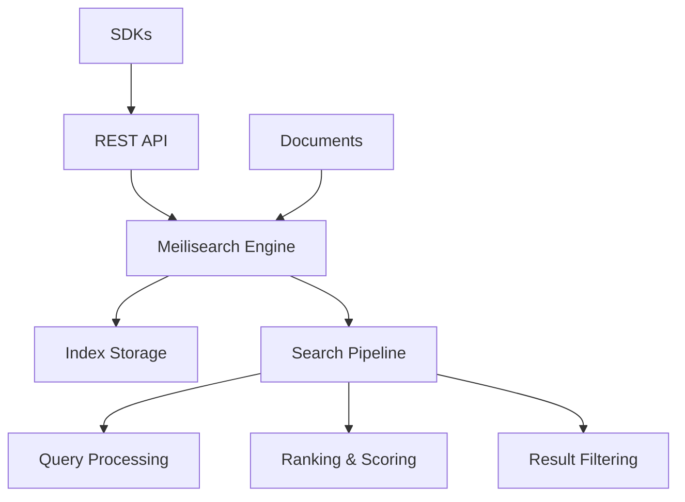

# MeiliSearch Tutorial: Lightning Fast Search Engine

> This tutorial is AI-generated! To learn more, check out [Awesome Code Docs](https://github.com/johnxie/awesome-code-docs)

[](https://github.com/meilisearch/meilisearch)
[](https://opensource.org/licenses/MIT)
[](https://github.com/meilisearch/meilisearch)


MeiliSearch<sup>[View Repo](https://github.com/meilisearch/meilisearch)</sup> is a powerful, fast, open-source search engine written in Rust. It provides instant search results with typo-tolerance, faceted search, and supports 80+ languages, making it perfect for modern applications requiring sophisticated search capabilities.

<p align="center">
  
</p>

<p align="center">
  <strong>⚡ Lightning-fast search engine with typo-tolerance and faceted search</strong>
</p>

---

## 🎯 What You'll Learn

This comprehensive tutorial will guide you through Meilisearch, a powerful search engine written in Rust that provides:

- **Instant Search Results**: Sub-millisecond response times
- **Typo-Tolerant Search**: Handles spelling mistakes automatically
- **Faceted Search**: Filter and categorize results
- **RESTful API**: Easy integration with any application
- **Real-time Indexing**: Documents are searchable immediately
- **Multi-language Support**: 80+ languages supported
- **Customizable Ranking**: Fine-tune search relevance

## 📚 Tutorial Chapters

1. **[Getting Started with Meilisearch](01-getting-started.md)** - Installation, setup, and first search
2. **[Document Management](02-document-management.md)** - Adding, updating, and deleting documents
3. **[Search Fundamentals](03-search-fundamentals.md)** - Basic and advanced search queries
4. **[Typo Tolerance & Relevance](04-typo-tolerance-relevance.md)** - Understanding search ranking and typo handling
5. **[Filtering & Facets](05-filtering-facets.md)** - Advanced filtering and faceted search
6. **[Multi-Language Support](06-multi-language-support.md)** - Internationalization and localization
7. **[API Integration](07-api-integration.md)** - REST API usage and SDK integration
8. **[Production Deployment](08-production-deployment.md)** - Scaling, monitoring, and optimization

## 🚀 Quick Start

```bash
# Install Meilisearch
curl -L https://install.meilisearch.com | sh

# Start Meilisearch
./meilisearch --master-key="your_master_key"

# Add documents via API
curl -X POST 'http://localhost:7700/indexes/movies/documents' \
  -H 'Content-Type: application/json' \
  --data-binary @movies.json

# Search
curl 'http://localhost:7700/indexes/movies/search?q=avengers'
```

## 🏗️ Architecture Overview



## 🎯 Use Cases

- **E-commerce**: Product search with filters
- **Documentation**: Technical documentation search
- **Content Management**: Blog/article search
- **Database Search**: SQL database augmentation
- **Mobile Apps**: Offline-capable search

## What's New in MeiliSearch v1.11/v1.12 (2024-2025)

> **AI-Powered Search Revolution**: Binary quantization, massive performance gains, and enhanced federated search capabilities redefine lightning-fast search.

**🤖 AI-Powered Search & Binary Quantization (v1.11):**
- 🎯 **Binary Quantization**: Converts vector embeddings to boolean values for 10x+ faster indexing with minimal relevance loss
- 📊 **Embedding Optimization**: Revolutionary approach to handling large embedding datasets
- 🔍 **Enhanced Federated Search**: Multi-source search improvements based on community feedback
- 🚀 **Performance Breakthrough**: Massive indexing speed improvements for AI-powered applications

**⚡ Revolutionary Performance (v1.12):**
- 🚀 **2x Faster Document Insertion**: Raw document indexing dramatically accelerated
- 🔄 **4x Faster Incremental Updates**: Massive improvements for large database updates and real-time sync
- ⚙️ **Advanced Index Settings**: New `facetSearch` and `prefixSearch` controls for fine-tuned performance
- 🎛️ **Flexible Configuration**: Disable unused features for maximum speed optimization
- 📈 **Scalability Enhancements**: Better handling of high-throughput indexing workloads

**🔧 Enterprise Features (2025):**
- 🏢 **Enhanced Monitoring**: Advanced metrics and observability for production deployments
- 🔐 **Security Improvements**: Enhanced access controls and audit logging
- 📊 **Analytics Dashboard**: Built-in search analytics and performance insights
- 🔄 **High Availability**: Improved clustering and failover capabilities
- 📈 **Large-Scale Support**: Better performance for massive document collections

## Learning Path

### 🟢 Beginner Track
Perfect for developers new to search engines:
1. Chapters 1-2: Setup and document management
2. Focus on getting MeiliSearch up and running

### 🟡 Intermediate Track
For developers building search applications:
1. Chapters 3-5: Search fundamentals, filtering, and facets
2. Learn advanced search features and optimization

### 🔴 Advanced Track
For production search system development:
1. Chapters 6-8: Multi-language, API integration, and production deployment
2. Master enterprise-grade search implementations

## Prerequisites

- Basic knowledge of REST APIs
- Understanding of JSON
- Familiarity with command line tools
- Basic programming concepts

## 🕐 Time Investment

- **Complete Tutorial**: 3-4 hours
- **Basic Setup**: 30 minutes
- **Advanced Features**: 2-3 hours

## 🎯 Learning Outcomes

By the end of this tutorial, you'll be able to:

- Set up and configure Meilisearch instances
- Index and manage documents effectively
- Implement advanced search features
- Integrate Meilisearch into applications
- Optimize search performance and relevance
- Deploy Meilisearch in production environments

## 🔗 Resources

- **Official Documentation**: [docs.meilisearch.com](https://docs.meilisearch.com)
- **GitHub Repository**: [github.com/meilisearch/meilisearch](https://github.com/meilisearch/meilisearch)
- **REST API Reference**: [docs.meilisearch.com/reference/api](https://docs.meilisearch.com/reference/api/)
- **SDKs**: JavaScript, Go, PHP, Python, Ruby, Swift, Java

---

*Generated by [AI Codebase Knowledge Builder](https://github.com/johnxie/awesome-code-docs)*
