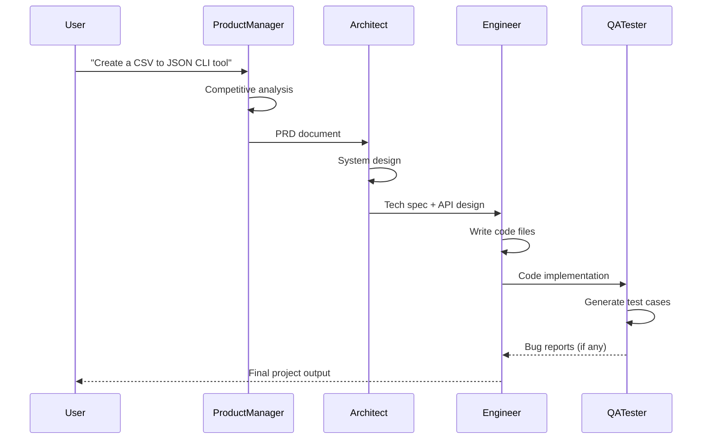
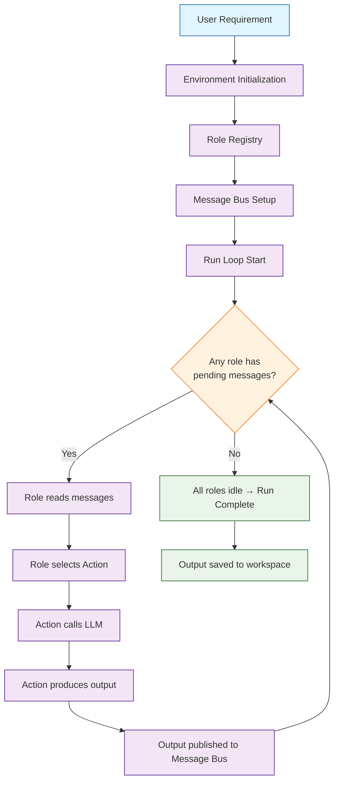

# Chapter 1: Getting Started with MetaGPT

Welcome to MetaGPT! In this chapter you will install the framework, configure it for your LLM provider, and run your first multi-agent software generation from a single requirement. By the end, you will have a working MetaGPT installation and a clear understanding of the development loop.

## What Problem Does This Solve?

Building software involves multiple roles -- product managers gather requirements, architects design systems, engineers write code, and QA testers validate correctness. Coordinating all of this manually is slow and expensive. MetaGPT automates this entire pipeline by assigning each role to a specialized AI agent that collaborates through structured workflows, turning a one-line idea into working code.

## Installing MetaGPT

### Basic Installation

```bash
# Create and activate a virtual environment
python -m venv metagpt-env
source metagpt-env/bin/activate  # On Windows: metagpt-env\Scripts\activate

# Install MetaGPT
pip install metagpt

# Or install from source for latest features
git clone https://github.com/geekan/MetaGPT.git
cd MetaGPT
pip install -e .
```

### Verifying Installation

```bash
# Check that MetaGPT is installed correctly
python -c "import metagpt; print(metagpt.__version__)"
```

## Configuration

MetaGPT uses a YAML configuration file to manage LLM providers, API keys, and runtime settings.

### Setting Up Your Configuration

```yaml
# ~/.metagpt/config2.yaml
llm:
  api_type: "openai"
  model: "gpt-4-turbo"
  base_url: "https://api.openai.com/v1"
  api_key: "sk-YOUR_API_KEY_HERE"

# Optional: cost controls
max_budget: 10.0  # Maximum spend in USD per run
```

### Environment Variables (Alternative)

```bash
# You can also configure via environment variables
export OPENAI_API_KEY="sk-YOUR_API_KEY_HERE"
export METAGPT_MODEL="gpt-4-turbo"
```

### Using Other LLM Providers

```yaml
# Example: Using Anthropic Claude
llm:
  api_type: "claude"
  model: "claude-3-opus-20240229"
  api_key: "sk-ant-YOUR_KEY_HERE"

# Example: Using a local model via Ollama
llm:
  api_type: "ollama"
  model: "llama3:70b"
  base_url: "http://localhost:11434/api"
```

## Your First Multi-Agent Run

The simplest way to use MetaGPT is to give it a product requirement and let the full team of agents handle the rest.

### From the Command Line

```bash
# Generate a complete project from a requirement
metagpt "Create a CLI tool that converts CSV files to JSON format with data validation"
```

### From Python Code

```python
import asyncio
from metagpt.software_company import generate_repo, ProjectRepo

async def main():
    """Run MetaGPT to generate a complete project."""
    repo: ProjectRepo = await generate_repo(
        idea="Create a CLI tool that converts CSV files to JSON format with data validation"
    )
    print(f"Project generated at: {repo.workdir}")

asyncio.run(main())
```

### Understanding the Output

When you run MetaGPT, it creates a structured project directory:

```
workspace/
  csv_to_json/
    docs/
      prd.md              # Product Requirements Document
      system_design.md     # Architecture design
      api_spec.md          # API specifications
    csv_to_json/
      __init__.py
      main.py              # Entry point
      converter.py         # Core conversion logic
      validator.py         # Data validation
    tests/
      test_converter.py    # Unit tests
      test_validator.py    # Validation tests
    requirements.txt       # Dependencies
```

## Understanding the Agent Pipeline

When you submit a requirement, MetaGPT orchestrates a sequence of specialized agents:



Each agent reads messages published by upstream agents, performs its specialized work, and publishes structured outputs for downstream agents. This mirrors the publish-subscribe pattern used in real software teams.

## A Simpler Example: Single Agent

You do not need to run the full pipeline every time. MetaGPT also lets you use individual roles:

```python
import asyncio
from metagpt.roles import Architect

async def main():
    """Use just the Architect agent to design a system."""
    architect = Architect()

    # Give the architect a requirement to design
    result = await architect.run(
        "Design a microservice architecture for a real-time chat application "
        "that supports 10,000 concurrent users."
    )
    print(result)

asyncio.run(main())
```

## Configuration Deep Dive

### Key Configuration Options

```yaml
# ~/.metagpt/config2.yaml - Full example
llm:
  api_type: "openai"
  model: "gpt-4-turbo"
  api_key: "sk-YOUR_KEY"
  base_url: "https://api.openai.com/v1"

# Project workspace location
workspace:
  path: "./workspace"

# Cost management
max_budget: 10.0

# Logging
log_level: "INFO"

# Code execution settings
enable_code_execution: true
```

### Verifying Your Setup

```python
import asyncio
from metagpt.config2 import Config

async def verify_setup():
    """Verify MetaGPT configuration is valid."""
    config = Config.default()
    print(f"LLM provider: {config.llm.api_type}")
    print(f"Model: {config.llm.model}")
    print(f"Max budget: {config.max_budget}")

asyncio.run(verify_setup())
```

## How It Works Under the Hood



The core engine works as an event-driven loop:

1. **Environment Initialization** -- loads configuration, sets up the LLM connection, and initializes the workspace.
2. **Role Registry** -- creates instances of each role (ProductManager, Architect, etc.) and registers them in a shared environment.
3. **Message Bus** -- all roles communicate through a centralized message bus. Each role watches for messages tagged with relevant action types.
4. **Run Loop** -- the engine repeatedly checks whether any role has pending messages to process. When a role receives a message, it selects the appropriate action, calls the LLM, and publishes the result.
5. **Completion** -- when no role has pending work, the loop terminates and results are saved.

## Common Issues and Troubleshooting

| Issue | Solution |
|-------|----------|
| `API key not found` | Check `~/.metagpt/config2.yaml` or environment variables |
| `Model not available` | Verify your API key has access to the specified model |
| `Rate limit exceeded` | Add retry configuration or reduce parallel agent count |
| `Workspace permission error` | Ensure write permissions on the workspace directory |
| `Import errors` | Verify installation with `pip show metagpt` |

## Summary

In this chapter you installed MetaGPT, configured it for your LLM provider, and ran your first multi-agent generation. You saw how a single requirement flows through ProductManager, Architect, Engineer, and QA agents to produce a complete project.

**Next:** [Chapter 2: Agent Roles](02-agent-roles.md) -- dive deep into each built-in role and learn how to customize agent behavior.

---

[Back to Tutorial Index](README.md) | [Next: Chapter 2: Agent Roles](02-agent-roles.md)
