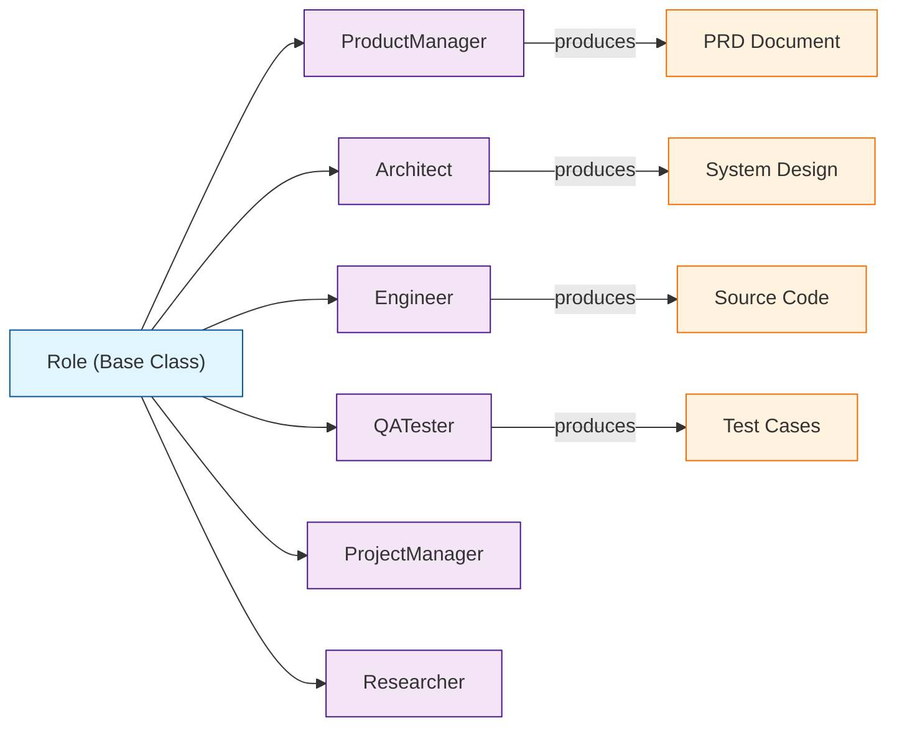
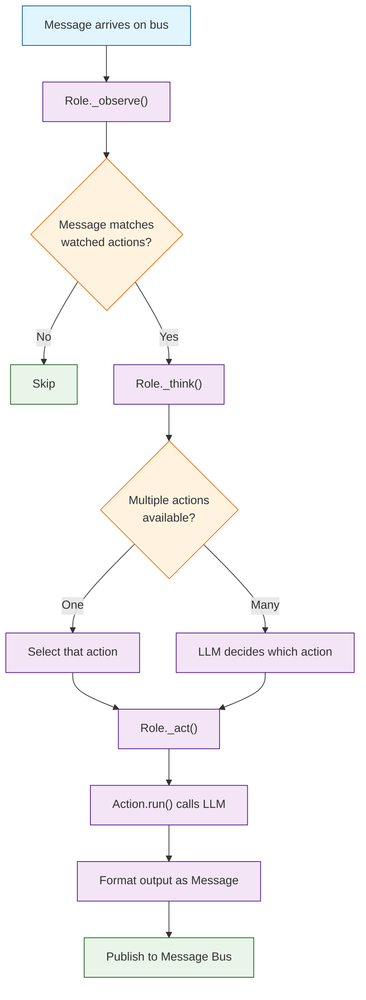

# Chapter 2: Agent Roles -- ProductManager, Architect, Engineer, and QA

In [Chapter 1](01-getting-started.md) you ran a full multi-agent pipeline. Now it is time to understand exactly what each role does, how roles are defined internally, and how to create your own custom roles.

## What Problem Does This Solve?

In a real software team, unstructured collaboration leads to chaos -- requirements drift, designs contradict implementation, and bugs slip through untested code. MetaGPT solves this by encoding each team member's responsibilities, inputs, outputs, and constraints into a formal `Role` class. Every agent knows precisely what it should do, what it should watch for, and what it should produce.

## The Built-In Role Hierarchy

MetaGPT ships with several pre-built roles that mirror a real software development team:



## The Role Base Class

Every agent in MetaGPT extends the `Role` base class. Understanding this class is essential for customization.

```python
from metagpt.roles import Role
from metagpt.actions import Action
from metagpt.schema import Message

class Role:
    """Base class for all MetaGPT roles."""

    name: str = ""           # Human-readable name
    profile: str = ""        # Role description / system prompt
    goal: str = ""           # What this role aims to achieve
    constraints: str = ""    # Behavioral constraints
    actions: list[Action] = []  # Actions this role can perform

    async def _observe(self) -> list[Message]:
        """Read new messages from the environment."""
        ...

    async def _think(self) -> Action:
        """Decide which action to take next."""
        ...

    async def _act(self) -> Message:
        """Execute the chosen action and return a result."""
        ...

    async def run(self, message: str) -> Message:
        """Full observe-think-act cycle."""
        ...
```

The three-phase cycle -- **observe**, **think**, **act** -- is the heartbeat of every role.

## ProductManager

The ProductManager is the entry point of the pipeline. It takes a raw user requirement and produces a structured Product Requirements Document (PRD).

```python
from metagpt.roles.product_manager import ProductManager

# The ProductManager's internal configuration
pm = ProductManager()
print(pm.profile)
# "You are a Product Manager focused on creating successful products..."

print(pm.goal)
# "Efficiently create a successful product that meets user needs"

print(pm.constraints)
# "Use the same language as the user requirement"
```

### What the ProductManager Produces

Given a requirement like "Build a task management app", the ProductManager generates:

- **Competitive analysis** of existing products
- **User stories** and acceptance criteria
- **Feature prioritization** using a structured format
- **PRD document** in Markdown with sections for goals, scope, and requirements

```python
import asyncio
from metagpt.roles.product_manager import ProductManager
from metagpt.schema import Message

async def run_product_manager():
    pm = ProductManager()
    result = await pm.run(Message(content="Build a real-time collaborative whiteboard app"))
    print(result.content)  # Structured PRD document

asyncio.run(run_product_manager())
```

## Architect

The Architect receives the PRD and produces a technical system design, including data models, API specifications, and technology choices.

```python
from metagpt.roles.architect import Architect

architect = Architect()
print(architect.profile)
# "You are an Architect designing robust, scalable systems..."
```

### Architect Outputs

- **System design document** with component diagrams
- **API specification** (often OpenAPI-compatible)
- **Data model definitions** including relationships
- **Technology stack recommendations**

```python
import asyncio
from metagpt.roles.architect import Architect
from metagpt.schema import Message

async def run_architect():
    architect = Architect()
    # In practice, the architect reads the PRD from the message bus
    prd_content = """
    ## Product Requirements
    - Real-time collaborative whiteboard
    - Support 100 concurrent users
    - Drawing tools: pen, shapes, text
    - Export to PNG/SVG
    """
    result = await architect.run(Message(content=prd_content))
    print(result.content)  # System design + API specs

asyncio.run(run_architect())
```

## Engineer

The Engineer takes the system design and API specs and writes actual code files. This is the most LLM-intensive role.

```python
from metagpt.roles.engineer import Engineer

engineer = Engineer()
print(engineer.goal)
# "Write elegant, readable, extensible, efficient code"

print(engineer.constraints)
# "The code should conform to standards like PEP8, be modular, "
# "easy to read and maintain..."
```

### Engineer Behavior

The Engineer role is unique because it:

1. Parses the system design to identify required files
2. Generates code for each file in dependency order
3. Handles imports and cross-file references
4. Can review and fix its own code based on QA feedback

```python
import asyncio
from metagpt.roles.engineer import Engineer
from metagpt.schema import Message

async def run_engineer():
    engineer = Engineer()
    tech_spec = """
    ## System Design
    Files to implement:
    - main.py: FastAPI entry point
    - models.py: Pydantic data models
    - services.py: Business logic layer
    - database.py: SQLite connection handling
    """
    result = await engineer.run(Message(content=tech_spec))
    print(result.content)

asyncio.run(run_engineer())
```

## QA Tester

The QA agent receives the code and generates test cases, runs them, and reports bugs back to the Engineer.

```python
from metagpt.roles.qa_engineer import QaEngineer

qa = QaEngineer()
print(qa.goal)
# "Write comprehensive and correct test cases to ensure code quality"
```

### QA Feedback Loop

```python
import asyncio
from metagpt.roles.qa_engineer import QaEngineer
from metagpt.schema import Message

async def run_qa():
    qa = QaEngineer()
    code_content = """
    ## Implementation
    File: converter.py
    ```python
    def convert_csv_to_json(csv_path: str) -> dict:
        import csv, json
        with open(csv_path) as f:
            reader = csv.DictReader(f)
            return json.dumps(list(reader))
    ```
    """
    result = await qa.run(Message(content=code_content))
    print(result.content)  # Test cases + bug reports

asyncio.run(run_qa())
```

## Creating a Custom Role

The real power of MetaGPT is building your own roles. Here is a complete example of a custom `TechnicalWriter` role:

```python
from metagpt.roles import Role
from metagpt.actions import Action
from metagpt.schema import Message

class WriteDocumentation(Action):
    """Action that generates technical documentation."""
    name: str = "WriteDocumentation"

    async def run(self, context: str) -> str:
        prompt = f"""Based on the following code and design documents,
        write comprehensive technical documentation including:
        - Overview and architecture
        - API reference
        - Usage examples
        - Configuration guide

        Context:
        {context}
        """
        return await self._aask(prompt)


class TechnicalWriter(Role):
    """A custom role that generates documentation from code."""
    name: str = "TechWriter"
    profile: str = "You are a Technical Writer who creates clear, comprehensive documentation."
    goal: str = "Produce developer-friendly documentation for the project."
    constraints: str = "Write in clear, concise English. Include code examples."

    def __init__(self, **kwargs):
        super().__init__(**kwargs)
        self.set_actions([WriteDocumentation])
        # Watch for messages from Engineer (code output)
        self._watch([Engineer])
```

### Using the Custom Role

```python
import asyncio

async def main():
    writer = TechnicalWriter()
    result = await writer.run(Message(
        content="## Code\ndef add(a, b): return a + b\ndef multiply(a, b): return a * b"
    ))
    print(result.content)

asyncio.run(main())
```

## How It Works Under the Hood



Key implementation details:

1. **Message Filtering** -- each role has a `_watch` list that determines which upstream actions it responds to. The ProductManager watches for user requirements; the Architect watches for PRD outputs.
2. **Action Selection** -- if a role has multiple actions, the `_think` step uses the LLM to decide which action to invoke based on context.
3. **Stateful Execution** -- roles maintain internal state across the observe-think-act cycle, allowing them to remember previous interactions and build on earlier outputs.
4. **Publish-Subscribe** -- all outputs are published as `Message` objects to a shared environment. Downstream roles receive only the messages they are subscribed to.

## Role Configuration Patterns

### Setting Role Constraints

```python
class StrictEngineer(Role):
    """An engineer with additional constraints."""
    name: str = "StrictEngineer"
    profile: str = "Senior Software Engineer"
    goal: str = "Write production-quality code"
    constraints: str = (
        "Always include type hints. "
        "Always add docstrings. "
        "Never use global variables. "
        "Follow SOLID principles."
    )
```

### Roles That Watch Multiple Sources

```python
class CodeReviewer(Role):
    """Reviews code from multiple engineers."""
    name: str = "CodeReviewer"
    profile: str = "Senior Code Reviewer"

    def __init__(self, **kwargs):
        super().__init__(**kwargs)
        self.set_actions([ReviewCode])
        # Watch for output from both Engineer and QA
        self._watch([Engineer, QaEngineer])
```

## Summary

Every MetaGPT agent is a `Role` with a defined profile, goal, constraints, and set of actions. The built-in roles -- ProductManager, Architect, Engineer, and QA -- form a complete software development pipeline. You can extend this by creating custom roles with their own actions and watch patterns.

**Next:** [Chapter 3: SOPs and Workflows](03-sop-and-workflows.md) -- learn how Standardized Operating Procedures govern role collaboration.

---

[Previous: Chapter 1: Getting Started](01-getting-started.md) | [Back to Tutorial Index](README.md) | [Next: Chapter 3: SOPs and Workflows](03-sop-and-workflows.md)
