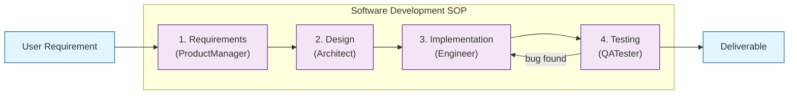
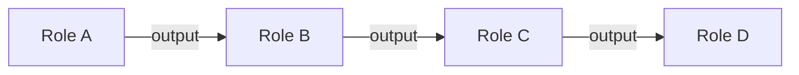
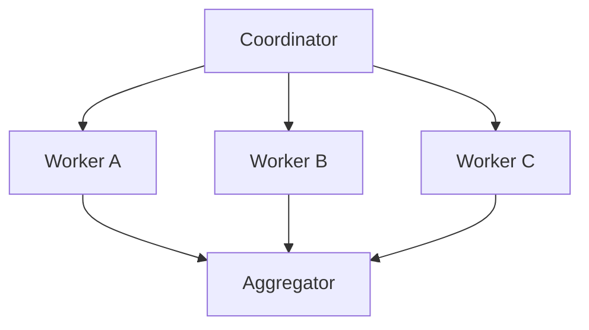
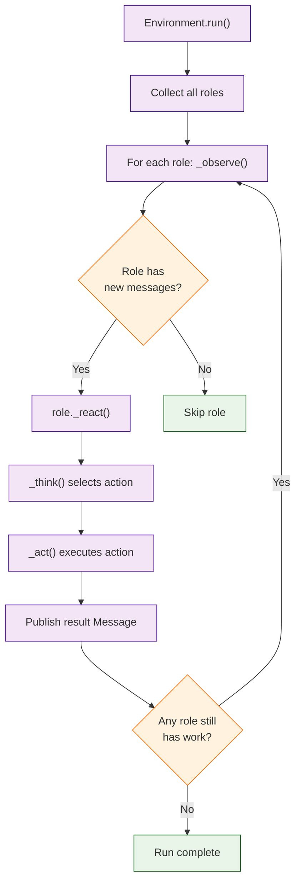

# Chapter 3: Standardized Operating Procedures and Workflows

In [Chapter 2](02-agent-roles.md) you learned about individual roles. This chapter explains how MetaGPT coordinates those roles through Standardized Operating Procedures (SOPs) -- the structured workflows that turn a collection of agents into a functioning team.

## What Problem Does This Solve?

When multiple LLM agents collaborate without structure, the result is unpredictable: agents repeat work, contradict each other, or produce outputs that do not connect. SOPs solve this by defining a deterministic sequence of handoffs, ensuring each agent receives the right input, produces the right output, and passes it to the right recipient. This is what makes MetaGPT fundamentally different from "chatbot-style" multi-agent systems.

## The SOP Concept

An SOP in MetaGPT is an implicit contract between roles. It defines:

1. **Who does what** -- which role is responsible for each phase
2. **In what order** -- the sequence of execution
3. **With what inputs** -- what each role reads from the message bus
4. **Producing what outputs** -- the structured artifact each role generates



## The Default Software Development SOP

MetaGPT's flagship SOP is the software development workflow. Here is how it works step by step:

### Phase 1: Requirements Analysis (ProductManager)

```python
from metagpt.actions.write_prd import WritePRD

# The ProductManager executes WritePRD, which:
# 1. Analyzes the user requirement
# 2. Performs competitive analysis
# 3. Identifies user personas
# 4. Defines user stories with acceptance criteria
# 5. Produces a structured PRD document
```

The PRD output follows a strict template:

```markdown
## Product Requirements Document

### Goals
- Primary goal description

### User Stories
1. As a [user type], I want to [action] so that [benefit]

### Competitive Analysis
| Product | Pros | Cons |

### Requirement Analysis
- Functional requirements
- Non-functional requirements

### UI/UX Design
- Interface guidelines
```

### Phase 2: System Design (Architect)

```python
from metagpt.actions.design_api import WriteDesign

# The Architect executes WriteDesign, which:
# 1. Reads the PRD from the message bus
# 2. Defines the system architecture
# 3. Specifies data models
# 4. Designs API endpoints
# 5. Chooses technology stack
```

### Phase 3: Implementation (Engineer)

```python
from metagpt.actions.write_code import WriteCode

# The Engineer executes WriteCode, which:
# 1. Reads system design and API spec
# 2. Identifies all files to create
# 3. Generates code in dependency order
# 4. Ensures cross-file consistency
```

### Phase 4: Testing (QATester)

```python
from metagpt.actions.write_test import WriteTest

# The QATester executes WriteTest, which:
# 1. Reads the code files
# 2. Generates unit tests for each module
# 3. Generates integration tests
# 4. Reports any issues found
```

## Implementing a Custom SOP

You can define your own SOPs by creating roles with specific watch patterns and action sequences.

### Example: Research Report SOP

```python
import asyncio
from metagpt.roles import Role
from metagpt.actions import Action
from metagpt.schema import Message
from metagpt.environment import Environment


class GatherSources(Action):
    """Gather and summarize research sources."""
    name: str = "GatherSources"

    async def run(self, context: str) -> str:
        prompt = f"""You are a research assistant. Given the topic below,
        identify 5-10 key sources, papers, or references and provide
        a brief summary of each.

        Topic: {context}
        """
        return await self._aask(prompt)


class AnalyzeFindings(Action):
    """Analyze research findings and identify patterns."""
    name: str = "AnalyzeFindings"

    async def run(self, context: str) -> str:
        prompt = f"""You are a research analyst. Based on the gathered sources
        below, identify key themes, contradictions, and insights.

        Sources:
        {context}
        """
        return await self._aask(prompt)


class WriteReport(Action):
    """Write a structured research report."""
    name: str = "WriteReport"

    async def run(self, context: str) -> str:
        prompt = f"""You are a technical writer. Based on the analysis below,
        write a comprehensive research report with:
        - Executive Summary
        - Key Findings
        - Detailed Analysis
        - Conclusions and Recommendations

        Analysis:
        {context}
        """
        return await self._aask(prompt)


class Researcher(Role):
    """Gathers sources on a topic."""
    name: str = "Researcher"
    profile: str = "Research Assistant"
    goal: str = "Find and summarize relevant sources"

    def __init__(self, **kwargs):
        super().__init__(**kwargs)
        self.set_actions([GatherSources])


class Analyst(Role):
    """Analyzes gathered research."""
    name: str = "Analyst"
    profile: str = "Research Analyst"
    goal: str = "Identify patterns and insights in research data"

    def __init__(self, **kwargs):
        super().__init__(**kwargs)
        self.set_actions([AnalyzeFindings])
        self._watch([Researcher])  # Watches Researcher output


class ReportWriter(Role):
    """Writes the final report."""
    name: str = "ReportWriter"
    profile: str = "Technical Writer"
    goal: str = "Produce a clear, comprehensive report"

    def __init__(self, **kwargs):
        super().__init__(**kwargs)
        self.set_actions([WriteReport])
        self._watch([Analyst])  # Watches Analyst output


async def run_research_sop():
    """Execute the research report SOP."""
    env = Environment()

    # Add roles to the environment
    env.add_roles([
        Researcher(),
        Analyst(),
        ReportWriter(),
    ])

    # Kick off with a research topic
    env.publish_message(Message(
        content="The impact of large language models on software engineering practices",
        role="User"
    ))

    # Run until all roles are idle
    await env.run()

asyncio.run(run_research_sop())
```

## Workflow Patterns

### Sequential Workflow (Default)

The most common pattern. Each role runs after the previous one completes.



```python
class StepOne(Role):
    def __init__(self, **kwargs):
        super().__init__(**kwargs)
        self.set_actions([ActionA])

class StepTwo(Role):
    def __init__(self, **kwargs):
        super().__init__(**kwargs)
        self.set_actions([ActionB])
        self._watch([StepOne])  # Sequential dependency

class StepThree(Role):
    def __init__(self, **kwargs):
        super().__init__(**kwargs)
        self.set_actions([ActionC])
        self._watch([StepTwo])  # Sequential dependency
```

### Fan-Out Workflow

One role's output triggers multiple parallel roles.



```python
class Coordinator(Role):
    """Publishes a task that multiple workers pick up."""
    def __init__(self, **kwargs):
        super().__init__(**kwargs)
        self.set_actions([DistributeTask])

class WorkerA(Role):
    def __init__(self, **kwargs):
        super().__init__(**kwargs)
        self.set_actions([ProcessPartA])
        self._watch([Coordinator])

class WorkerB(Role):
    def __init__(self, **kwargs):
        super().__init__(**kwargs)
        self.set_actions([ProcessPartB])
        self._watch([Coordinator])

class Aggregator(Role):
    """Collects results from all workers."""
    def __init__(self, **kwargs):
        super().__init__(**kwargs)
        self.set_actions([CombineResults])
        self._watch([WorkerA, WorkerB])  # Watches multiple roles
```

### Feedback Loop Workflow

A downstream role can send feedback to an upstream role, creating an iterative improvement loop.

```python
class Coder(Role):
    """Writes code, also handles revision requests."""
    def __init__(self, **kwargs):
        super().__init__(**kwargs)
        self.set_actions([WriteCode, ReviseCode])
        self._watch([Architect, Reviewer])  # Watches both upstream and feedback

class Reviewer(Role):
    """Reviews code and sends feedback."""
    def __init__(self, **kwargs):
        super().__init__(**kwargs)
        self.set_actions([ReviewCode])
        self._watch([Coder])
```

## How It Works Under the Hood



The SOP is enforced through the message bus and watch patterns:

1. **Message Tags** -- every message carries metadata about which action produced it. Roles use `_watch` to subscribe only to specific action types.
2. **Ordering Guarantee** -- the environment processes roles in registration order within each cycle, ensuring deterministic execution when roles have clear dependencies.
3. **Convergence** -- the run loop terminates when no role has pending messages, ensuring that feedback loops eventually stabilize.
4. **Idempotency** -- each message is processed exactly once by each watching role, preventing duplicate work.

## Customizing the Default SOP

You can modify the default software development SOP by adding, removing, or replacing roles:

```python
import asyncio
from metagpt.environment import Environment
from metagpt.roles import ProductManager, Architect, Engineer
from metagpt.schema import Message

async def custom_pipeline():
    """Run a pipeline without QA (faster, cheaper)."""
    env = Environment()
    env.add_roles([
        ProductManager(),
        Architect(),
        Engineer(),
        # QaTester omitted intentionally
    ])

    env.publish_message(Message(
        content="Build a simple URL shortener service",
        role="User"
    ))

    await env.run()

asyncio.run(custom_pipeline())
```

## Summary

SOPs are the backbone of MetaGPT's reliability. They transform unstructured multi-agent chat into a predictable, auditable pipeline. The key patterns -- sequential, fan-out, and feedback loop -- can be combined to model any team workflow. The message bus and watch mechanism enforce these patterns without requiring explicit orchestration code.

## Source Code Walkthrough

Key source files in [`geekan/MetaGPT`](https://github.com/geekan/MetaGPT):

- [`metagpt/environment/base_env.py`](https://github.com/geekan/MetaGPT/blob/main/metagpt/environment/base_env.py) -- `Environment` class: message bus (`publish_message`, `get_messages`) used by all roles
- [`metagpt/roles/role.py`](https://github.com/geekan/MetaGPT/blob/main/metagpt/roles/role.py) -- `_watch` and `_observe` methods define the SOP's implicit sequencing rules
- [`metagpt/actions/write_prd.py`](https://github.com/geekan/MetaGPT/blob/main/metagpt/actions/write_prd.py) -- example action that reads context from the environment and produces a structured artifact

**Next:** [Chapter 4: Action System](04-action-system.md) -- learn how to build the individual actions that roles execute.

---

[Previous: Chapter 2: Agent Roles](02-agent-roles.md) | [Back to Tutorial Index](README.md) | [Next: Chapter 4: Action System](04-action-system.md)
