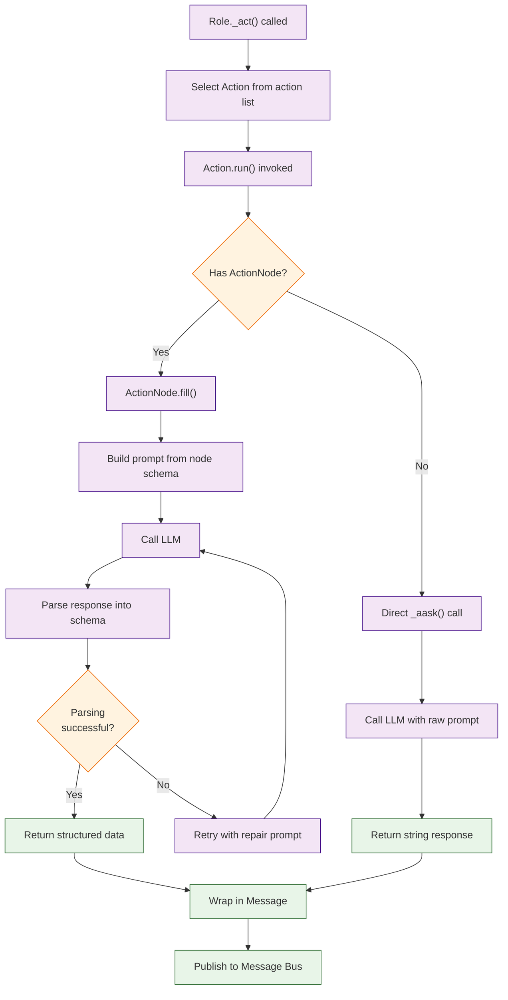

# Chapter 4: The Action System -- Actions, Action Nodes, and Custom Actions

In [Chapter 3](03-sop-and-workflows.md) you learned how SOPs coordinate roles. Now we zoom into the atomic unit of work in MetaGPT: the **Action**. Every meaningful operation -- writing a PRD, generating code, running tests -- is an Action.

## What Problem Does This Solve?

LLMs produce unstructured text by default. When building multi-agent systems, you need structured, validated outputs that downstream agents can reliably parse. The Action system solves this by providing a framework for defining prompts, parsing outputs, validating structure, and handling errors -- all in a reusable, composable way.

## The Action Base Class

Every action in MetaGPT extends the `Action` class:

```python
from metagpt.actions import Action

class Action:
    """Base class for all MetaGPT actions."""

    name: str = ""          # Unique action identifier
    node: ActionNode = None  # Optional structured output schema

    async def run(self, *args, **kwargs) -> str:
        """Execute this action. Override in subclasses."""
        ...

    async def _aask(self, prompt: str, system_msgs: list[str] = None) -> str:
        """Send a prompt to the LLM and return the response."""
        ...
```

### A Simple Custom Action

```python
from metagpt.actions import Action

class SummarizeText(Action):
    """Summarize a block of text into key points."""
    name: str = "SummarizeText"

    async def run(self, text: str) -> str:
        prompt = f"""Summarize the following text into 3-5 bullet points.
        Be concise and focus on the most important information.

        Text:
        {text}
        """
        result = await self._aask(prompt)
        return result
```

### Using the Action

```python
import asyncio

async def main():
    action = SummarizeText()
    summary = await action.run(
        "MetaGPT is a multi-agent framework that assigns GPT agents "
        "to different software development roles. It uses standardized "
        "operating procedures to coordinate agents, producing structured "
        "outputs like PRDs, system designs, and tested code from a single "
        "requirement."
    )
    print(summary)

asyncio.run(main())
```

## Action Nodes: Structured Output

Action Nodes are MetaGPT's mechanism for enforcing structured output from LLMs. Instead of free-form text, you define an output schema and the framework ensures the LLM's response conforms to it.

### Defining an Action Node

```python
from metagpt.actions.action_node import ActionNode

# Define a structured output schema
REVIEW_NODE = ActionNode(
    key="CodeReview",
    expected_type=str,
    instruction="Review the code and provide structured feedback",
    example="",
    schema="""
    {
        "summary": "Brief overview of code quality",
        "issues": [
            {
                "severity": "high|medium|low",
                "file": "filename.py",
                "line": 42,
                "description": "What is wrong",
                "suggestion": "How to fix it"
            }
        ],
        "score": 0-10,
        "approved": true/false
    }
    """
)
```

### Composing Action Nodes

Action Nodes can be composed into trees for complex structured outputs:

```python
from metagpt.actions.action_node import ActionNode

# Individual leaf nodes
GOAL_NODE = ActionNode(
    key="goal",
    expected_type=str,
    instruction="Describe the primary goal of the product",
    example="Create a fast, user-friendly URL shortener"
)

USER_STORIES_NODE = ActionNode(
    key="user_stories",
    expected_type=list[str],
    instruction="List 3-5 user stories in standard format",
    example=[
        "As a user, I want to shorten URLs so I can share them easily",
        "As an admin, I want analytics so I can track link usage"
    ]
)

REQUIREMENTS_NODE = ActionNode(
    key="requirements",
    expected_type=list[str],
    instruction="List functional and non-functional requirements",
    example=["Support custom short URLs", "Handle 1000 requests/second"]
)

# Compose into a parent node
PRD_NODE = ActionNode(
    key="prd",
    expected_type=str,
    instruction="Generate a complete Product Requirements Document",
    example="",
    children=[GOAL_NODE, USER_STORIES_NODE, REQUIREMENTS_NODE]
)
```

### Using Action Nodes in an Action

```python
from metagpt.actions import Action
from metagpt.actions.action_node import ActionNode

ANALYSIS_NODE = ActionNode(
    key="analysis",
    expected_type=dict,
    instruction="Analyze the given topic",
    example={"summary": "...", "key_points": ["..."], "confidence": 0.9}
)

class StructuredAnalysis(Action):
    """An action that produces structured output using ActionNode."""
    name: str = "StructuredAnalysis"
    node: ActionNode = ANALYSIS_NODE

    async def run(self, topic: str) -> dict:
        # fill() calls the LLM and parses the response into the node schema
        result = await self.node.fill(
            context=topic,
            llm=self.llm
        )
        return result.instruct_content.model_dump()
```

```python
import asyncio

async def main():
    action = StructuredAnalysis()
    result = await action.run("The future of WebAssembly in server-side computing")
    print(result)
    # {"summary": "...", "key_points": [...], "confidence": 0.85}

asyncio.run(main())
```

## Built-In Actions

MetaGPT ships with several production-quality actions:

| Action | Used By | Output |
|--------|---------|--------|
| `WritePRD` | ProductManager | Product Requirements Document |
| `WriteDesign` | Architect | System design + API spec |
| `WriteCode` | Engineer | Source code files |
| `WriteTest` | QaTester | Test cases |
| `WriteCodeReview` | Engineer | Code review feedback |
| `DebugError` | Engineer | Bug fix suggestions |
| `RunCode` | Engineer | Code execution results |
| `SearchAndSummarize` | Researcher | Research summaries |

### Examining a Built-In Action

```python
from metagpt.actions.write_prd import WritePRD

# WritePRD uses Action Nodes internally
prd_action = WritePRD()
print(prd_action.name)  # "WritePRD"

# It defines structured output for:
# - Product goals
# - User stories
# - Competitive analysis
# - Requirements specification
```

## Advanced Action Patterns

### Actions with Validation

```python
import json
from metagpt.actions import Action

class GenerateConfig(Action):
    """Generate and validate a configuration file."""
    name: str = "GenerateConfig"

    async def run(self, requirements: str) -> dict:
        prompt = f"""Generate a JSON configuration based on these requirements:
        {requirements}

        Return ONLY valid JSON.
        """
        for attempt in range(3):
            response = await self._aask(prompt)
            try:
                # Strip markdown code fences if present
                clean = response.strip().strip("```json").strip("```").strip()
                config = json.loads(clean)
                return config
            except json.JSONDecodeError:
                if attempt < 2:
                    prompt = f"Your previous response was not valid JSON. Try again:\n{prompt}"
                else:
                    raise ValueError("Failed to generate valid JSON after 3 attempts")
```

### Actions with Multi-Step Prompting

```python
from metagpt.actions import Action

class DesignDatabase(Action):
    """Multi-step action: first analyze, then design schema."""
    name: str = "DesignDatabase"

    async def run(self, requirements: str) -> str:
        # Step 1: Analyze data requirements
        analysis = await self._aask(
            f"Analyze the data requirements for:\n{requirements}\n"
            "List all entities, their attributes, and relationships."
        )

        # Step 2: Generate schema based on analysis
        schema = await self._aask(
            f"Based on this data analysis:\n{analysis}\n"
            "Generate a complete SQL CREATE TABLE schema with "
            "proper types, constraints, and foreign keys."
        )

        # Step 3: Generate ORM models
        models = await self._aask(
            f"Based on this SQL schema:\n{schema}\n"
            "Generate SQLAlchemy ORM models in Python."
        )

        return f"## Data Analysis\n{analysis}\n\n## SQL Schema\n{schema}\n\n## ORM Models\n{models}"
```

### Actions with Context from Previous Actions

```python
from metagpt.actions import Action
from metagpt.schema import Message

class RefineDesign(Action):
    """Refine a design based on feedback from multiple sources."""
    name: str = "RefineDesign"

    async def run(self, messages: list[Message]) -> str:
        # Collect context from multiple upstream messages
        original_design = ""
        feedback_items = []

        for msg in messages:
            if "design" in msg.cause_by.lower():
                original_design = msg.content
            elif "review" in msg.cause_by.lower():
                feedback_items.append(msg.content)

        prompt = f"""Original design:
        {original_design}

        Feedback received:
        {chr(10).join(feedback_items)}

        Produce a revised design that addresses all feedback points.
        """
        return await self._aask(prompt)
```

## How It Works Under the Hood



Key internals:

1. **Prompt Construction** -- Action Nodes automatically build prompts that include the expected output schema, examples, and instructions. This dramatically improves output quality compared to free-form prompts.
2. **Output Parsing** -- the framework attempts to parse the LLM response into the declared schema. For JSON schemas, it uses structured extraction. For text schemas, it uses pattern matching.
3. **Retry Logic** -- if parsing fails, the framework sends a "repair" prompt that includes the original response and the parsing error, asking the LLM to fix its output.
4. **LLM Abstraction** -- `_aask()` abstracts over different LLM providers, handling API calls, rate limiting, and token management transparently.

## Registering Actions with Roles

```python
from metagpt.roles import Role

class DataPipelineBuilder(Role):
    """A role that builds data pipelines through multiple actions."""
    name: str = "DataPipelineBuilder"
    profile: str = "Data Engineer"

    def __init__(self, **kwargs):
        super().__init__(**kwargs)
        # Register multiple actions -- the role will select the appropriate one
        self.set_actions([
            DesignDatabase,
            GenerateConfig,
            WriteCode,  # reuse built-in
        ])
```

## Summary

Actions are the building blocks of everything agents do in MetaGPT. Simple actions use `_aask()` for free-form LLM calls. Action Nodes enforce structured output through schemas, automatic parsing, and retry logic. You can compose nodes into trees, chain actions into multi-step workflows, and add validation logic for reliability.

**Next:** [Chapter 5: Memory and Context](05-memory-and-context.md) -- learn how agents remember and share information.

---

[Previous: Chapter 3: SOPs and Workflows](03-sop-and-workflows.md) | [Back to Tutorial Index](README.md) | [Next: Chapter 5: Memory and Context](05-memory-and-context.md)
