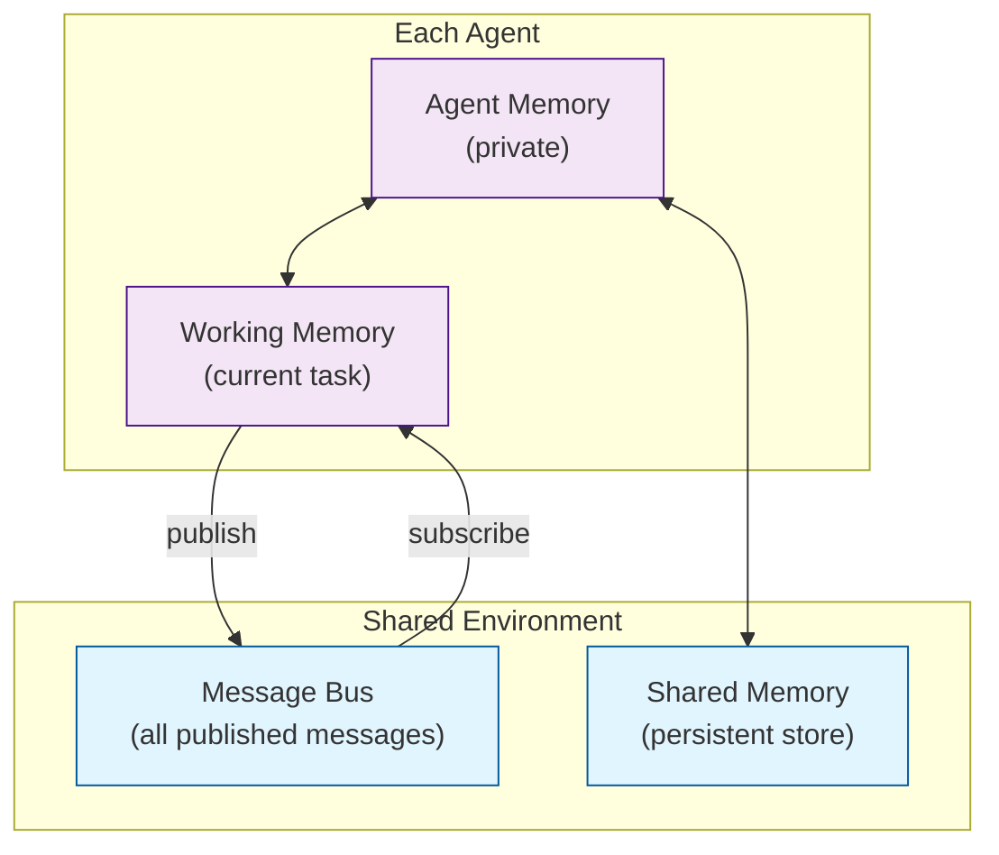
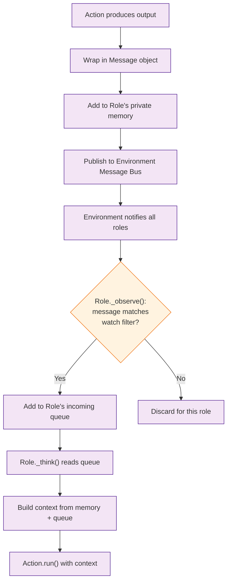

# Chapter 5: Memory and Context -- How Agents Remember and Share Information

In [Chapter 4](04-action-system.md) you learned how Actions produce outputs. This chapter covers how those outputs are stored, retrieved, and shared across agents through MetaGPT's memory system.

## What Problem Does This Solve?

LLMs are stateless -- each API call starts with no memory of previous interactions. In a multi-agent system, this is a critical problem: the Engineer needs to remember the Architect's design, the QA agent needs access to the code, and iterative refinement requires remembering feedback from previous rounds. MetaGPT's memory system provides persistent, queryable context that agents can read from and write to.

## Memory Architecture Overview



MetaGPT has three levels of memory:

1. **Agent Memory** -- private to each role, stores that role's history of actions and observations
2. **Working Memory** -- the active context for the current task, built from relevant messages
3. **Shared Memory / Message Bus** -- the environment-level store where all published messages are accessible to watching roles

## Agent Memory

Each role maintains its own memory of past interactions:

```python
from metagpt.roles import Role
from metagpt.schema import Message

class MemoryAwareRole(Role):
    """A role that uses its memory for decision-making."""
    name: str = "MemoryAwareRole"
    profile: str = "An agent that remembers"

    async def _act(self) -> Message:
        # Access this role's message history
        memories = self.rc.memory.get()

        # Get the most recent messages
        recent = self.rc.memory.get(k=5)  # Last 5 messages

        # Search memory by keyword
        relevant = self.rc.memory.get_by_keyword("database")

        # Build context from memory
        context = "\n".join([m.content for m in relevant])

        result = await self._aask(
            f"Based on your previous work:\n{context}\n\n"
            "Continue with the next step."
        )
        return Message(content=result, role=self.name)
```

### Memory Storage Operations

```python
from metagpt.memory import Memory
from metagpt.schema import Message

# Create a memory instance
memory = Memory()

# Add messages to memory
memory.add(Message(content="User wants a REST API", role="User"))
memory.add(Message(content="Design: FastAPI with SQLite", role="Architect"))
memory.add(Message(content="Code: main.py implemented", role="Engineer"))

# Retrieve all messages
all_msgs = memory.get()
print(f"Total messages: {len(all_msgs)}")

# Retrieve last k messages
recent = memory.get(k=2)

# Get messages by role
architect_msgs = [m for m in memory.get() if m.role == "Architect"]

# Count messages
print(f"Memory size: {memory.count()}")

# Clear memory
memory.clear()
```

## The Message Bus

The message bus is the primary mechanism for inter-agent communication. Messages flow through it automatically based on the watch patterns defined in [Chapter 3](03-sop-and-workflows.md).

### Message Structure

```python
from metagpt.schema import Message

# A message carries content, metadata, and routing information
msg = Message(
    content="The system should use PostgreSQL for persistence",
    role="Architect",                  # Who sent it
    cause_by="WriteDesign",           # Which action produced it
    sent_from="Architect",            # Source role
    send_to=["Engineer", "QaTester"], # Target roles (optional)
)
```

### Publishing and Subscribing

```python
from metagpt.environment import Environment
from metagpt.schema import Message

env = Environment()

# Publish a message to the bus
env.publish_message(Message(
    content="Build a todo app",
    role="User",
    cause_by="UserRequirement"
))

# Roles receive messages automatically through _observe()
# The filtering is based on _watch patterns set during __init__
```

## Context Window Management

LLMs have finite context windows. MetaGPT provides strategies for managing what goes into each prompt.

### Automatic Context Compression

```python
from metagpt.roles import Role
from metagpt.schema import Message

class ContextAwareRole(Role):
    """Demonstrates context window management."""
    name: str = "ContextAwareRole"

    async def _act(self) -> Message:
        # Get all available messages
        all_messages = self.rc.memory.get()

        # Strategy 1: Use only the most recent messages
        recent_context = self.rc.memory.get(k=10)

        # Strategy 2: Summarize older messages, keep recent ones detailed
        if len(all_messages) > 20:
            old_messages = all_messages[:-10]
            old_summary = await self._aask(
                f"Summarize these messages in 200 words:\n"
                + "\n".join([m.content[:200] for m in old_messages])
            )
            recent_messages = all_messages[-10:]
            context = f"Previous context (summary):\n{old_summary}\n\n"
            context += "Recent messages:\n"
            context += "\n".join([m.content for m in recent_messages])
        else:
            context = "\n".join([m.content for m in all_messages])

        result = await self._aask(f"Context:\n{context}\n\nContinue the task.")
        return Message(content=result, role=self.name)
```

### Selective Context Building

```python
from metagpt.roles import Role
from metagpt.schema import Message

class SelectiveReader(Role):
    """Reads only relevant parts of the message history."""
    name: str = "SelectiveReader"

    async def _act(self) -> Message:
        memories = self.rc.memory.get()

        # Filter by action type -- only read design documents
        design_docs = [
            m for m in memories
            if m.cause_by and "Design" in m.cause_by
        ]

        # Filter by role -- only read architect outputs
        architect_outputs = [
            m for m in memories
            if m.role == "Architect"
        ]

        context = "\n---\n".join([m.content for m in design_docs])
        result = await self._aask(
            f"Based on the design documents:\n{context}\n\n"
            "Implement the described system."
        )
        return Message(content=result, role=self.name)
```

## Shared Context Between Agents

Sometimes agents need to share structured state beyond simple messages.

### Using a Shared Data Store

```python
import asyncio
from metagpt.roles import Role
from metagpt.actions import Action
from metagpt.schema import Message
from metagpt.environment import Environment

# A simple shared state that all roles can access
class SharedState:
    """Thread-safe shared state for multi-agent collaboration."""
    def __init__(self):
        self._data = {}

    def set(self, key: str, value) -> None:
        self._data[key] = value

    def get(self, key: str, default=None):
        return self._data.get(key, default)

    def get_all(self) -> dict:
        return dict(self._data)


class ContextProducer(Role):
    """Writes data to shared context."""
    name: str = "Producer"
    shared_state: SharedState = None

    async def _act(self) -> Message:
        # Store structured data for other agents
        self.shared_state.set("database_type", "PostgreSQL")
        self.shared_state.set("api_framework", "FastAPI")
        self.shared_state.set("auth_method", "JWT")

        return Message(
            content="Technology choices recorded in shared state",
            role=self.name
        )


class ContextConsumer(Role):
    """Reads data from shared context."""
    name: str = "Consumer"
    shared_state: SharedState = None

    async def _act(self) -> Message:
        # Read structured data from other agents
        db = self.shared_state.get("database_type")
        framework = self.shared_state.get("api_framework")

        result = await self._aask(
            f"Generate code using {framework} with {db} as the database."
        )
        return Message(content=result, role=self.name)


async def main():
    state = SharedState()
    env = Environment()
    env.add_roles([
        ContextProducer(shared_state=state),
        ContextConsumer(shared_state=state),
    ])
    env.publish_message(Message(content="Start", role="User"))
    await env.run()

asyncio.run(main())
```

## Long-Term Memory with Vector Storage

For complex projects, MetaGPT supports vector-based memory for semantic retrieval:

```python
from metagpt.memory import Memory
from metagpt.schema import Message

class VectorMemoryRole(Role):
    """Uses vector similarity for memory retrieval."""
    name: str = "VectorMemoryRole"

    async def _act(self) -> Message:
        # Store messages with embeddings
        self.rc.memory.add(Message(
            content="The authentication system uses OAuth 2.0 with PKCE flow",
            role="Architect"
        ))
        self.rc.memory.add(Message(
            content="Database uses PostgreSQL with connection pooling via asyncpg",
            role="Architect"
        ))
        self.rc.memory.add(Message(
            content="Frontend uses React with TypeScript and TailwindCSS",
            role="Architect"
        ))

        # Semantic search -- find messages related to a query
        query = "How does the user login process work?"
        relevant = self.rc.memory.get_by_keyword("authentication")

        context = "\n".join([m.content for m in relevant])
        result = await self._aask(
            f"Based on this context:\n{context}\n\n"
            f"Answer: {query}"
        )
        return Message(content=result, role=self.name)
```

## How It Works Under the Hood



Memory internals:

1. **Append-Only Log** -- agent memory is an append-only list of Messages. This preserves the full history and ensures consistency.
2. **Message Deduplication** -- the environment tracks which messages each role has already processed, preventing double-handling.
3. **Context Budget** -- roles track available token budget and truncate or summarize older context when approaching limits.
4. **Serialization** -- memory can be serialized to disk, allowing checkpointing and resumption of long-running pipelines.

## Persisting Memory Across Sessions

```python
import json
from metagpt.memory import Memory
from metagpt.schema import Message

def save_memory(memory: Memory, path: str):
    """Save memory to a JSON file."""
    messages = memory.get()
    data = [{"content": m.content, "role": m.role, "cause_by": m.cause_by}
            for m in messages]
    with open(path, "w") as f:
        json.dump(data, f, indent=2)

def load_memory(path: str) -> Memory:
    """Load memory from a JSON file."""
    memory = Memory()
    with open(path) as f:
        data = json.load(f)
    for item in data:
        memory.add(Message(**item))
    return memory
```

## Summary

MetaGPT's memory system operates at three levels: private agent memory, working memory for the current task, and the shared message bus. Messages carry routing metadata that enables the watch/subscribe pattern. For large projects, context window management through summarization and selective retrieval keeps prompts focused and efficient. Vector-based memory enables semantic search when keyword matching is insufficient.

## Source Code Walkthrough

Key source files in [`geekan/MetaGPT`](https://github.com/geekan/MetaGPT):

- [`metagpt/memory/memory.py`](https://github.com/geekan/MetaGPT/blob/main/metagpt/memory/memory.py) -- `Memory` class: stores messages; `get_by_actions()` for selective retrieval
- [`metagpt/schema.py`](https://github.com/geekan/MetaGPT/blob/main/metagpt/schema.py) -- `Message` dataclass with `role`, `content`, `cause_by`, and `sent_to` routing fields
- [`metagpt/environment/base_env.py`](https://github.com/geekan/MetaGPT/blob/main/metagpt/environment/base_env.py) -- shared `history` list acts as the global message bus accessible to all roles

**Next:** [Chapter 6: Tool Integration](06-tool-integration.md) -- give your agents access to the outside world.

---

[Previous: Chapter 4: Action System](04-action-system.md) | [Back to Tutorial Index](README.md) | [Next: Chapter 6: Tool Integration](06-tool-integration.md)
