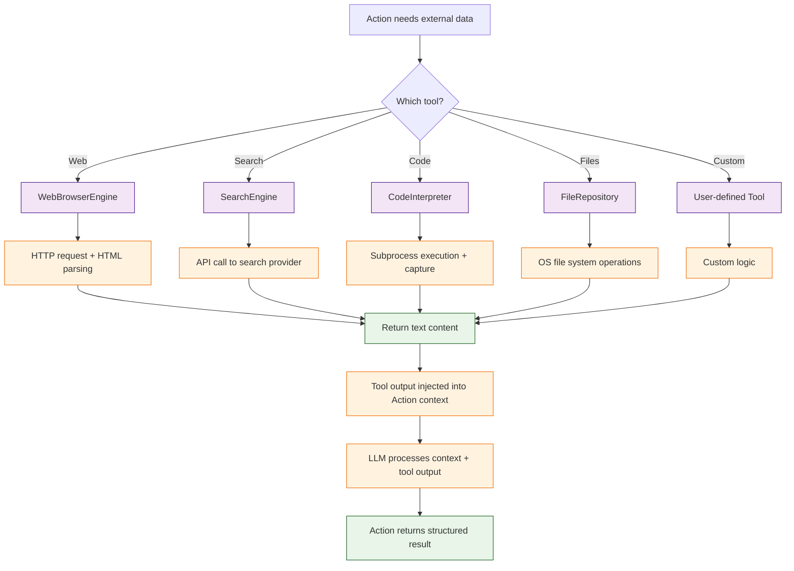

# Chapter 6: Tool Integration -- Web Browsing, Code Execution, and Custom Tools

In [Chapter 5](05-memory-and-context.md) you learned how agents share information through memory. This chapter covers how agents interact with the outside world through tools -- web search, code execution, file I/O, and custom integrations.

## What Problem Does This Solve?

LLMs can reason about problems but cannot act on the world by default. An agent that needs to verify its code compiles, look up current API documentation, or query a database requires tools. MetaGPT's tool system provides a standardized way to give agents these capabilities while maintaining the structured SOP workflow.

## Built-In Tools Overview

MetaGPT includes several ready-to-use tools:

| Tool | Purpose | Requires |
|------|---------|----------|
| `WebBrowserEngine` | Browse and extract content from web pages | Browser dependency |
| `SearchEngine` | Search the web via Google/Bing/SerpAPI | API key |
| `CodeInterpreter` | Execute Python code in a sandbox | None |
| `FileRepository` | Read/write files in the workspace | None |
| `Terminal` | Run shell commands | None |

## Web Browsing

### Basic Web Page Reading

```python
import asyncio
from metagpt.tools.web_browser_engine import WebBrowserEngine

async def browse_web():
    """Fetch and parse a web page."""
    browser = WebBrowserEngine()

    # Fetch a page and extract its content
    result = await browser.run("https://docs.python.org/3/library/asyncio.html")
    print(result)  # Cleaned text content of the page

asyncio.run(browse_web())
```

### Using Web Browsing in an Action

```python
from metagpt.actions import Action
from metagpt.tools.web_browser_engine import WebBrowserEngine

class ResearchAction(Action):
    """An action that researches a topic using web browsing."""
    name: str = "ResearchAction"

    async def run(self, topic: str) -> str:
        browser = WebBrowserEngine()

        # Step 1: Search for the topic
        search_results = await browser.run(
            f"https://www.google.com/search?q={topic.replace(' ', '+')}"
        )

        # Step 2: Ask LLM to extract relevant URLs
        urls = await self._aask(
            f"From these search results, list the 3 most relevant URLs:\n{search_results}"
        )

        # Step 3: Read each URL
        contents = []
        for url in urls.strip().split("\n")[:3]:
            url = url.strip()
            if url.startswith("http"):
                try:
                    content = await browser.run(url)
                    contents.append(content[:2000])  # Limit per page
                except Exception as e:
                    contents.append(f"Failed to read {url}: {e}")

        # Step 4: Synthesize findings
        all_content = "\n---\n".join(contents)
        summary = await self._aask(
            f"Synthesize these sources into a research summary on '{topic}':\n{all_content}"
        )
        return summary
```

## Search Engine Integration

```python
import asyncio
from metagpt.tools.search_engine import SearchEngine

async def search_example():
    """Search the web and return structured results."""
    # Configure with your preferred search provider
    engine = SearchEngine(engine="serpapi")  # or "google", "bing"

    results = await engine.run("MetaGPT multi-agent framework tutorial")
    for result in results:
        print(f"Title: {result['title']}")
        print(f"URL: {result['url']}")
        print(f"Snippet: {result['snippet']}")
        print("---")

asyncio.run(search_example())
```

### Search in a Role

```python
from metagpt.roles import Role
from metagpt.actions import Action
from metagpt.tools.search_engine import SearchEngine
from metagpt.schema import Message

class WebSearch(Action):
    """Search the web for information."""
    name: str = "WebSearch"

    async def run(self, query: str) -> str:
        engine = SearchEngine(engine="serpapi")
        results = await engine.run(query)
        formatted = "\n".join([
            f"- [{r['title']}]({r['url']}): {r['snippet']}"
            for r in results[:5]
        ])
        return f"## Search Results for: {query}\n\n{formatted}"


class ResearchAssistant(Role):
    """A role that can search the web to answer questions."""
    name: str = "ResearchAssistant"
    profile: str = "Web Research Specialist"
    goal: str = "Find accurate, up-to-date information from the web"

    def __init__(self, **kwargs):
        super().__init__(**kwargs)
        self.set_actions([WebSearch])
```

## Code Execution

MetaGPT can execute code to verify implementations, run tests, or perform computations.

### Basic Code Execution

```python
import asyncio
from metagpt.actions import Action

class ExecuteAndVerify(Action):
    """Write code and verify it runs correctly."""
    name: str = "ExecuteAndVerify"

    async def run(self, requirement: str) -> str:
        # Step 1: Generate code
        code = await self._aask(
            f"Write a Python function for: {requirement}\n"
            "Include a main block that demonstrates usage."
        )

        # Step 2: Extract code from response
        if "```python" in code:
            code = code.split("```python")[1].split("```")[0]

        # Step 3: Execute code
        try:
            exec_globals = {}
            exec(code, exec_globals)
            return f"Code executed successfully.\n\n```python\n{code}\n```"
        except Exception as e:
            # Step 4: Fix the code based on the error
            fixed_code = await self._aask(
                f"This code produced an error:\n```python\n{code}\n```\n"
                f"Error: {e}\n\nFix the code."
            )
            return f"Original had error: {e}\n\nFixed code:\n{fixed_code}"
```

### Sandboxed Code Interpreter

For safer execution, MetaGPT provides a sandboxed code interpreter:

```python
import asyncio
from metagpt.actions import Action

class SafeCodeRunner(Action):
    """Run code in a sandboxed environment."""
    name: str = "SafeCodeRunner"

    async def run(self, code: str) -> str:
        from metagpt.utils.code_parser import CodeParser

        # Parse code blocks from LLM output
        parsed = CodeParser.parse_code(block="", text=code)

        # Execute in isolated subprocess
        import subprocess
        result = subprocess.run(
            ["python", "-c", parsed],
            capture_output=True,
            text=True,
            timeout=30  # 30-second timeout
        )

        if result.returncode == 0:
            return f"Output:\n{result.stdout}"
        else:
            return f"Error:\n{result.stderr}"
```

## File System Tools

### Working with the Workspace

```python
from metagpt.utils.file_repository import FileRepository

async def file_operations():
    """Demonstrate file system operations."""
    repo = FileRepository(root="./workspace/my_project")

    # Write a file
    await repo.save(filename="main.py", content="""
import sys

def main():
    print("Hello from MetaGPT!")
    return 0

if __name__ == "__main__":
    sys.exit(main())
""")

    # Read a file
    content = await repo.get(filename="main.py")
    print(content)

    # List all files
    files = repo.all_files
    print(f"Files in project: {files}")

    # Check if file exists
    exists = repo.exists(filename="main.py")
    print(f"main.py exists: {exists}")
```

## Building Custom Tools

You can create your own tools and integrate them into actions and roles.

### Example: Database Query Tool

```python
import sqlite3
from metagpt.actions import Action

class DatabaseTool:
    """A tool for querying SQLite databases."""

    def __init__(self, db_path: str):
        self.db_path = db_path

    def query(self, sql: str) -> list[dict]:
        conn = sqlite3.connect(self.db_path)
        conn.row_factory = sqlite3.Row
        cursor = conn.cursor()
        cursor.execute(sql)
        results = [dict(row) for row in cursor.fetchall()]
        conn.close()
        return results

    def execute(self, sql: str) -> int:
        conn = sqlite3.connect(self.db_path)
        cursor = conn.cursor()
        cursor.execute(sql)
        conn.commit()
        affected = cursor.rowcount
        conn.close()
        return affected


class QueryDatabase(Action):
    """Action that queries a database based on natural language."""
    name: str = "QueryDatabase"

    async def run(self, question: str, db_path: str) -> str:
        tool = DatabaseTool(db_path)

        # Get schema information
        tables = tool.query(
            "SELECT name FROM sqlite_master WHERE type='table'"
        )
        schema_info = []
        for table in tables:
            cols = tool.query(f"PRAGMA table_info({table['name']})")
            schema_info.append(f"Table {table['name']}: {cols}")

        # Generate SQL from natural language
        sql = await self._aask(
            f"Database schema:\n{schema_info}\n\n"
            f"Question: {question}\n\n"
            "Generate a SQL query to answer the question. "
            "Return ONLY the SQL, no explanation."
        )

        # Execute and return results
        sql = sql.strip().strip("```sql").strip("```").strip()
        results = tool.query(sql)
        return f"Query: {sql}\n\nResults ({len(results)} rows):\n{results}"
```

### Example: REST API Tool

```python
import aiohttp
from metagpt.actions import Action

class APITool:
    """A tool for making REST API calls."""

    def __init__(self, base_url: str, headers: dict = None):
        self.base_url = base_url.rstrip("/")
        self.headers = headers or {}

    async def get(self, endpoint: str, params: dict = None) -> dict:
        async with aiohttp.ClientSession() as session:
            async with session.get(
                f"{self.base_url}/{endpoint}",
                params=params,
                headers=self.headers
            ) as resp:
                return await resp.json()

    async def post(self, endpoint: str, data: dict = None) -> dict:
        async with aiohttp.ClientSession() as session:
            async with session.post(
                f"{self.base_url}/{endpoint}",
                json=data,
                headers=self.headers
            ) as resp:
                return await resp.json()


class FetchAPIData(Action):
    """Fetch data from an API and analyze it."""
    name: str = "FetchAPIData"

    async def run(self, api_url: str, question: str) -> str:
        tool = APITool(base_url=api_url)

        # Fetch data
        data = await tool.get("")

        # Analyze with LLM
        analysis = await self._aask(
            f"API Response:\n{data}\n\n"
            f"Question: {question}\n\n"
            "Provide a detailed answer based on the API data."
        )
        return analysis
```

## How It Works Under the Hood



Tool integration details:

1. **Lazy Initialization** -- tools are instantiated only when an action needs them, avoiding unnecessary resource allocation.
2. **Error Isolation** -- tool failures are caught and reported to the LLM as context, allowing the agent to adapt or retry with different parameters.
3. **Output Truncation** -- web content and large API responses are automatically truncated to fit within the LLM's context window.
4. **Async by Default** -- all tool interfaces are async, enabling parallel tool calls when an action needs data from multiple sources.

## Summary

MetaGPT tools bridge the gap between LLM reasoning and real-world action. Built-in tools cover web browsing, search, code execution, and file management. Custom tools follow a simple pattern: create a tool class with the integration logic, then use it inside an Action. The framework handles error isolation, output truncation, and async execution.

**Next:** [Chapter 7: Multi-Agent Orchestration](07-multi-agent-orchestration.md) -- compose agents into sophisticated teams.

---

[Previous: Chapter 5: Memory and Context](05-memory-and-context.md) | [Back to Tutorial Index](README.md) | [Next: Chapter 7: Multi-Agent Orchestration](07-multi-agent-orchestration.md)
