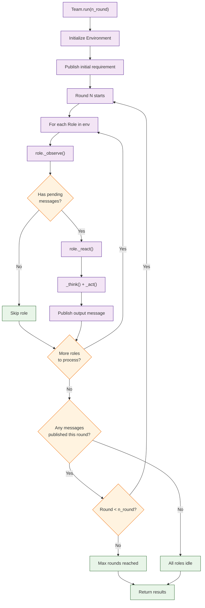

# Chapter 7: Multi-Agent Orchestration -- Team Composition, Task Decomposition, and Parallel Execution

In [Chapter 6](06-tool-integration.md) you gave agents access to external tools. This chapter covers how to compose multiple agents into coordinated teams, decompose complex tasks, and leverage parallel execution for efficiency.

## What Problem Does This Solve?

A single agent can handle simple tasks, but real-world problems require multiple specialists working together. You need to decide which agents to include, how to decompose the task, whether agents should run sequentially or in parallel, and how to aggregate their outputs. MetaGPT's orchestration layer handles all of this through the Environment and Team abstractions.

## Team Composition

### The Team Class

MetaGPT's `Team` class is the top-level orchestrator that manages roles and their interactions:

```python
import asyncio
from metagpt.team import Team
from metagpt.roles import ProductManager, Architect, Engineer

async def build_software_team():
    """Create and run a standard software development team."""
    team = Team()

    # Add roles to the team
    team.hire([
        ProductManager(),
        Architect(),
        Engineer(),
    ])

    # Set the initial requirement
    team.run_project(
        "Build a REST API for a bookstore with CRUD operations, "
        "user authentication, and search functionality"
    )

    # Execute the team workflow
    await team.run(n_round=10)  # Max 10 communication rounds

asyncio.run(build_software_team())
```

### Custom Team Compositions

You can mix built-in and custom roles to create specialized teams:

```python
import asyncio
from metagpt.team import Team
from metagpt.roles import Role, ProductManager, Engineer
from metagpt.actions import Action
from metagpt.schema import Message

class SecurityAuditor(Role):
    """Reviews code for security vulnerabilities."""
    name: str = "SecurityAuditor"
    profile: str = "Application Security Engineer"
    goal: str = "Identify and report security vulnerabilities in code"
    constraints: str = "Focus on OWASP Top 10 vulnerabilities"

    def __init__(self, **kwargs):
        super().__init__(**kwargs)
        self.set_actions([SecurityReview])
        self._watch([Engineer])  # Review after code is written


class SecurityReview(Action):
    name: str = "SecurityReview"

    async def run(self, context: str) -> str:
        return await self._aask(
            f"Review this code for security vulnerabilities "
            f"(OWASP Top 10):\n{context}\n\n"
            "For each vulnerability found, provide:\n"
            "- Severity (Critical/High/Medium/Low)\n"
            "- Description\n"
            "- Remediation"
        )


class PerformanceTester(Role):
    """Analyzes code for performance issues."""
    name: str = "PerformanceTester"
    profile: str = "Performance Engineer"
    goal: str = "Identify performance bottlenecks and optimization opportunities"

    def __init__(self, **kwargs):
        super().__init__(**kwargs)
        self.set_actions([PerformanceAnalysis])
        self._watch([Engineer])


class PerformanceAnalysis(Action):
    name: str = "PerformanceAnalysis"

    async def run(self, context: str) -> str:
        return await self._aask(
            f"Analyze this code for performance issues:\n{context}\n\n"
            "Check for: N+1 queries, memory leaks, "
            "inefficient algorithms, missing caching opportunities."
        )


async def enhanced_team():
    """A team with extra quality checks."""
    team = Team()
    team.hire([
        ProductManager(),
        Architect(),
        Engineer(),
        SecurityAuditor(),
        PerformanceTester(),
    ])
    team.run_project("Build a payment processing microservice")
    await team.run(n_round=15)

asyncio.run(enhanced_team())
```

## Task Decomposition

For complex requirements, you often need to break the work into subtasks before assigning them to agents.

### Automatic Task Decomposition

```python
from metagpt.actions import Action
from metagpt.roles import Role
from metagpt.schema import Message

class DecomposeTask(Action):
    """Break a complex requirement into subtasks."""
    name: str = "DecomposeTask"

    async def run(self, requirement: str) -> str:
        return await self._aask(
            f"Break this requirement into 3-7 independent subtasks:\n"
            f"{requirement}\n\n"
            "Format each subtask as:\n"
            "TASK [number]: [title]\n"
            "Description: [what needs to be done]\n"
            "Dependencies: [list of task numbers this depends on, or 'none']"
        )


class TaskDecomposer(Role):
    """Decomposes complex tasks before the team starts work."""
    name: str = "TaskDecomposer"
    profile: str = "Project Manager"
    goal: str = "Break complex requirements into manageable subtasks"

    def __init__(self, **kwargs):
        super().__init__(**kwargs)
        self.set_actions([DecomposeTask])
```

### Hierarchical Decomposition

For large projects, decomposition can be hierarchical:

```python
import asyncio
from metagpt.actions import Action
from metagpt.schema import Message

class HierarchicalDecompose(Action):
    """Multi-level task decomposition."""
    name: str = "HierarchicalDecompose"

    async def run(self, requirement: str) -> str:
        # Level 1: Break into major components
        components = await self._aask(
            f"Break this into major system components:\n{requirement}\n\n"
            "List each component with a one-line description."
        )

        # Level 2: Break each component into tasks
        detailed_tasks = []
        for component in components.strip().split("\n"):
            if component.strip():
                tasks = await self._aask(
                    f"Break this component into implementation tasks:\n"
                    f"{component}\n\n"
                    "List specific coding tasks with estimated complexity."
                )
                detailed_tasks.append(f"## {component}\n{tasks}")

        return "\n\n".join(detailed_tasks)
```

## Parallel Execution

When tasks are independent, running agents in parallel dramatically reduces total execution time.

### Parallel Role Execution

```python
import asyncio
from metagpt.roles import Role
from metagpt.actions import Action
from metagpt.schema import Message
from metagpt.environment import Environment


class AnalyzeModule(Action):
    """Analyze a single module."""
    name: str = "AnalyzeModule"

    async def run(self, module_spec: str) -> str:
        return await self._aask(
            f"Analyze this module and provide implementation details:\n{module_spec}"
        )


class ModuleAnalyzer(Role):
    """Analyzes a specific module. Multiple instances run in parallel."""
    name: str = "ModuleAnalyzer"
    profile: str = "Module Specialist"
    module_name: str = ""

    def __init__(self, module_name: str = "", **kwargs):
        super().__init__(**kwargs)
        self.module_name = module_name
        self.name = f"Analyzer_{module_name}"
        self.set_actions([AnalyzeModule])


async def parallel_analysis():
    """Run multiple analyzers in parallel."""
    env = Environment()

    modules = ["Authentication", "Database", "API Layer", "Frontend", "Caching"]

    # Create a parallel analyzer for each module
    analyzers = [ModuleAnalyzer(module_name=m) for m in modules]
    env.add_roles(analyzers)

    # All analyzers will process the same initial message in parallel
    env.publish_message(Message(
        content="Analyze the module and provide: architecture, key classes, "
                "dependencies, and estimated lines of code.",
        role="ProjectManager"
    ))

    await env.run()

asyncio.run(parallel_analysis())
```

### Coordinated Parallel-Then-Aggregate Pattern

```python
import asyncio
from metagpt.roles import Role
from metagpt.actions import Action
from metagpt.schema import Message
from metagpt.environment import Environment


class ResearchTopic(Action):
    name: str = "ResearchTopic"
    async def run(self, topic: str) -> str:
        return await self._aask(f"Research and summarize: {topic}")


class AggregateResults(Action):
    name: str = "AggregateResults"
    async def run(self, context: str) -> str:
        return await self._aask(
            f"Synthesize these research results into a coherent report:\n{context}"
        )


class TopicResearcher(Role):
    """Researches a specific topic in parallel with other researchers."""
    name: str = "TopicResearcher"

    def __init__(self, topic: str = "", **kwargs):
        super().__init__(**kwargs)
        self.name = f"Researcher_{topic.replace(' ', '_')}"
        self.set_actions([ResearchTopic])


class ReportAggregator(Role):
    """Waits for all researchers and combines their findings."""
    name: str = "ReportAggregator"
    profile: str = "Report Writer"
    expected_sources: int = 0

    def __init__(self, expected_sources: int = 0, **kwargs):
        super().__init__(**kwargs)
        self.expected_sources = expected_sources
        self.set_actions([AggregateResults])
        self._watch([TopicResearcher])

    async def _observe(self):
        """Wait until all researchers have reported."""
        msgs = await super()._observe()
        # Only proceed when we have all expected inputs
        research_msgs = [m for m in self.rc.memory.get()
                        if "Researcher_" in (m.role or "")]
        if len(research_msgs) < self.expected_sources:
            return []  # Not ready yet
        return msgs


async def parallel_research():
    """Research multiple topics in parallel, then aggregate."""
    env = Environment()
    topics = [
        "transformer architectures",
        "multi-agent systems",
        "reinforcement learning from human feedback",
    ]

    researchers = [TopicResearcher(topic=t) for t in topics]
    aggregator = ReportAggregator(expected_sources=len(topics))

    env.add_roles(researchers + [aggregator])
    env.publish_message(Message(content="Begin research", role="User"))
    await env.run()

asyncio.run(parallel_research())
```

## Dynamic Team Formation

Sometimes you do not know which agents you need until runtime:

```python
import asyncio
from metagpt.team import Team
from metagpt.roles import Role, ProductManager, Architect, Engineer
from metagpt.actions import Action
from metagpt.schema import Message


class PlanTeam(Action):
    name: str = "PlanTeam"
    async def run(self, requirement: str) -> str:
        return await self._aask(
            f"Given this requirement:\n{requirement}\n\n"
            "What team roles are needed? Return a JSON list of role names. "
            "Choose from: ProductManager, Architect, Engineer, QaTester, "
            "SecurityAuditor, DatabaseSpecialist, FrontendDeveloper"
        )


ROLE_REGISTRY = {
    "ProductManager": ProductManager,
    "Architect": Architect,
    "Engineer": Engineer,
}

async def dynamic_team(requirement: str):
    """Form a team based on the requirement."""
    import json

    # Step 1: Determine needed roles
    planner = PlanTeam()
    roles_json = await planner.run(requirement)
    role_names = json.loads(roles_json.strip().strip("```json").strip("```"))

    # Step 2: Instantiate the team dynamically
    team = Team()
    roles = []
    for name in role_names:
        if name in ROLE_REGISTRY:
            roles.append(ROLE_REGISTRY[name]())
    team.hire(roles)

    # Step 3: Run
    team.run_project(requirement)
    await team.run(n_round=10)

asyncio.run(dynamic_team("Build a machine learning model serving platform"))
```

## How It Works Under the Hood



Orchestration internals:

1. **Round-Based Execution** -- the environment runs in rounds. Each round gives every role a chance to observe and act. This continues until either no messages are published in a round (convergence) or the round limit is reached.
2. **Deterministic Ordering** -- within each round, roles are processed in the order they were added to the environment. This ensures reproducible behavior for sequential workflows.
3. **Parallel-Compatible** -- when multiple roles watch the same upstream action and none depend on each other, they effectively execute in parallel within the same round.
4. **Budget Tracking** -- the team tracks total LLM spend across all roles and can halt execution when the budget is exhausted.
5. **Graceful Termination** -- feedback loops between roles (e.g., Engineer <-> QA) converge because each iteration reduces the number of issues, eventually producing no new messages.

## Controlling Execution

### Setting Round Limits

```python
# Limit total rounds to control cost and time
await team.run(n_round=5)  # Stop after 5 rounds max
```

### Budget Controls

```python
team = Team()
team.hire([ProductManager(), Architect(), Engineer()])
team.run_project("Build a chat application")

# Set budget limit (in USD)
# The team will stop when the budget is exhausted
await team.run(n_round=20)
```

### Inspecting Team State

```python
async def inspect_team():
    team = Team()
    team.hire([ProductManager(), Architect(), Engineer()])
    team.run_project("Build a calculator")

    await team.run(n_round=10)

    # Access the environment after execution
    env = team.env

    # Check all messages that were exchanged
    for msg in env.memory.get():
        print(f"[{msg.role}] ({msg.cause_by}): {msg.content[:100]}...")
```

## Summary

Multi-agent orchestration in MetaGPT is managed through the Team and Environment abstractions. Teams are composed by hiring roles, and the environment manages round-based execution, message routing, and convergence detection. Advanced patterns include parallel execution with aggregation, dynamic team formation, and hierarchical task decomposition. Budget and round controls ensure predictable resource usage.

**Next:** [Chapter 8: Production Deployment](08-production-deployment.md) -- deploy MetaGPT systems at scale.

---

[Previous: Chapter 6: Tool Integration](06-tool-integration.md) | [Back to Tutorial Index](README.md) | [Next: Chapter 8: Production Deployment](08-production-deployment.md)
