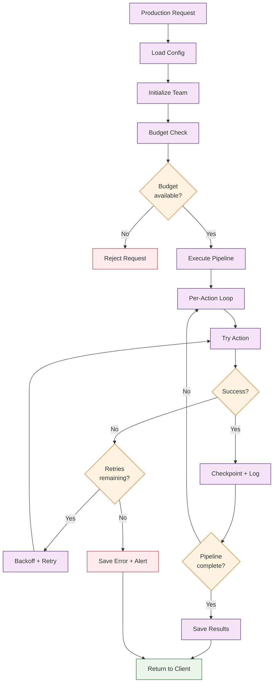

# Chapter 8: Production Deployment -- Configuration, Cost Optimization, and Enterprise Patterns

In [Chapter 7](07-multi-agent-orchestration.md) you learned how to orchestrate multi-agent teams. This final chapter covers what it takes to run MetaGPT in production: configuration management, cost controls, error handling, monitoring, and enterprise integration patterns.

## What Problem Does This Solve?

Development experiments and production systems have fundamentally different requirements. In production you need predictable costs, graceful error recovery, observability, security, and reproducibility. This chapter provides the patterns and configurations needed to bridge that gap.

## Production Configuration

### Complete Configuration Template

```yaml
# config2.yaml -- Production configuration
llm:
  api_type: "openai"
  model: "gpt-4-turbo"
  base_url: "https://api.openai.com/v1"
  api_key: "${OPENAI_API_KEY}"  # Use environment variable reference
  temperature: 0.0  # Deterministic outputs for reproducibility
  max_tokens: 4096
  timeout: 120  # Seconds

# Cost management
max_budget: 50.0  # USD per run
budget_alert_threshold: 0.8  # Alert at 80% of budget

# Workspace
workspace:
  path: "/var/metagpt/workspace"
  use_git: true  # Track changes with git

# Retry configuration
retry:
  max_retries: 3
  retry_delay: 1.0  # Seconds between retries
  exponential_backoff: true

# Logging
log_level: "INFO"
log_file: "/var/log/metagpt/agent.log"

# Code execution
enable_code_execution: true
code_execution_timeout: 60  # Seconds
sandbox_mode: true  # Run code in isolated environment
```

### Environment-Based Configuration

```python
import os
from metagpt.config2 import Config

def get_production_config() -> Config:
    """Load production configuration with environment overrides."""
    config = Config.default()

    # Override from environment for deployment flexibility
    config.llm.api_key = os.environ["OPENAI_API_KEY"]
    config.llm.model = os.environ.get("METAGPT_MODEL", "gpt-4-turbo")
    config.max_budget = float(os.environ.get("METAGPT_BUDGET", "50.0"))

    return config
```

### Multi-Model Configuration

Use different models for different roles to optimize cost and quality:

```python
import asyncio
from metagpt.team import Team
from metagpt.roles import ProductManager, Architect, Engineer
from metagpt.config2 import Config

async def multi_model_team():
    """Use expensive models for design, cheaper models for code generation."""
    # High-capability model for product and architecture decisions
    design_config = Config.default()
    design_config.llm.model = "gpt-4-turbo"

    # Cost-effective model for code generation (high volume)
    code_config = Config.default()
    code_config.llm.model = "gpt-4o-mini"

    team = Team()
    team.hire([
        ProductManager(config=design_config),
        Architect(config=design_config),
        Engineer(config=code_config),  # Cheaper model for bulk code
    ])

    team.run_project("Build an inventory management system")
    await team.run(n_round=10)

asyncio.run(multi_model_team())
```

## Cost Optimization Strategies

### 1. Token Budget Management

```python
from metagpt.roles import Role
from metagpt.schema import Message

class CostAwareRole(Role):
    """A role that tracks and limits its token usage."""
    name: str = "CostAwareRole"
    max_tokens_per_action: int = 2000

    async def _act(self) -> Message:
        # Truncate context to fit within budget
        memories = self.rc.memory.get()
        context = ""
        token_estimate = 0

        for msg in reversed(memories):
            msg_tokens = len(msg.content.split()) * 1.3  # Rough estimate
            if token_estimate + msg_tokens > self.max_tokens_per_action:
                break
            context = msg.content + "\n---\n" + context
            token_estimate += msg_tokens

        result = await self._aask(f"Context:\n{context}\n\nContinue the task.")
        return Message(content=result, role=self.name)
```

### 2. Caching LLM Responses

```python
import hashlib
import json
import os
from metagpt.actions import Action

class CachedAction(Action):
    """An action that caches LLM responses to avoid duplicate API calls."""
    name: str = "CachedAction"
    cache_dir: str = "/var/metagpt/cache"

    def _cache_key(self, prompt: str) -> str:
        return hashlib.sha256(prompt.encode()).hexdigest()

    def _get_cached(self, key: str) -> str | None:
        path = os.path.join(self.cache_dir, f"{key}.json")
        if os.path.exists(path):
            with open(path) as f:
                return json.load(f)["response"]
        return None

    def _set_cached(self, key: str, response: str) -> None:
        os.makedirs(self.cache_dir, exist_ok=True)
        path = os.path.join(self.cache_dir, f"{key}.json")
        with open(path, "w") as f:
            json.dump({"response": response}, f)

    async def _aask_cached(self, prompt: str) -> str:
        key = self._cache_key(prompt)
        cached = self._get_cached(key)
        if cached is not None:
            return cached

        response = await self._aask(prompt)
        self._set_cached(key, response)
        return response
```

### 3. Incremental Generation

Instead of regenerating everything on each run, reuse previous outputs:

```python
import asyncio
import json
import os
from metagpt.team import Team
from metagpt.roles import Engineer
from metagpt.schema import Message

async def incremental_build(requirement: str, workspace: str):
    """Only regenerate files that have changed requirements."""
    manifest_path = os.path.join(workspace, ".metagpt_manifest.json")

    # Load previous manifest
    if os.path.exists(manifest_path):
        with open(manifest_path) as f:
            previous = json.load(f)
    else:
        previous = {"requirement": "", "files": {}}

    # Check if requirement changed
    if previous["requirement"] == requirement:
        print("No changes detected, skipping generation.")
        return

    # Run generation
    team = Team()
    team.hire([Engineer()])
    team.run_project(requirement)
    await team.run(n_round=5)

    # Save manifest
    manifest = {
        "requirement": requirement,
        "files": {
            f: os.path.getmtime(os.path.join(workspace, f))
            for f in os.listdir(workspace)
            if f.endswith(".py")
        }
    }
    with open(manifest_path, "w") as f:
        json.dump(manifest, f)
```

## Error Handling and Recovery

### Retry with Exponential Backoff

```python
import asyncio
import random
from metagpt.actions import Action

class ResilientAction(Action):
    """An action with production-grade error handling."""
    name: str = "ResilientAction"

    async def run(self, context: str) -> str:
        max_retries = 3

        for attempt in range(max_retries):
            try:
                result = await self._aask(
                    f"Process this request:\n{context}"
                )
                return result
            except Exception as e:
                if attempt == max_retries - 1:
                    raise RuntimeError(
                        f"Action failed after {max_retries} attempts: {e}"
                    )
                # Exponential backoff with jitter
                delay = (2 ** attempt) + random.uniform(0, 1)
                print(f"Attempt {attempt + 1} failed: {e}. "
                      f"Retrying in {delay:.1f}s...")
                await asyncio.sleep(delay)
```

### Checkpoint and Resume

```python
import json
import os
from metagpt.schema import Message

class CheckpointManager:
    """Save and restore agent pipeline state."""

    def __init__(self, checkpoint_dir: str):
        self.checkpoint_dir = checkpoint_dir
        os.makedirs(checkpoint_dir, exist_ok=True)

    def save(self, stage: str, messages: list[Message]) -> None:
        path = os.path.join(self.checkpoint_dir, f"{stage}.json")
        data = [
            {"content": m.content, "role": m.role, "cause_by": m.cause_by}
            for m in messages
        ]
        with open(path, "w") as f:
            json.dump(data, f, indent=2)

    def load(self, stage: str) -> list[Message] | None:
        path = os.path.join(self.checkpoint_dir, f"{stage}.json")
        if not os.path.exists(path):
            return None
        with open(path) as f:
            data = json.load(f)
        return [Message(**item) for item in data]

    def has_checkpoint(self, stage: str) -> bool:
        path = os.path.join(self.checkpoint_dir, f"{stage}.json")
        return os.path.exists(path)
```

### Using Checkpoints in a Pipeline

```python
import asyncio
from metagpt.roles import ProductManager, Architect, Engineer
from metagpt.schema import Message
from metagpt.environment import Environment

async def resumable_pipeline(requirement: str, checkpoint_dir: str):
    """A pipeline that can resume from the last successful stage."""
    ckpt = CheckpointManager(checkpoint_dir)
    env = Environment()

    stages = [
        ("prd", ProductManager()),
        ("design", Architect()),
        ("code", Engineer()),
    ]

    last_output = Message(content=requirement, role="User")

    for stage_name, role in stages:
        # Check for existing checkpoint
        cached = ckpt.load(stage_name)
        if cached:
            print(f"Resuming from checkpoint: {stage_name}")
            last_output = cached[-1]
            continue

        # Execute this stage
        try:
            result = await role.run(last_output)
            ckpt.save(stage_name, [result])
            last_output = result
            print(f"Stage '{stage_name}' completed and checkpointed.")
        except Exception as e:
            print(f"Stage '{stage_name}' failed: {e}")
            print("Re-run the pipeline to resume from this point.")
            raise

asyncio.run(resumable_pipeline(
    "Build an e-commerce checkout flow",
    "/var/metagpt/checkpoints/ecommerce"
))
```

## Monitoring and Observability

### Logging Agent Activity

```python
import logging
from metagpt.roles import Role
from metagpt.schema import Message

logger = logging.getLogger("metagpt.production")

class MonitoredRole(Role):
    """A role with production logging."""
    name: str = "MonitoredRole"

    async def _observe(self):
        messages = await super()._observe()
        logger.info(f"[{self.name}] Observed {len(messages)} new messages")
        return messages

    async def _think(self):
        action = await super()._think()
        logger.info(f"[{self.name}] Selected action: {action.name}")
        return action

    async def _act(self) -> Message:
        import time
        start = time.time()

        result = await super()._act()

        duration = time.time() - start
        logger.info(
            f"[{self.name}] Action completed in {duration:.2f}s, "
            f"output length: {len(result.content)} chars"
        )
        return result
```

### Cost Tracking

```python
class CostTracker:
    """Track LLM API costs across a pipeline run."""

    # Approximate costs per 1K tokens (as of 2024)
    COSTS = {
        "gpt-4-turbo": {"input": 0.01, "output": 0.03},
        "gpt-4o-mini": {"input": 0.00015, "output": 0.0006},
        "gpt-4o": {"input": 0.005, "output": 0.015},
    }

    def __init__(self):
        self.total_input_tokens = 0
        self.total_output_tokens = 0
        self.total_cost = 0.0
        self.calls = []

    def record(self, model: str, input_tokens: int, output_tokens: int):
        costs = self.COSTS.get(model, {"input": 0.01, "output": 0.03})
        cost = (
            (input_tokens / 1000) * costs["input"]
            + (output_tokens / 1000) * costs["output"]
        )
        self.total_input_tokens += input_tokens
        self.total_output_tokens += output_tokens
        self.total_cost += cost
        self.calls.append({
            "model": model,
            "input_tokens": input_tokens,
            "output_tokens": output_tokens,
            "cost": cost,
        })

    def summary(self) -> str:
        return (
            f"Total calls: {len(self.calls)}\n"
            f"Total input tokens: {self.total_input_tokens:,}\n"
            f"Total output tokens: {self.total_output_tokens:,}\n"
            f"Total cost: ${self.total_cost:.4f}"
        )
```

## Enterprise Integration Patterns

### API Wrapper

Expose MetaGPT as a REST API for integration with other systems:

```python
from fastapi import FastAPI, BackgroundTasks
from pydantic import BaseModel
import asyncio
import uuid

app = FastAPI()

# Store results by job ID
results = {}

class GenerateRequest(BaseModel):
    requirement: str
    max_rounds: int = 10
    budget: float = 50.0

class JobStatus(BaseModel):
    job_id: str
    status: str
    result: str | None = None

async def run_metagpt_job(job_id: str, requirement: str, max_rounds: int):
    """Run MetaGPT in the background."""
    from metagpt.team import Team
    from metagpt.roles import ProductManager, Architect, Engineer

    try:
        results[job_id] = {"status": "running", "result": None}
        team = Team()
        team.hire([ProductManager(), Architect(), Engineer()])
        team.run_project(requirement)
        await team.run(n_round=max_rounds)
        results[job_id] = {"status": "completed", "result": "Project generated"}
    except Exception as e:
        results[job_id] = {"status": "failed", "result": str(e)}


@app.post("/generate", response_model=JobStatus)
async def generate(request: GenerateRequest, background_tasks: BackgroundTasks):
    job_id = str(uuid.uuid4())
    results[job_id] = {"status": "queued", "result": None}
    background_tasks.add_task(
        run_metagpt_job, job_id, request.requirement, request.max_rounds
    )
    return JobStatus(job_id=job_id, status="queued")


@app.get("/status/{job_id}", response_model=JobStatus)
async def get_status(job_id: str):
    if job_id not in results:
        return JobStatus(job_id=job_id, status="not_found")
    r = results[job_id]
    return JobStatus(job_id=job_id, status=r["status"], result=r["result"])
```

### Docker Deployment

```dockerfile
FROM python:3.11-slim

WORKDIR /app

# Install MetaGPT
RUN pip install metagpt

# Copy configuration
COPY config2.yaml /root/.metagpt/config2.yaml

# Copy application code
COPY app/ /app/

# Environment variables (set at runtime, not build time)
ENV OPENAI_API_KEY=""
ENV METAGPT_BUDGET="50.0"

EXPOSE 8000

CMD ["uvicorn", "main:app", "--host", "0.0.0.0", "--port", "8000"]
```

```yaml
# docker-compose.yml
version: "3.8"
services:
  metagpt-api:
    build: .
    ports:
      - "8000:8000"
    environment:
      - OPENAI_API_KEY=${OPENAI_API_KEY}
      - METAGPT_BUDGET=50.0
    volumes:
      - ./workspace:/var/metagpt/workspace
      - ./logs:/var/log/metagpt
    restart: unless-stopped
```

## How It Works Under the Hood



Production deployment principles:

1. **Configuration Layering** -- base configuration in YAML, environment-specific overrides via environment variables, per-request overrides via API parameters.
2. **Cost Boundaries** -- budgets are enforced at the team level. Each LLM call deducts from the budget, and the pipeline halts gracefully when the limit is reached.
3. **Idempotent Checkpoints** -- each pipeline stage checkpoints its output. If a run is interrupted, it resumes from the last successful checkpoint without repeating work.
4. **Observability** -- every action logs its duration, token usage, and cost. These metrics can be exported to monitoring systems like Prometheus, Datadog, or CloudWatch.
5. **Security** -- API keys are never stored in configuration files. Use environment variables or secret managers. Code execution runs in sandboxed environments.

## Production Checklist

| Category | Item | Status |
|----------|------|--------|
| **Configuration** | API keys in environment variables | Required |
| **Configuration** | Budget limits set | Required |
| **Configuration** | Temperature set to 0.0 for reproducibility | Recommended |
| **Reliability** | Retry logic with backoff | Required |
| **Reliability** | Checkpoint and resume | Recommended |
| **Reliability** | Graceful error handling | Required |
| **Observability** | Structured logging | Required |
| **Observability** | Cost tracking per run | Recommended |
| **Observability** | Latency monitoring | Recommended |
| **Security** | Sandboxed code execution | Required |
| **Security** | Input validation | Required |
| **Security** | Rate limiting on API | Recommended |
| **Performance** | Response caching | Recommended |
| **Performance** | Multi-model strategy | Optional |
| **Performance** | Incremental generation | Optional |

## Summary

Running MetaGPT in production requires attention to cost management, error recovery, observability, and security. The key patterns are: multi-model configuration for cost optimization, checkpoint-based resumption for reliability, structured logging for observability, and API wrapping for system integration. With these patterns in place, MetaGPT can serve as a reliable component in enterprise software delivery pipelines.

---

[Previous: Chapter 7: Multi-Agent Orchestration](07-multi-agent-orchestration.md) | [Back to Tutorial Index](README.md)
