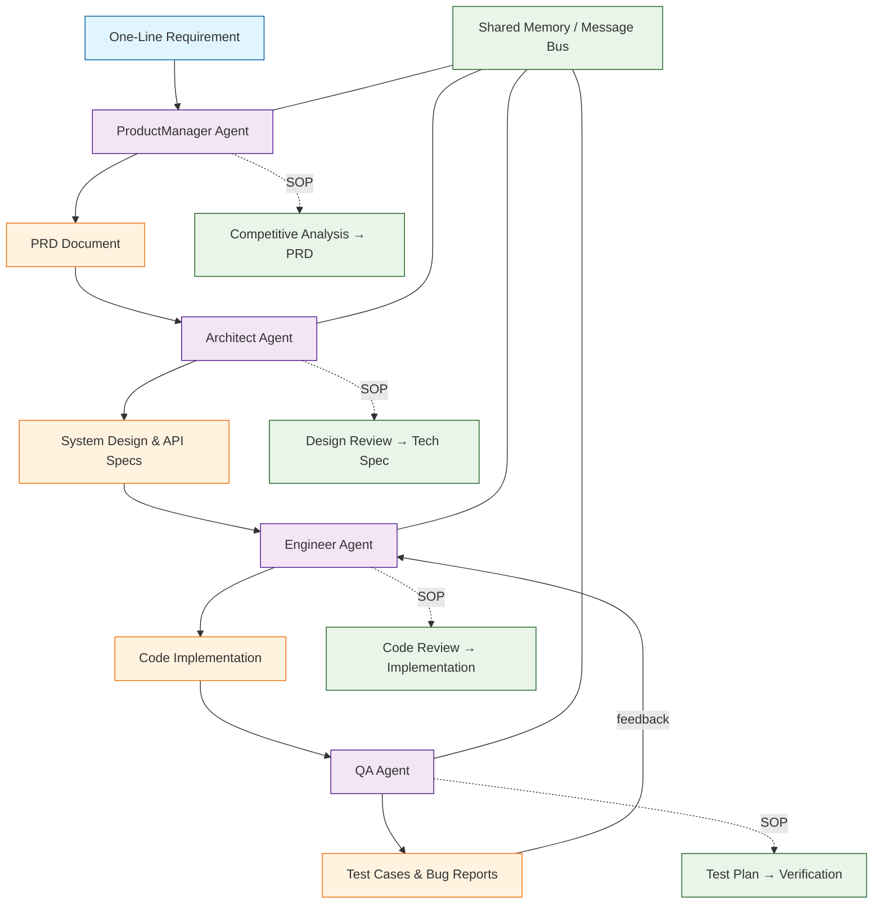

# MetaGPT Tutorial: Multi-Agent Software Development with Role-Based Collaboration

MetaGPT[View Repo](https://github.com/geekan/MetaGPT) is a multi-agent framework where GPT-powered agents assume real-world software roles -- Product Manager, Architect, Engineer, and QA -- to collaboratively build complete software from a single one-line requirement. It encodes Standardized Operating Procedures (SOPs) into agent prompts, enabling structured, role-based collaboration that mirrors how professional development teams actually work.

> **In one sentence:** Give MetaGPT a product idea, and a virtual software company of AI agents designs, architects, codes, and tests it for you.

## Why This Track Matters

MetaGPT introduces a paradigm where multiple AI agents collaborate through structured roles and standardized processes, closely mirroring the way real software teams operate. This approach is directly relevant to Genesis-style agent teams and any system that requires coordinated, multi-step AI workflows.

This track focuses on:

- Understanding **role-based multi-agent collaboration** where each agent has a defined responsibility
- Learning how **Standardized Operating Procedures (SOPs)** constrain and guide agent behavior
- Building **custom actions and tools** that extend agent capabilities
- Designing **production-ready multi-agent pipelines** with memory, context sharing, and cost optimization

## Current Snapshot (auto-updated)

- repository: [`geekan/MetaGPT`](https://github.com/geekan/MetaGPT)
- stars: about **67.3k**
- latest release: [`v0.8.1`](https://github.com/geekan/MetaGPT/releases/tag/v0.8.1) (published 2024-04-22)

## Mental Model

## Chapter Guide

Welcome to your journey through multi-agent software development! This tutorial explores how MetaGPT orchestrates AI agents into a functioning software team.

1. **[Chapter 1: Getting Started](01-getting-started.md)** - Installation, configuration, and your first multi-agent software run
2. **[Chapter 2: Agent Roles](02-agent-roles.md)** - ProductManager, Architect, Engineer, and QA roles in depth
3. **[Chapter 3: SOPs and Workflows](03-sop-and-workflows.md)** - Standardized Operating Procedures and role collaboration patterns
4. **[Chapter 4: Action System](04-action-system.md)** - Actions, action nodes, and building custom actions
5. **[Chapter 5: Memory and Context](05-memory-and-context.md)** - Memory management and context sharing between agents
6. **[Chapter 6: Tool Integration](06-tool-integration.md)** - Web browsing, code execution, and custom tool creation
7. **[Chapter 7: Multi-Agent Orchestration](07-multi-agent-orchestration.md)** - Team composition, task decomposition, and parallel execution
8. **[Chapter 8: Production Deployment](08-production-deployment.md)** - Configuration, cost optimization, and enterprise patterns

## What You Will Learn

By the end of this tutorial, you will be able to:

- **Run a full software generation pipeline** from a single requirement using MetaGPT's built-in roles
- **Understand the SOP-driven architecture** that constrains agents into productive workflows
- **Create custom agent roles** with specialized actions and behaviors
- **Build custom actions and action nodes** for domain-specific tasks
- **Manage shared memory and context** across multi-agent conversations
- **Integrate external tools** including web search, code execution, and APIs
- **Orchestrate complex multi-agent teams** with hierarchical and parallel execution
- **Deploy MetaGPT in production** with cost controls, caching, and monitoring

## Prerequisites

- Python 3.9+ (3.10+ recommended)
- Basic understanding of LLM concepts and API usage
- Familiarity with async/await patterns in Python
- An OpenAI API key (or compatible LLM provider key)

## Source References

- [MetaGPT GitHub Repository](https://github.com/geekan/MetaGPT)
- [MetaGPT Documentation](https://docs.deepwisdom.ai/main/en/)
- [MetaGPT Paper: "MetaGPT: Meta Programming for A Multi-Agent Collaborative Framework"](https://arxiv.org/abs/2308.00352)

## Related Tutorials

- [CrewAI Tutorial](../crewai-tutorial/) - Another role-based multi-agent framework
- [AutoGen Tutorial](../autogen-tutorial/) - Microsoft's multi-agent conversation framework
- [Taskade Tutorial](../taskade-tutorial/) - AI-powered productivity with agent workflows

## Navigation & Backlinks

- [Start Here: Chapter 1: Getting Started](01-getting-started.md)
- [Back to Main Catalog](../../README.md#-tutorial-catalog)
- [Browse A-Z Tutorial Directory](../../discoverability/tutorial-directory.md)
- [Search by Intent](../../discoverability/query-hub.md)
- [Explore Category Hubs](../../README.md#category-hubs)

*Generated by [AI Codebase Knowledge Builder](https://github.com/The-Pocket/Tutorial-Codebase-Knowledge)*

## Full Chapter Map

1. [Chapter 1: Getting Started](01-getting-started.md)
2. [Chapter 2: Agent Roles](02-agent-roles.md)
3. [Chapter 3: SOPs and Workflows](03-sop-and-workflows.md)
4. [Chapter 4: Action System](04-action-system.md)
5. [Chapter 5: Memory and Context](05-memory-and-context.md)
6. [Chapter 6: Tool Integration](06-tool-integration.md)
7. [Chapter 7: Multi-Agent Orchestration](07-multi-agent-orchestration.md)
8. [Chapter 8: Production Deployment](08-production-deployment.md)
