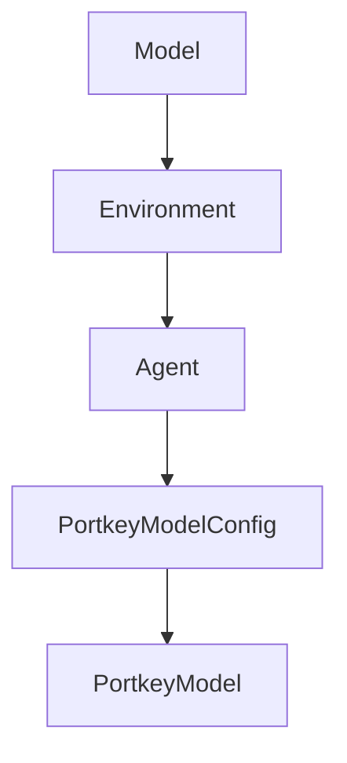

# Chapter 1: Getting Started

Welcome to **Chapter 1: Getting Started**. In this part of **Mini-SWE-Agent Tutorial: Minimal Autonomous Code Agent Design at Benchmark Scale**, you will build an intuitive mental model first, then move into concrete implementation details and practical production tradeoffs.


This chapter gets mini-swe-agent running with minimal setup friction.

## Learning Goals

- install CLI and Python package paths
- run a first task with the `mini` command
- understand v2 context and migration assumptions
- verify baseline outputs and trajectories

## Fast Install Options

- `uvx mini-swe-agent`
- `pip install mini-swe-agent`
- source install with editable mode for development

## Source References

- [Mini-SWE-Agent README](https://github.com/SWE-agent/mini-swe-agent/blob/main/README.md)
- [Mini-SWE-Agent Quickstart](https://mini-swe-agent.com/latest/quickstart/)
- [Mini-SWE-Agent v2 Migration Guide](https://mini-swe-agent.com/latest/advanced/v2_migration/)

## Summary

You now have a working mini-swe-agent baseline.

Next: [Chapter 2: Core Architecture and Minimal Design](02-core-architecture-and-minimal-design.md)

## Source Code Walkthrough

### `src/minisweagent/__init__.py`

The `Model` class in [`src/minisweagent/__init__.py`](https://github.com/SWE-agent/mini-swe-agent/blob/HEAD/src/minisweagent/__init__.py) handles a key part of this chapter's functionality:

```py


class Model(Protocol):
    """Protocol for language models."""

    config: Any

    def query(self, messages: list[dict[str, str]], **kwargs) -> dict: ...

    def format_message(self, **kwargs) -> dict: ...

    def format_observation_messages(
        self, message: dict, outputs: list[dict], template_vars: dict | None = None
    ) -> list[dict]: ...

    def get_template_vars(self, **kwargs) -> dict[str, Any]: ...

    def serialize(self) -> dict: ...


class Environment(Protocol):
    """Protocol for execution environments."""

    config: Any

    def execute(self, action: dict, cwd: str = "") -> dict[str, Any]: ...

    def get_template_vars(self, **kwargs) -> dict[str, Any]: ...

    def serialize(self) -> dict: ...


```

This class is important because it defines how Mini-SWE-Agent Tutorial: Minimal Autonomous Code Agent Design at Benchmark Scale implements the patterns covered in this chapter.

### `src/minisweagent/__init__.py`

The `Environment` class in [`src/minisweagent/__init__.py`](https://github.com/SWE-agent/mini-swe-agent/blob/HEAD/src/minisweagent/__init__.py) handles a key part of this chapter's functionality:

```py


class Environment(Protocol):
    """Protocol for execution environments."""

    config: Any

    def execute(self, action: dict, cwd: str = "") -> dict[str, Any]: ...

    def get_template_vars(self, **kwargs) -> dict[str, Any]: ...

    def serialize(self) -> dict: ...


class Agent(Protocol):
    """Protocol for agents."""

    config: Any

    def run(self, task: str, **kwargs) -> dict: ...

    def save(self, path: Path | None, *extra_dicts) -> dict: ...


__all__ = [
    "Agent",
    "Model",
    "Environment",
    "package_dir",
    "__version__",
    "global_config_file",
    "global_config_dir",
```

This class is important because it defines how Mini-SWE-Agent Tutorial: Minimal Autonomous Code Agent Design at Benchmark Scale implements the patterns covered in this chapter.

### `src/minisweagent/__init__.py`

The `Agent` class in [`src/minisweagent/__init__.py`](https://github.com/SWE-agent/mini-swe-agent/blob/HEAD/src/minisweagent/__init__.py) handles a key part of this chapter's functionality:

```py


class Agent(Protocol):
    """Protocol for agents."""

    config: Any

    def run(self, task: str, **kwargs) -> dict: ...

    def save(self, path: Path | None, *extra_dicts) -> dict: ...


__all__ = [
    "Agent",
    "Model",
    "Environment",
    "package_dir",
    "__version__",
    "global_config_file",
    "global_config_dir",
    "logger",
]

```

This class is important because it defines how Mini-SWE-Agent Tutorial: Minimal Autonomous Code Agent Design at Benchmark Scale implements the patterns covered in this chapter.

### `src/minisweagent/models/portkey_model.py`

The `PortkeyModelConfig` class in [`src/minisweagent/models/portkey_model.py`](https://github.com/SWE-agent/mini-swe-agent/blob/HEAD/src/minisweagent/models/portkey_model.py) handles a key part of this chapter's functionality:

```py


class PortkeyModelConfig(BaseModel):
    model_name: str
    model_kwargs: dict[str, Any] = {}
    provider: str = ""
    """The LLM provider to use (e.g., 'openai', 'anthropic', 'google').
    If not specified, will be auto-detected from model_name.
    Required by Portkey when not using a virtual key.
    """
    litellm_model_registry: Path | str | None = os.getenv("LITELLM_MODEL_REGISTRY_PATH")
    """We currently use litellm to calculate costs. Here you can register additional models to litellm's model registry.
    Note that this might change if we get better support for Portkey and change how we calculate costs.
    """
    litellm_model_name_override: str = ""
    """We currently use litellm to calculate costs. Here you can override the model name to use for litellm in case it
    doesn't match the Portkey model name.
    Note that this might change if we get better support for Portkey and change how we calculate costs.
    """
    set_cache_control: Literal["default_end"] | None = None
    """Set explicit cache control markers, for example for Anthropic models"""
    cost_tracking: Literal["default", "ignore_errors"] = os.getenv("MSWEA_COST_TRACKING", "default")
    """Cost tracking mode for this model. Can be "default" or "ignore_errors" (ignore errors/missing cost info)"""
    format_error_template: str = "{{ error }}"
    """Template used when the LM's output is not in the expected format."""
    observation_template: str = (
        "<exception>{{output.exception_info}}</exception>\n"
        "<returncode>{{output.returncode}}</returncode>\n<output>\n{{output.output}}</output>"
    )
    """Template used to render the observation after executing an action."""
    multimodal_regex: str = ""
    """Regex to extract multimodal content. Empty string disables multimodal processing."""
```

This class is important because it defines how Mini-SWE-Agent Tutorial: Minimal Autonomous Code Agent Design at Benchmark Scale implements the patterns covered in this chapter.


## How These Components Connect


