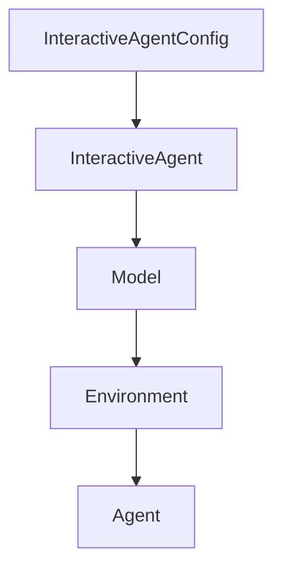

# Chapter 1: Getting Started

Welcome to **Chapter 1: Getting Started**. In this part of **Mini-SWE-Agent Tutorial: Minimal Autonomous Code Agent Design at Benchmark Scale**, you will build an intuitive mental model first, then move into concrete implementation details and practical production tradeoffs.


This chapter gets mini-swe-agent running with minimal setup friction.

## Learning Goals

- install CLI and Python package paths
- run a first task with the `mini` command
- understand v2 context and migration assumptions
- verify baseline outputs and trajectories

## Fast Install Options

- `uvx mini-swe-agent`
- `pip install mini-swe-agent`
- source install with editable mode for development

## Source References

- [Mini-SWE-Agent README](https://github.com/SWE-agent/mini-swe-agent/blob/main/README.md)
- [Mini-SWE-Agent Quickstart](https://mini-swe-agent.com/latest/quickstart/)
- [Mini-SWE-Agent v2 Migration Guide](https://mini-swe-agent.com/latest/advanced/v2_migration/)

## Summary

You now have a working mini-swe-agent baseline.

Next: [Chapter 2: Core Architecture and Minimal Design](02-core-architecture-and-minimal-design.md)

## Depth Expansion Playbook

## Source Code Walkthrough

### `src/minisweagent/agents/interactive.py`

The `InteractiveAgentConfig` class in [`src/minisweagent/agents/interactive.py`](https://github.com/SWE-agent/mini-swe-agent/blob/HEAD/src/minisweagent/agents/interactive.py) handles a key part of this chapter's functionality:

```py


class InteractiveAgentConfig(AgentConfig):
    mode: Literal["human", "confirm", "yolo"] = "confirm"
    """Whether to confirm actions."""
    whitelist_actions: list[str] = []
    """Never confirm actions that match these regular expressions."""
    confirm_exit: bool = True
    """If the agent wants to finish, do we ask for confirmation from user?"""


class InteractiveAgent(DefaultAgent):
    _MODE_COMMANDS_MAPPING = {"/u": "human", "/c": "confirm", "/y": "yolo"}

    def __init__(self, *args, config_class=InteractiveAgentConfig, **kwargs):
        super().__init__(*args, config_class=config_class, **kwargs)
        self.cost_last_confirmed = 0.0

    def _interrupt(self, content: str, *, itype: str = "UserInterruption") -> NoReturn:
        raise UserInterruption({"role": "user", "content": content, "extra": {"interrupt_type": itype}})

    def add_messages(self, *messages: dict) -> list[dict]:
        # Extend supermethod to print messages
        for msg in messages:
            role, content = msg.get("role") or msg.get("type", "unknown"), get_content_string(msg)
            if role == "assistant":
                console.print(
                    f"\n[red][bold]mini-swe-agent[/bold] (step [bold]{self.n_calls}[/bold], [bold]${self.cost:.2f}[/bold]):[/red]\n",
                    end="",
                    highlight=False,
                )
            else:
```

This class is important because it defines how Mini-SWE-Agent Tutorial: Minimal Autonomous Code Agent Design at Benchmark Scale implements the patterns covered in this chapter.

### `src/minisweagent/agents/interactive.py`

The `InteractiveAgent` class in [`src/minisweagent/agents/interactive.py`](https://github.com/SWE-agent/mini-swe-agent/blob/HEAD/src/minisweagent/agents/interactive.py) handles a key part of this chapter's functionality:

```py


class InteractiveAgentConfig(AgentConfig):
    mode: Literal["human", "confirm", "yolo"] = "confirm"
    """Whether to confirm actions."""
    whitelist_actions: list[str] = []
    """Never confirm actions that match these regular expressions."""
    confirm_exit: bool = True
    """If the agent wants to finish, do we ask for confirmation from user?"""


class InteractiveAgent(DefaultAgent):
    _MODE_COMMANDS_MAPPING = {"/u": "human", "/c": "confirm", "/y": "yolo"}

    def __init__(self, *args, config_class=InteractiveAgentConfig, **kwargs):
        super().__init__(*args, config_class=config_class, **kwargs)
        self.cost_last_confirmed = 0.0

    def _interrupt(self, content: str, *, itype: str = "UserInterruption") -> NoReturn:
        raise UserInterruption({"role": "user", "content": content, "extra": {"interrupt_type": itype}})

    def add_messages(self, *messages: dict) -> list[dict]:
        # Extend supermethod to print messages
        for msg in messages:
            role, content = msg.get("role") or msg.get("type", "unknown"), get_content_string(msg)
            if role == "assistant":
                console.print(
                    f"\n[red][bold]mini-swe-agent[/bold] (step [bold]{self.n_calls}[/bold], [bold]${self.cost:.2f}[/bold]):[/red]\n",
                    end="",
                    highlight=False,
                )
            else:
```

This class is important because it defines how Mini-SWE-Agent Tutorial: Minimal Autonomous Code Agent Design at Benchmark Scale implements the patterns covered in this chapter.

### `src/minisweagent/__init__.py`

The `Model` class in [`src/minisweagent/__init__.py`](https://github.com/SWE-agent/mini-swe-agent/blob/HEAD/src/minisweagent/__init__.py) handles a key part of this chapter's functionality:

```py


class Model(Protocol):
    """Protocol for language models."""

    config: Any

    def query(self, messages: list[dict[str, str]], **kwargs) -> dict: ...

    def format_message(self, **kwargs) -> dict: ...

    def format_observation_messages(
        self, message: dict, outputs: list[dict], template_vars: dict | None = None
    ) -> list[dict]: ...

    def get_template_vars(self, **kwargs) -> dict[str, Any]: ...

    def serialize(self) -> dict: ...


class Environment(Protocol):
    """Protocol for execution environments."""

    config: Any

    def execute(self, action: dict, cwd: str = "") -> dict[str, Any]: ...

    def get_template_vars(self, **kwargs) -> dict[str, Any]: ...

    def serialize(self) -> dict: ...


```

This class is important because it defines how Mini-SWE-Agent Tutorial: Minimal Autonomous Code Agent Design at Benchmark Scale implements the patterns covered in this chapter.

### `src/minisweagent/__init__.py`

The `Environment` class in [`src/minisweagent/__init__.py`](https://github.com/SWE-agent/mini-swe-agent/blob/HEAD/src/minisweagent/__init__.py) handles a key part of this chapter's functionality:

```py


class Environment(Protocol):
    """Protocol for execution environments."""

    config: Any

    def execute(self, action: dict, cwd: str = "") -> dict[str, Any]: ...

    def get_template_vars(self, **kwargs) -> dict[str, Any]: ...

    def serialize(self) -> dict: ...


class Agent(Protocol):
    """Protocol for agents."""

    config: Any

    def run(self, task: str, **kwargs) -> dict: ...

    def save(self, path: Path | None, *extra_dicts) -> dict: ...


__all__ = [
    "Agent",
    "Model",
    "Environment",
    "package_dir",
    "__version__",
    "global_config_file",
    "global_config_dir",
```

This class is important because it defines how Mini-SWE-Agent Tutorial: Minimal Autonomous Code Agent Design at Benchmark Scale implements the patterns covered in this chapter.


## How These Components Connect


