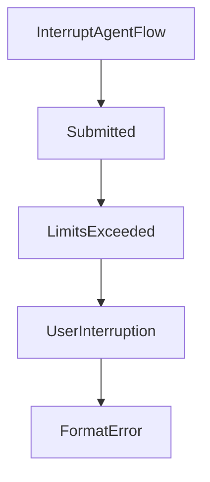

# Chapter 2: Core Architecture and Minimal Design

Welcome to **Chapter 2: Core Architecture and Minimal Design**. In this part of **Mini-SWE-Agent Tutorial: Minimal Autonomous Code Agent Design at Benchmark Scale**, you will build an intuitive mental model first, then move into concrete implementation details and practical production tradeoffs.


This chapter explains the small-core philosophy and its implications.

## Learning Goals

- understand agent/environment/model separation
- see why linear histories improve inspectability
- reason about bash-only action strategy
- identify where complexity should and should not live

## Design Characteristics

- minimal agent class and explicit control flow
- independent action execution via subprocess model
- linear message trajectories for easier debugging and FT/RL workflows

## Source References

- [Mini-SWE-Agent README: Minimal Architecture Notes](https://github.com/SWE-agent/mini-swe-agent/blob/main/README.md)
- [Default Agent Source](https://github.com/SWE-agent/mini-swe-agent/blob/main/src/minisweagent/agents/default.py)
- [Local Environment Source](https://github.com/SWE-agent/mini-swe-agent/blob/main/src/minisweagent/environments/local.py)

## Summary

You now understand how mini-swe-agent keeps performance and simplicity aligned.

Next: [Chapter 3: CLI, Batch, and Inspector Workflows](03-cli-batch-and-inspector-workflows.md)

## Source Code Walkthrough

### `src/minisweagent/exceptions.py`

The `InterruptAgentFlow` class in [`src/minisweagent/exceptions.py`](https://github.com/SWE-agent/mini-swe-agent/blob/HEAD/src/minisweagent/exceptions.py) handles a key part of this chapter's functionality:

```py
class InterruptAgentFlow(Exception):
    """Raised to interrupt the agent flow and add messages."""

    def __init__(self, *messages: dict):
        self.messages = messages
        super().__init__()


class Submitted(InterruptAgentFlow):
    """Raised when the agent has completed its task."""


class LimitsExceeded(InterruptAgentFlow):
    """Raised when the agent has exceeded its cost or step limit."""


class UserInterruption(InterruptAgentFlow):
    """Raised when the user interrupts the agent."""


class FormatError(InterruptAgentFlow):
    """Raised when the LM's output is not in the expected format."""

```

This class is important because it defines how Mini-SWE-Agent Tutorial: Minimal Autonomous Code Agent Design at Benchmark Scale implements the patterns covered in this chapter.

### `src/minisweagent/exceptions.py`

The `Submitted` class in [`src/minisweagent/exceptions.py`](https://github.com/SWE-agent/mini-swe-agent/blob/HEAD/src/minisweagent/exceptions.py) handles a key part of this chapter's functionality:

```py


class Submitted(InterruptAgentFlow):
    """Raised when the agent has completed its task."""


class LimitsExceeded(InterruptAgentFlow):
    """Raised when the agent has exceeded its cost or step limit."""


class UserInterruption(InterruptAgentFlow):
    """Raised when the user interrupts the agent."""


class FormatError(InterruptAgentFlow):
    """Raised when the LM's output is not in the expected format."""

```

This class is important because it defines how Mini-SWE-Agent Tutorial: Minimal Autonomous Code Agent Design at Benchmark Scale implements the patterns covered in this chapter.

### `src/minisweagent/exceptions.py`

The `LimitsExceeded` class in [`src/minisweagent/exceptions.py`](https://github.com/SWE-agent/mini-swe-agent/blob/HEAD/src/minisweagent/exceptions.py) handles a key part of this chapter's functionality:

```py


class LimitsExceeded(InterruptAgentFlow):
    """Raised when the agent has exceeded its cost or step limit."""


class UserInterruption(InterruptAgentFlow):
    """Raised when the user interrupts the agent."""


class FormatError(InterruptAgentFlow):
    """Raised when the LM's output is not in the expected format."""

```

This class is important because it defines how Mini-SWE-Agent Tutorial: Minimal Autonomous Code Agent Design at Benchmark Scale implements the patterns covered in this chapter.

### `src/minisweagent/exceptions.py`

The `UserInterruption` class in [`src/minisweagent/exceptions.py`](https://github.com/SWE-agent/mini-swe-agent/blob/HEAD/src/minisweagent/exceptions.py) handles a key part of this chapter's functionality:

```py


class UserInterruption(InterruptAgentFlow):
    """Raised when the user interrupts the agent."""


class FormatError(InterruptAgentFlow):
    """Raised when the LM's output is not in the expected format."""

```

This class is important because it defines how Mini-SWE-Agent Tutorial: Minimal Autonomous Code Agent Design at Benchmark Scale implements the patterns covered in this chapter.


## How These Components Connect


