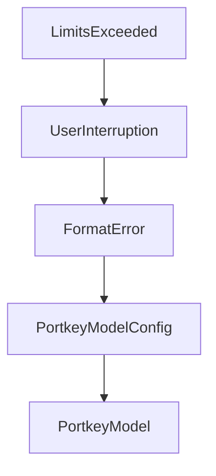

# Chapter 2: Core Architecture and Minimal Design

Welcome to **Chapter 2: Core Architecture and Minimal Design**. In this part of **Mini-SWE-Agent Tutorial: Minimal Autonomous Code Agent Design at Benchmark Scale**, you will build an intuitive mental model first, then move into concrete implementation details and practical production tradeoffs.


This chapter explains the small-core philosophy and its implications.

## Learning Goals

- understand agent/environment/model separation
- see why linear histories improve inspectability
- reason about bash-only action strategy
- identify where complexity should and should not live

## Design Characteristics

- minimal agent class and explicit control flow
- independent action execution via subprocess model
- linear message trajectories for easier debugging and FT/RL workflows

## Source References

- [Mini-SWE-Agent README: Minimal Architecture Notes](https://github.com/SWE-agent/mini-swe-agent/blob/main/README.md)
- [Default Agent Source](https://github.com/SWE-agent/mini-swe-agent/blob/main/src/minisweagent/agents/default.py)
- [Local Environment Source](https://github.com/SWE-agent/mini-swe-agent/blob/main/src/minisweagent/environments/local.py)

## Summary

You now understand how mini-swe-agent keeps performance and simplicity aligned.

Next: [Chapter 3: CLI, Batch, and Inspector Workflows](03-cli-batch-and-inspector-workflows.md)

## Depth Expansion Playbook

## Source Code Walkthrough

### `src/minisweagent/exceptions.py`

The `LimitsExceeded` class in [`src/minisweagent/exceptions.py`](https://github.com/SWE-agent/mini-swe-agent/blob/HEAD/src/minisweagent/exceptions.py) handles a key part of this chapter's functionality:

```py


class LimitsExceeded(InterruptAgentFlow):
    """Raised when the agent has exceeded its cost or step limit."""


class UserInterruption(InterruptAgentFlow):
    """Raised when the user interrupts the agent."""


class FormatError(InterruptAgentFlow):
    """Raised when the LM's output is not in the expected format."""

```

This class is important because it defines how Mini-SWE-Agent Tutorial: Minimal Autonomous Code Agent Design at Benchmark Scale implements the patterns covered in this chapter.

### `src/minisweagent/exceptions.py`

The `UserInterruption` class in [`src/minisweagent/exceptions.py`](https://github.com/SWE-agent/mini-swe-agent/blob/HEAD/src/minisweagent/exceptions.py) handles a key part of this chapter's functionality:

```py


class UserInterruption(InterruptAgentFlow):
    """Raised when the user interrupts the agent."""


class FormatError(InterruptAgentFlow):
    """Raised when the LM's output is not in the expected format."""

```

This class is important because it defines how Mini-SWE-Agent Tutorial: Minimal Autonomous Code Agent Design at Benchmark Scale implements the patterns covered in this chapter.

### `src/minisweagent/exceptions.py`

The `FormatError` class in [`src/minisweagent/exceptions.py`](https://github.com/SWE-agent/mini-swe-agent/blob/HEAD/src/minisweagent/exceptions.py) handles a key part of this chapter's functionality:

```py


class FormatError(InterruptAgentFlow):
    """Raised when the LM's output is not in the expected format."""

```

This class is important because it defines how Mini-SWE-Agent Tutorial: Minimal Autonomous Code Agent Design at Benchmark Scale implements the patterns covered in this chapter.

### `src/minisweagent/models/portkey_model.py`

The `PortkeyModelConfig` class in [`src/minisweagent/models/portkey_model.py`](https://github.com/SWE-agent/mini-swe-agent/blob/HEAD/src/minisweagent/models/portkey_model.py) handles a key part of this chapter's functionality:

```py


class PortkeyModelConfig(BaseModel):
    model_name: str
    model_kwargs: dict[str, Any] = {}
    provider: str = ""
    """The LLM provider to use (e.g., 'openai', 'anthropic', 'google').
    If not specified, will be auto-detected from model_name.
    Required by Portkey when not using a virtual key.
    """
    litellm_model_registry: Path | str | None = os.getenv("LITELLM_MODEL_REGISTRY_PATH")
    """We currently use litellm to calculate costs. Here you can register additional models to litellm's model registry.
    Note that this might change if we get better support for Portkey and change how we calculate costs.
    """
    litellm_model_name_override: str = ""
    """We currently use litellm to calculate costs. Here you can override the model name to use for litellm in case it
    doesn't match the Portkey model name.
    Note that this might change if we get better support for Portkey and change how we calculate costs.
    """
    set_cache_control: Literal["default_end"] | None = None
    """Set explicit cache control markers, for example for Anthropic models"""
    cost_tracking: Literal["default", "ignore_errors"] = os.getenv("MSWEA_COST_TRACKING", "default")
    """Cost tracking mode for this model. Can be "default" or "ignore_errors" (ignore errors/missing cost info)"""
    format_error_template: str = "{{ error }}"
    """Template used when the LM's output is not in the expected format."""
    observation_template: str = (
        "<exception>{{output.exception_info}}</exception>\n"
        "<returncode>{{output.returncode}}</returncode>\n<output>\n{{output.output}}</output>"
    )
    """Template used to render the observation after executing an action."""
    multimodal_regex: str = ""
    """Regex to extract multimodal content. Empty string disables multimodal processing."""
```

This class is important because it defines how Mini-SWE-Agent Tutorial: Minimal Autonomous Code Agent Design at Benchmark Scale implements the patterns covered in this chapter.


## How These Components Connect


