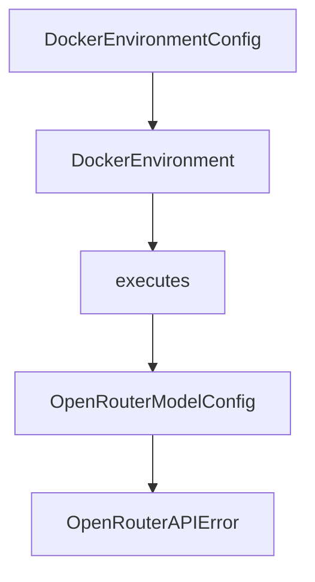

# Chapter 3: CLI, Batch, and Inspector Workflows

Welcome to **Chapter 3: CLI, Batch, and Inspector Workflows**. In this part of **Mini-SWE-Agent Tutorial: Minimal Autonomous Code Agent Design at Benchmark Scale**, you will build an intuitive mental model first, then move into concrete implementation details and practical production tradeoffs.


This chapter covers operating modes for local and benchmark tasks.

## Learning Goals

- run interactive CLI workflows efficiently
- execute batch swebench-style runs
- inspect trajectories for debugging and review
- choose mode based on workload requirements

## Workflow Modes

- `mini` CLI for direct task execution
- `swebench` mode for larger benchmark batches
- inspector tooling for trajectory analysis and failure review

## Source References

- [Mini CLI Usage](https://mini-swe-agent.com/latest/usage/mini/)
- [SWE-bench Usage](https://mini-swe-agent.com/latest/usage/swebench/)
- [Inspector Usage](https://mini-swe-agent.com/latest/usage/inspector/)

## Summary

You now have a practical operating model for both interactive and benchmark runs.

Next: [Chapter 4: Global and YAML Configuration Strategy](04-global-and-yaml-configuration-strategy.md)

## Depth Expansion Playbook

## Source Code Walkthrough

### `src/minisweagent/environments/docker.py`

The `DockerEnvironmentConfig` class in [`src/minisweagent/environments/docker.py`](https://github.com/SWE-agent/mini-swe-agent/blob/HEAD/src/minisweagent/environments/docker.py) handles a key part of this chapter's functionality:

```py


class DockerEnvironmentConfig(BaseModel):
    image: str
    cwd: str = "/"
    """Working directory in which to execute commands."""
    env: dict[str, str] = {}
    """Environment variables to set in the container."""
    forward_env: list[str] = []
    """Environment variables to forward to the container.
    Variables are only forwarded if they are set in the host environment.
    In case of conflict with `env`, the `env` variables take precedence.
    """
    timeout: int = 30
    """Timeout for executing commands in the container."""
    executable: str = os.getenv("MSWEA_DOCKER_EXECUTABLE", "docker")
    """Path to the docker/container executable."""
    run_args: list[str] = ["--rm"]
    """Additional arguments to pass to the docker/container executable.
    Default is ["--rm"], which removes the container after it exits.
    """
    container_timeout: str = "2h"
    """Max duration to keep container running. Uses the same format as the sleep command."""
    pull_timeout: int = 120
    """Timeout in seconds for pulling images."""
    interpreter: list[str] = ["bash", "-lc"]
    """Interpreter to use to execute commands. Default is ["bash", "-lc"].
    The actual command will be appended as argument to this. Override this to e.g., modify shell flags
    (e.g., to remove the `-l` flag to disable login shell) or to use python instead of bash to interpret commands.
    """


```

This class is important because it defines how Mini-SWE-Agent Tutorial: Minimal Autonomous Code Agent Design at Benchmark Scale implements the patterns covered in this chapter.

### `src/minisweagent/environments/docker.py`

The `DockerEnvironment` class in [`src/minisweagent/environments/docker.py`](https://github.com/SWE-agent/mini-swe-agent/blob/HEAD/src/minisweagent/environments/docker.py) handles a key part of this chapter's functionality:

```py


class DockerEnvironmentConfig(BaseModel):
    image: str
    cwd: str = "/"
    """Working directory in which to execute commands."""
    env: dict[str, str] = {}
    """Environment variables to set in the container."""
    forward_env: list[str] = []
    """Environment variables to forward to the container.
    Variables are only forwarded if they are set in the host environment.
    In case of conflict with `env`, the `env` variables take precedence.
    """
    timeout: int = 30
    """Timeout for executing commands in the container."""
    executable: str = os.getenv("MSWEA_DOCKER_EXECUTABLE", "docker")
    """Path to the docker/container executable."""
    run_args: list[str] = ["--rm"]
    """Additional arguments to pass to the docker/container executable.
    Default is ["--rm"], which removes the container after it exits.
    """
    container_timeout: str = "2h"
    """Max duration to keep container running. Uses the same format as the sleep command."""
    pull_timeout: int = 120
    """Timeout in seconds for pulling images."""
    interpreter: list[str] = ["bash", "-lc"]
    """Interpreter to use to execute commands. Default is ["bash", "-lc"].
    The actual command will be appended as argument to this. Override this to e.g., modify shell flags
    (e.g., to remove the `-l` flag to disable login shell) or to use python instead of bash to interpret commands.
    """


```

This class is important because it defines how Mini-SWE-Agent Tutorial: Minimal Autonomous Code Agent Design at Benchmark Scale implements the patterns covered in this chapter.

### `src/minisweagent/environments/docker.py`

The `executes` class in [`src/minisweagent/environments/docker.py`](https://github.com/SWE-agent/mini-swe-agent/blob/HEAD/src/minisweagent/environments/docker.py) handles a key part of this chapter's functionality:

```py
        **kwargs,
    ):
        """This class executes bash commands in a Docker container using direct docker commands.
        See `DockerEnvironmentConfig` for keyword arguments.
        """
        self.logger = logger or logging.getLogger("minisweagent.environment")
        self.container_id: str | None = None
        self.config = config_class(**kwargs)
        self._start_container()

    def get_template_vars(self, **kwargs) -> dict[str, Any]:
        return recursive_merge(self.config.model_dump(), platform.uname()._asdict(), kwargs)

    def serialize(self) -> dict:
        return {
            "info": {
                "config": {
                    "environment": self.config.model_dump(mode="json"),
                    "environment_type": f"{self.__class__.__module__}.{self.__class__.__name__}",
                }
            }
        }

    def _start_container(self):
        """Start the Docker container and return the container ID."""
        container_name = f"minisweagent-{uuid.uuid4().hex[:8]}"
        cmd = [
            self.config.executable,
            "run",
            "-d",
            "--name",
            container_name,
```

This class is important because it defines how Mini-SWE-Agent Tutorial: Minimal Autonomous Code Agent Design at Benchmark Scale implements the patterns covered in this chapter.

### `src/minisweagent/models/openrouter_model.py`

The `OpenRouterModelConfig` class in [`src/minisweagent/models/openrouter_model.py`](https://github.com/SWE-agent/mini-swe-agent/blob/HEAD/src/minisweagent/models/openrouter_model.py) handles a key part of this chapter's functionality:

```py


class OpenRouterModelConfig(BaseModel):
    model_name: str
    model_kwargs: dict[str, Any] = {}
    set_cache_control: Literal["default_end"] | None = None
    """Set explicit cache control markers, for example for Anthropic models"""
    cost_tracking: Literal["default", "ignore_errors"] = os.getenv("MSWEA_COST_TRACKING", "default")
    """Cost tracking mode for this model. Can be "default" or "ignore_errors" (ignore errors/missing cost info)"""
    format_error_template: str = "{{ error }}"
    """Template used when the LM's output is not in the expected format."""
    observation_template: str = (
        "<exception>{{output.exception_info}}</exception>\n"
        "<returncode>{{output.returncode}}</returncode>\n<output>\n{{output.output}}</output>"
    )
    """Template used to render the observation after executing an action."""
    multimodal_regex: str = ""
    """Regex to extract multimodal content. Empty string disables multimodal processing."""


class OpenRouterAPIError(Exception):
    """Custom exception for OpenRouter API errors."""


class OpenRouterAuthenticationError(Exception):
    """Custom exception for OpenRouter authentication errors."""


class OpenRouterRateLimitError(Exception):
    """Custom exception for OpenRouter rate limit errors."""


```

This class is important because it defines how Mini-SWE-Agent Tutorial: Minimal Autonomous Code Agent Design at Benchmark Scale implements the patterns covered in this chapter.


## How These Components Connect


