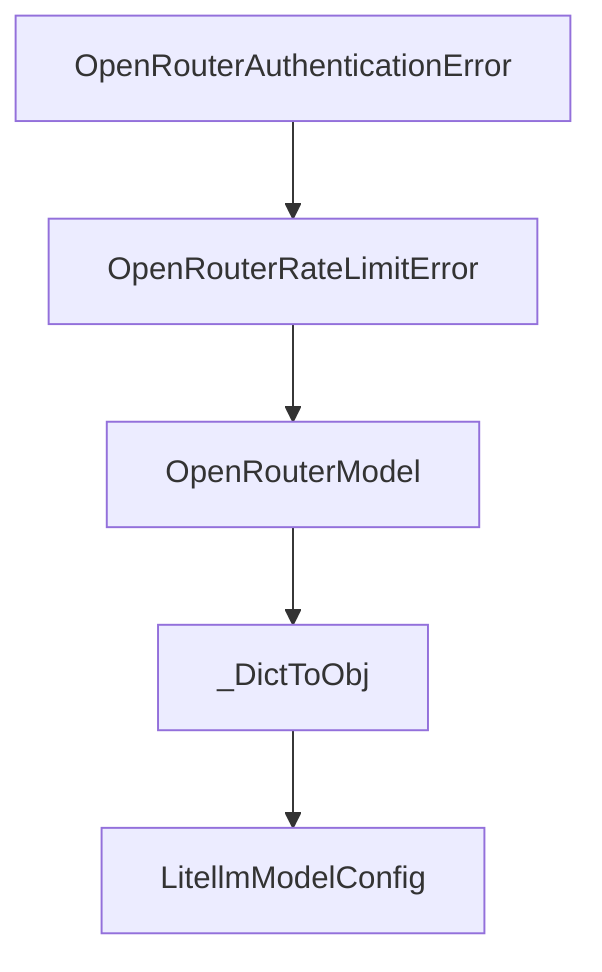

# Chapter 3: CLI, Batch, and Inspector Workflows

Welcome to **Chapter 3: CLI, Batch, and Inspector Workflows**. In this part of **Mini-SWE-Agent Tutorial: Minimal Autonomous Code Agent Design at Benchmark Scale**, you will build an intuitive mental model first, then move into concrete implementation details and practical production tradeoffs.


This chapter covers operating modes for local and benchmark tasks.

## Learning Goals

- run interactive CLI workflows efficiently
- execute batch swebench-style runs
- inspect trajectories for debugging and review
- choose mode based on workload requirements

## Workflow Modes

- `mini` CLI for direct task execution
- `swebench` mode for larger benchmark batches
- inspector tooling for trajectory analysis and failure review

## Source References

- [Mini CLI Usage](https://mini-swe-agent.com/latest/usage/mini/)
- [SWE-bench Usage](https://mini-swe-agent.com/latest/usage/swebench/)
- [Inspector Usage](https://mini-swe-agent.com/latest/usage/inspector/)

## Summary

You now have a practical operating model for both interactive and benchmark runs.

Next: [Chapter 4: Global and YAML Configuration Strategy](04-global-and-yaml-configuration-strategy.md)

## Source Code Walkthrough

### `src/minisweagent/models/openrouter_model.py`

The `OpenRouterAuthenticationError` class in [`src/minisweagent/models/openrouter_model.py`](https://github.com/SWE-agent/mini-swe-agent/blob/HEAD/src/minisweagent/models/openrouter_model.py) handles a key part of this chapter's functionality:

```py


class OpenRouterAuthenticationError(Exception):
    """Custom exception for OpenRouter authentication errors."""


class OpenRouterRateLimitError(Exception):
    """Custom exception for OpenRouter rate limit errors."""


class OpenRouterModel:
    abort_exceptions: list[type[Exception]] = [OpenRouterAuthenticationError, KeyboardInterrupt]

    def __init__(self, **kwargs):
        self.config = OpenRouterModelConfig(**kwargs)
        self._api_url = "https://openrouter.ai/api/v1/chat/completions"
        self._api_key = os.getenv("OPENROUTER_API_KEY", "")

    def _query(self, messages: list[dict[str, str]], **kwargs):
        headers = {
            "Authorization": f"Bearer {self._api_key}",
            "Content-Type": "application/json",
        }

        payload = {
            "model": self.config.model_name,
            "messages": messages,
            "tools": [BASH_TOOL],
            "usage": {"include": True},
            **(self.config.model_kwargs | kwargs),
        }

```

This class is important because it defines how Mini-SWE-Agent Tutorial: Minimal Autonomous Code Agent Design at Benchmark Scale implements the patterns covered in this chapter.

### `src/minisweagent/models/openrouter_model.py`

The `OpenRouterRateLimitError` class in [`src/minisweagent/models/openrouter_model.py`](https://github.com/SWE-agent/mini-swe-agent/blob/HEAD/src/minisweagent/models/openrouter_model.py) handles a key part of this chapter's functionality:

```py


class OpenRouterRateLimitError(Exception):
    """Custom exception for OpenRouter rate limit errors."""


class OpenRouterModel:
    abort_exceptions: list[type[Exception]] = [OpenRouterAuthenticationError, KeyboardInterrupt]

    def __init__(self, **kwargs):
        self.config = OpenRouterModelConfig(**kwargs)
        self._api_url = "https://openrouter.ai/api/v1/chat/completions"
        self._api_key = os.getenv("OPENROUTER_API_KEY", "")

    def _query(self, messages: list[dict[str, str]], **kwargs):
        headers = {
            "Authorization": f"Bearer {self._api_key}",
            "Content-Type": "application/json",
        }

        payload = {
            "model": self.config.model_name,
            "messages": messages,
            "tools": [BASH_TOOL],
            "usage": {"include": True},
            **(self.config.model_kwargs | kwargs),
        }

        try:
            response = requests.post(self._api_url, headers=headers, data=json.dumps(payload), timeout=60)
            response.raise_for_status()
            return response.json()
```

This class is important because it defines how Mini-SWE-Agent Tutorial: Minimal Autonomous Code Agent Design at Benchmark Scale implements the patterns covered in this chapter.

### `src/minisweagent/models/openrouter_model.py`

The `OpenRouterModel` class in [`src/minisweagent/models/openrouter_model.py`](https://github.com/SWE-agent/mini-swe-agent/blob/HEAD/src/minisweagent/models/openrouter_model.py) handles a key part of this chapter's functionality:

```py


class OpenRouterModelConfig(BaseModel):
    model_name: str
    model_kwargs: dict[str, Any] = {}
    set_cache_control: Literal["default_end"] | None = None
    """Set explicit cache control markers, for example for Anthropic models"""
    cost_tracking: Literal["default", "ignore_errors"] = os.getenv("MSWEA_COST_TRACKING", "default")
    """Cost tracking mode for this model. Can be "default" or "ignore_errors" (ignore errors/missing cost info)"""
    format_error_template: str = "{{ error }}"
    """Template used when the LM's output is not in the expected format."""
    observation_template: str = (
        "<exception>{{output.exception_info}}</exception>\n"
        "<returncode>{{output.returncode}}</returncode>\n<output>\n{{output.output}}</output>"
    )
    """Template used to render the observation after executing an action."""
    multimodal_regex: str = ""
    """Regex to extract multimodal content. Empty string disables multimodal processing."""


class OpenRouterAPIError(Exception):
    """Custom exception for OpenRouter API errors."""


class OpenRouterAuthenticationError(Exception):
    """Custom exception for OpenRouter authentication errors."""


class OpenRouterRateLimitError(Exception):
    """Custom exception for OpenRouter rate limit errors."""


```

This class is important because it defines how Mini-SWE-Agent Tutorial: Minimal Autonomous Code Agent Design at Benchmark Scale implements the patterns covered in this chapter.

### `src/minisweagent/models/openrouter_model.py`

The `_DictToObj` class in [`src/minisweagent/models/openrouter_model.py`](https://github.com/SWE-agent/mini-swe-agent/blob/HEAD/src/minisweagent/models/openrouter_model.py) handles a key part of this chapter's functionality:

```py
        """Parse tool calls from the response. Raises FormatError if unknown tool."""
        tool_calls = response["choices"][0]["message"].get("tool_calls") or []
        tool_calls = [_DictToObj(tc) for tc in tool_calls]
        return parse_toolcall_actions(tool_calls, format_error_template=self.config.format_error_template)

    def format_message(self, **kwargs) -> dict:
        return expand_multimodal_content(kwargs, pattern=self.config.multimodal_regex)

    def format_observation_messages(
        self, message: dict, outputs: list[dict], template_vars: dict | None = None
    ) -> list[dict]:
        """Format execution outputs into tool result messages."""
        actions = message.get("extra", {}).get("actions", [])
        return format_toolcall_observation_messages(
            actions=actions,
            outputs=outputs,
            observation_template=self.config.observation_template,
            template_vars=template_vars,
            multimodal_regex=self.config.multimodal_regex,
        )

    def get_template_vars(self, **kwargs) -> dict[str, Any]:
        return self.config.model_dump()

    def serialize(self) -> dict:
        return {
            "info": {
                "config": {
                    "model": self.config.model_dump(mode="json"),
                    "model_type": f"{self.__class__.__module__}.{self.__class__.__name__}",
                },
            }
```

This class is important because it defines how Mini-SWE-Agent Tutorial: Minimal Autonomous Code Agent Design at Benchmark Scale implements the patterns covered in this chapter.


## How These Components Connect


