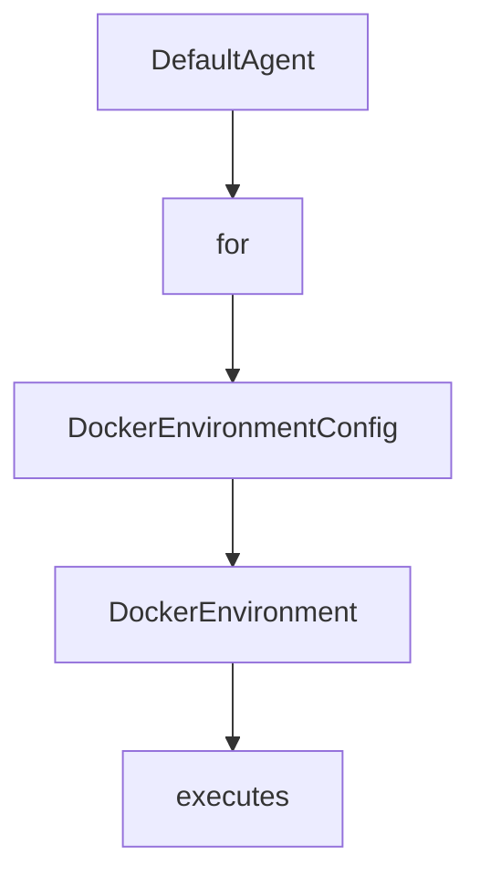

# Chapter 4: Global and YAML Configuration Strategy

Welcome to **Chapter 4: Global and YAML Configuration Strategy**. In this part of **Mini-SWE-Agent Tutorial: Minimal Autonomous Code Agent Design at Benchmark Scale**, you will build an intuitive mental model first, then move into concrete implementation details and practical production tradeoffs.


This chapter maps configuration layers for reproducible behavior.

## Learning Goals

- separate global environment settings from run config
- structure YAML files for agent/environment/model/run
- avoid config drift across contributors
- keep templates and parsing rules maintainable

## Config Guidance

- use global config for credentials/defaults
- use YAML for run-specific behavior and templates
- version config presets for reproducible evaluations

## Source References

- [Global Configuration](https://mini-swe-agent.com/latest/advanced/global_configuration/)
- [YAML Configuration](https://mini-swe-agent.com/latest/advanced/yaml_configuration/)
- [Usage Config Docs](https://mini-swe-agent.com/latest/usage/config/)

## Summary

You now have a disciplined configuration strategy for mini-swe-agent.

Next: [Chapter 5: Environments, Sandboxing, and Deployment](05-environments-sandboxing-and-deployment.md)

## Source Code Walkthrough

### `src/minisweagent/agents/default.py`

The `DefaultAgent` class in [`src/minisweagent/agents/default.py`](https://github.com/SWE-agent/mini-swe-agent/blob/HEAD/src/minisweagent/agents/default.py) handles a key part of this chapter's functionality:

```py


class DefaultAgent:
    def __init__(self, model: Model, env: Environment, *, config_class: type = AgentConfig, **kwargs):
        """See the `AgentConfig` class for permitted keyword arguments."""
        self.config = config_class(**kwargs)
        self.messages: list[dict] = []
        self.model = model
        self.env = env
        self.extra_template_vars = {}
        self.logger = logging.getLogger("agent")
        self.cost = 0.0
        self.n_calls = 0

    def get_template_vars(self, **kwargs) -> dict:
        return recursive_merge(
            self.config.model_dump(),
            self.env.get_template_vars(),
            self.model.get_template_vars(),
            {"n_model_calls": self.n_calls, "model_cost": self.cost},
            self.extra_template_vars,
            kwargs,
        )

    def _render_template(self, template: str) -> str:
        return Template(template, undefined=StrictUndefined).render(**self.get_template_vars())

    def add_messages(self, *messages: dict) -> list[dict]:
        self.logger.debug(messages)  # set log level to debug to see
        self.messages.extend(messages)
        return list(messages)

```

This class is important because it defines how Mini-SWE-Agent Tutorial: Minimal Autonomous Code Agent Design at Benchmark Scale implements the patterns covered in this chapter.

### `src/minisweagent/agents/default.py`

The `for` class in [`src/minisweagent/agents/default.py`](https://github.com/SWE-agent/mini-swe-agent/blob/HEAD/src/minisweagent/agents/default.py) handles a key part of this chapter's functionality:

```py
"""Basic agent class. See https://mini-swe-agent.com/latest/advanced/control_flow/ for visual explanation
or https://minimal-agent.com for a tutorial on the basic building principles.
"""

import json
import logging
import traceback
from pathlib import Path

from jinja2 import StrictUndefined, Template
from pydantic import BaseModel

from minisweagent import Environment, Model, __version__
from minisweagent.exceptions import InterruptAgentFlow, LimitsExceeded
from minisweagent.utils.serialize import recursive_merge


class AgentConfig(BaseModel):
    """Check the config files in minisweagent/config for example settings."""

    system_template: str
    """Template for the system message (the first message)."""
    instance_template: str
    """Template for the first user message specifying the task (the second message overall)."""
    step_limit: int = 0
    """Maximum number of steps the agent can take."""
    cost_limit: float = 3.0
    """Stop agent after exceeding (!) this cost."""
    output_path: Path | None = None
    """Save the trajectory to this path."""
```

This class is important because it defines how Mini-SWE-Agent Tutorial: Minimal Autonomous Code Agent Design at Benchmark Scale implements the patterns covered in this chapter.

### `src/minisweagent/environments/docker.py`

The `DockerEnvironmentConfig` class in [`src/minisweagent/environments/docker.py`](https://github.com/SWE-agent/mini-swe-agent/blob/HEAD/src/minisweagent/environments/docker.py) handles a key part of this chapter's functionality:

```py


class DockerEnvironmentConfig(BaseModel):
    image: str
    cwd: str = "/"
    """Working directory in which to execute commands."""
    env: dict[str, str] = {}
    """Environment variables to set in the container."""
    forward_env: list[str] = []
    """Environment variables to forward to the container.
    Variables are only forwarded if they are set in the host environment.
    In case of conflict with `env`, the `env` variables take precedence.
    """
    timeout: int = 30
    """Timeout for executing commands in the container."""
    executable: str = os.getenv("MSWEA_DOCKER_EXECUTABLE", "docker")
    """Path to the docker/container executable."""
    run_args: list[str] = ["--rm"]
    """Additional arguments to pass to the docker/container executable.
    Default is ["--rm"], which removes the container after it exits.
    """
    container_timeout: str = "2h"
    """Max duration to keep container running. Uses the same format as the sleep command."""
    pull_timeout: int = 120
    """Timeout in seconds for pulling images."""
    interpreter: list[str] = ["bash", "-lc"]
    """Interpreter to use to execute commands. Default is ["bash", "-lc"].
    The actual command will be appended as argument to this. Override this to e.g., modify shell flags
    (e.g., to remove the `-l` flag to disable login shell) or to use python instead of bash to interpret commands.
    """


```

This class is important because it defines how Mini-SWE-Agent Tutorial: Minimal Autonomous Code Agent Design at Benchmark Scale implements the patterns covered in this chapter.

### `src/minisweagent/environments/docker.py`

The `DockerEnvironment` class in [`src/minisweagent/environments/docker.py`](https://github.com/SWE-agent/mini-swe-agent/blob/HEAD/src/minisweagent/environments/docker.py) handles a key part of this chapter's functionality:

```py


class DockerEnvironmentConfig(BaseModel):
    image: str
    cwd: str = "/"
    """Working directory in which to execute commands."""
    env: dict[str, str] = {}
    """Environment variables to set in the container."""
    forward_env: list[str] = []
    """Environment variables to forward to the container.
    Variables are only forwarded if they are set in the host environment.
    In case of conflict with `env`, the `env` variables take precedence.
    """
    timeout: int = 30
    """Timeout for executing commands in the container."""
    executable: str = os.getenv("MSWEA_DOCKER_EXECUTABLE", "docker")
    """Path to the docker/container executable."""
    run_args: list[str] = ["--rm"]
    """Additional arguments to pass to the docker/container executable.
    Default is ["--rm"], which removes the container after it exits.
    """
    container_timeout: str = "2h"
    """Max duration to keep container running. Uses the same format as the sleep command."""
    pull_timeout: int = 120
    """Timeout in seconds for pulling images."""
    interpreter: list[str] = ["bash", "-lc"]
    """Interpreter to use to execute commands. Default is ["bash", "-lc"].
    The actual command will be appended as argument to this. Override this to e.g., modify shell flags
    (e.g., to remove the `-l` flag to disable login shell) or to use python instead of bash to interpret commands.
    """


```

This class is important because it defines how Mini-SWE-Agent Tutorial: Minimal Autonomous Code Agent Design at Benchmark Scale implements the patterns covered in this chapter.


## How These Components Connect


