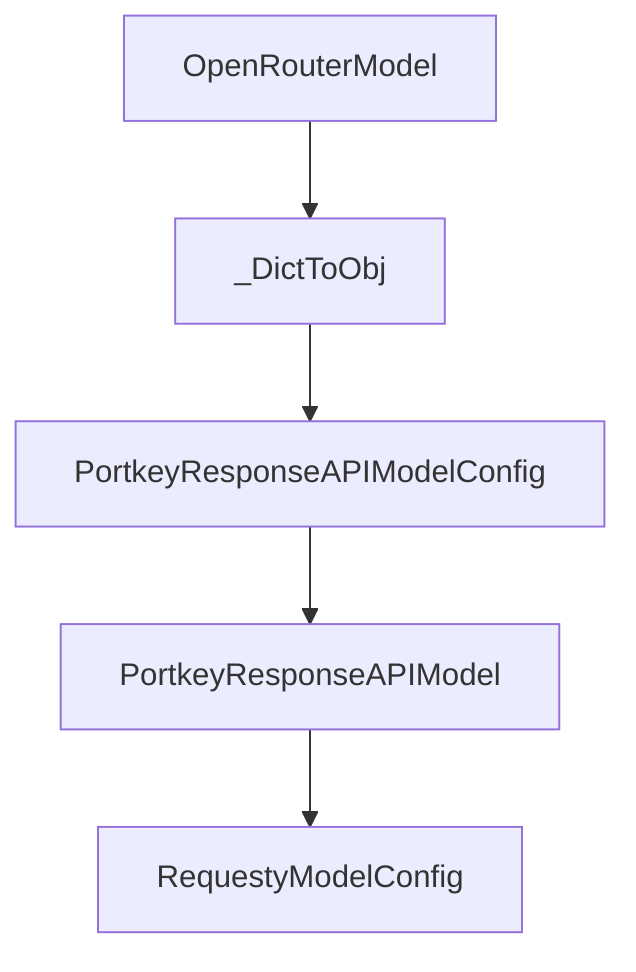

# Chapter 4: Global and YAML Configuration Strategy

Welcome to **Chapter 4: Global and YAML Configuration Strategy**. In this part of **Mini-SWE-Agent Tutorial: Minimal Autonomous Code Agent Design at Benchmark Scale**, you will build an intuitive mental model first, then move into concrete implementation details and practical production tradeoffs.


This chapter maps configuration layers for reproducible behavior.

## Learning Goals

- separate global environment settings from run config
- structure YAML files for agent/environment/model/run
- avoid config drift across contributors
- keep templates and parsing rules maintainable

## Config Guidance

- use global config for credentials/defaults
- use YAML for run-specific behavior and templates
- version config presets for reproducible evaluations

## Source References

- [Global Configuration](https://mini-swe-agent.com/latest/advanced/global_configuration/)
- [YAML Configuration](https://mini-swe-agent.com/latest/advanced/yaml_configuration/)
- [Usage Config Docs](https://mini-swe-agent.com/latest/usage/config/)

## Summary

You now have a disciplined configuration strategy for mini-swe-agent.

Next: [Chapter 5: Environments, Sandboxing, and Deployment](05-environments-sandboxing-and-deployment.md)

## Depth Expansion Playbook

## Source Code Walkthrough

### `src/minisweagent/models/openrouter_model.py`

The `OpenRouterModel` class in [`src/minisweagent/models/openrouter_model.py`](https://github.com/SWE-agent/mini-swe-agent/blob/HEAD/src/minisweagent/models/openrouter_model.py) handles a key part of this chapter's functionality:

```py


class OpenRouterModelConfig(BaseModel):
    model_name: str
    model_kwargs: dict[str, Any] = {}
    set_cache_control: Literal["default_end"] | None = None
    """Set explicit cache control markers, for example for Anthropic models"""
    cost_tracking: Literal["default", "ignore_errors"] = os.getenv("MSWEA_COST_TRACKING", "default")
    """Cost tracking mode for this model. Can be "default" or "ignore_errors" (ignore errors/missing cost info)"""
    format_error_template: str = "{{ error }}"
    """Template used when the LM's output is not in the expected format."""
    observation_template: str = (
        "<exception>{{output.exception_info}}</exception>\n"
        "<returncode>{{output.returncode}}</returncode>\n<output>\n{{output.output}}</output>"
    )
    """Template used to render the observation after executing an action."""
    multimodal_regex: str = ""
    """Regex to extract multimodal content. Empty string disables multimodal processing."""


class OpenRouterAPIError(Exception):
    """Custom exception for OpenRouter API errors."""


class OpenRouterAuthenticationError(Exception):
    """Custom exception for OpenRouter authentication errors."""


class OpenRouterRateLimitError(Exception):
    """Custom exception for OpenRouter rate limit errors."""


```

This class is important because it defines how Mini-SWE-Agent Tutorial: Minimal Autonomous Code Agent Design at Benchmark Scale implements the patterns covered in this chapter.

### `src/minisweagent/models/openrouter_model.py`

The `_DictToObj` class in [`src/minisweagent/models/openrouter_model.py`](https://github.com/SWE-agent/mini-swe-agent/blob/HEAD/src/minisweagent/models/openrouter_model.py) handles a key part of this chapter's functionality:

```py
        """Parse tool calls from the response. Raises FormatError if unknown tool."""
        tool_calls = response["choices"][0]["message"].get("tool_calls") or []
        tool_calls = [_DictToObj(tc) for tc in tool_calls]
        return parse_toolcall_actions(tool_calls, format_error_template=self.config.format_error_template)

    def format_message(self, **kwargs) -> dict:
        return expand_multimodal_content(kwargs, pattern=self.config.multimodal_regex)

    def format_observation_messages(
        self, message: dict, outputs: list[dict], template_vars: dict | None = None
    ) -> list[dict]:
        """Format execution outputs into tool result messages."""
        actions = message.get("extra", {}).get("actions", [])
        return format_toolcall_observation_messages(
            actions=actions,
            outputs=outputs,
            observation_template=self.config.observation_template,
            template_vars=template_vars,
            multimodal_regex=self.config.multimodal_regex,
        )

    def get_template_vars(self, **kwargs) -> dict[str, Any]:
        return self.config.model_dump()

    def serialize(self) -> dict:
        return {
            "info": {
                "config": {
                    "model": self.config.model_dump(mode="json"),
                    "model_type": f"{self.__class__.__module__}.{self.__class__.__name__}",
                },
            }
```

This class is important because it defines how Mini-SWE-Agent Tutorial: Minimal Autonomous Code Agent Design at Benchmark Scale implements the patterns covered in this chapter.

### `src/minisweagent/models/portkey_response_model.py`

The `PortkeyResponseAPIModelConfig` class in [`src/minisweagent/models/portkey_response_model.py`](https://github.com/SWE-agent/mini-swe-agent/blob/HEAD/src/minisweagent/models/portkey_response_model.py) handles a key part of this chapter's functionality:

```py


class PortkeyResponseAPIModelConfig(BaseModel):
    model_name: str
    model_kwargs: dict[str, Any] = {}
    litellm_model_registry: Path | str | None = os.getenv("LITELLM_MODEL_REGISTRY_PATH")
    litellm_model_name_override: str = ""
    cost_tracking: Literal["default", "ignore_errors"] = os.getenv("MSWEA_COST_TRACKING", "default")
    format_error_template: str = "{{ error }}"
    observation_template: str = (
        "<exception>{{output.exception_info}}</exception>\n"
        "<returncode>{{output.returncode}}</returncode>\n<output>\n{{output.output}}</output>"
    )
    multimodal_regex: str = ""


class PortkeyResponseAPIModel:
    """Portkey model using the Responses API with native tool calling.

    Note: This implementation is stateless - each request must include
    the full conversation history. previous_response_id is not used.
    """

    abort_exceptions: list[type[Exception]] = [KeyboardInterrupt, TypeError, ValueError]

    def __init__(self, **kwargs):
        self.config = PortkeyResponseAPIModelConfig(**kwargs)
        if self.config.litellm_model_registry and Path(self.config.litellm_model_registry).is_file():
            litellm.utils.register_model(json.loads(Path(self.config.litellm_model_registry).read_text()))

        self._api_key = os.getenv("PORTKEY_API_KEY")
        if not self._api_key:
```

This class is important because it defines how Mini-SWE-Agent Tutorial: Minimal Autonomous Code Agent Design at Benchmark Scale implements the patterns covered in this chapter.

### `src/minisweagent/models/portkey_response_model.py`

The `PortkeyResponseAPIModel` class in [`src/minisweagent/models/portkey_response_model.py`](https://github.com/SWE-agent/mini-swe-agent/blob/HEAD/src/minisweagent/models/portkey_response_model.py) handles a key part of this chapter's functionality:

```py
except ImportError:
    raise ImportError(
        "The portkey-ai package is required to use PortkeyResponseAPIModel. Please install it with: pip install portkey-ai"
    )


class PortkeyResponseAPIModelConfig(BaseModel):
    model_name: str
    model_kwargs: dict[str, Any] = {}
    litellm_model_registry: Path | str | None = os.getenv("LITELLM_MODEL_REGISTRY_PATH")
    litellm_model_name_override: str = ""
    cost_tracking: Literal["default", "ignore_errors"] = os.getenv("MSWEA_COST_TRACKING", "default")
    format_error_template: str = "{{ error }}"
    observation_template: str = (
        "<exception>{{output.exception_info}}</exception>\n"
        "<returncode>{{output.returncode}}</returncode>\n<output>\n{{output.output}}</output>"
    )
    multimodal_regex: str = ""


class PortkeyResponseAPIModel:
    """Portkey model using the Responses API with native tool calling.

    Note: This implementation is stateless - each request must include
    the full conversation history. previous_response_id is not used.
    """

    abort_exceptions: list[type[Exception]] = [KeyboardInterrupt, TypeError, ValueError]

    def __init__(self, **kwargs):
        self.config = PortkeyResponseAPIModelConfig(**kwargs)
        if self.config.litellm_model_registry and Path(self.config.litellm_model_registry).is_file():
```

This class is important because it defines how Mini-SWE-Agent Tutorial: Minimal Autonomous Code Agent Design at Benchmark Scale implements the patterns covered in this chapter.


## How These Components Connect


