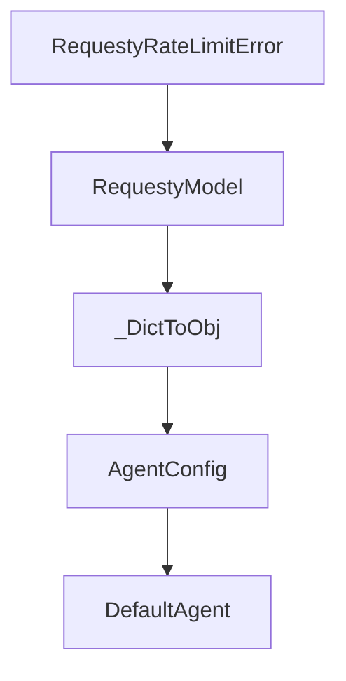

# Chapter 5: Environments, Sandboxing, and Deployment

Welcome to **Chapter 5: Environments, Sandboxing, and Deployment**. In this part of **Mini-SWE-Agent Tutorial: Minimal Autonomous Code Agent Design at Benchmark Scale**, you will build an intuitive mental model first, then move into concrete implementation details and practical production tradeoffs.


This chapter covers safe execution strategies across local and containerized environments.

## Learning Goals

- choose local vs containerized execution
- manage environment boundaries and permissions
- deploy with reproducible runtime assumptions
- reduce risk from arbitrary command execution

## Environment Strategy

- local environment for fast iteration
- containerized runtimes for isolation and reproducibility
- explicit filesystem and network policies in production-like runs

## Source References

- [Environments Guide](https://mini-swe-agent.com/latest/advanced/environments/)
- [FAQ: Shell Session Design Notes](https://mini-swe-agent.com/latest/faq/)
- [Security Guidance](https://github.com/SWE-agent/mini-swe-agent/blob/main/docs/SECURITY.md)

## Summary

You now have a safer deployment baseline for mini-swe-agent tasks.

Next: [Chapter 6: Benchmarking and SWE-bench Practices](06-benchmarking-and-swe-bench-practices.md)

## Depth Expansion Playbook

## Source Code Walkthrough

### `src/minisweagent/models/requesty_model.py`

The `RequestyRateLimitError` class in [`src/minisweagent/models/requesty_model.py`](https://github.com/SWE-agent/mini-swe-agent/blob/HEAD/src/minisweagent/models/requesty_model.py) handles a key part of this chapter's functionality:

```py


class RequestyRateLimitError(Exception):
    """Custom exception for Requesty rate limit errors."""

    pass


class RequestyModel:
    abort_exceptions: list[type[Exception]] = [RequestyAuthenticationError, KeyboardInterrupt]

    def __init__(self, **kwargs):
        self.config = RequestyModelConfig(**kwargs)
        self._api_url = "https://router.requesty.ai/v1/chat/completions"
        self._api_key = os.getenv("REQUESTY_API_KEY", "")

    def _query(self, messages: list[dict[str, str]], **kwargs):
        headers = {
            "Authorization": f"Bearer {self._api_key}",
            "Content-Type": "application/json",
            "HTTP-Referer": "https://github.com/SWE-agent/mini-swe-agent",
            "X-Title": "mini-swe-agent",
        }

        payload = {
            "model": self.config.model_name,
            "messages": messages,
            "tools": [BASH_TOOL],
            **(self.config.model_kwargs | kwargs),
        }

        try:
```

This class is important because it defines how Mini-SWE-Agent Tutorial: Minimal Autonomous Code Agent Design at Benchmark Scale implements the patterns covered in this chapter.

### `src/minisweagent/models/requesty_model.py`

The `RequestyModel` class in [`src/minisweagent/models/requesty_model.py`](https://github.com/SWE-agent/mini-swe-agent/blob/HEAD/src/minisweagent/models/requesty_model.py) handles a key part of this chapter's functionality:

```py


class RequestyModelConfig(BaseModel):
    model_name: str
    model_kwargs: dict[str, Any] = {}
    set_cache_control: Literal["default_end"] | None = None
    """Set explicit cache control markers, for example for Anthropic models"""
    format_error_template: str = "{{ error }}"
    """Template used when the LM's output is not in the expected format."""
    observation_template: str = (
        "<exception>{{output.exception_info}}</exception>\n"
        "<returncode>{{output.returncode}}</returncode>\n<output>\n{{output.output}}</output>"
    )
    """Template used to render the observation after executing an action."""
    multimodal_regex: str = ""
    """Regex to extract multimodal content. Empty string disables multimodal processing."""


class RequestyAPIError(Exception):
    """Custom exception for Requesty API errors."""

    pass


class RequestyAuthenticationError(Exception):
    """Custom exception for Requesty authentication errors."""

    pass


class RequestyRateLimitError(Exception):
    """Custom exception for Requesty rate limit errors."""
```

This class is important because it defines how Mini-SWE-Agent Tutorial: Minimal Autonomous Code Agent Design at Benchmark Scale implements the patterns covered in this chapter.

### `src/minisweagent/models/requesty_model.py`

The `_DictToObj` class in [`src/minisweagent/models/requesty_model.py`](https://github.com/SWE-agent/mini-swe-agent/blob/HEAD/src/minisweagent/models/requesty_model.py) handles a key part of this chapter's functionality:

```py
        """Parse tool calls from the response. Raises FormatError if unknown tool."""
        tool_calls = response["choices"][0]["message"].get("tool_calls") or []
        tool_calls = [_DictToObj(tc) for tc in tool_calls]
        return parse_toolcall_actions(tool_calls, format_error_template=self.config.format_error_template)

    def format_message(self, **kwargs) -> dict:
        return expand_multimodal_content(kwargs, pattern=self.config.multimodal_regex)

    def format_observation_messages(
        self, message: dict, outputs: list[dict], template_vars: dict | None = None
    ) -> list[dict]:
        """Format execution outputs into tool result messages."""
        actions = message.get("extra", {}).get("actions", [])
        return format_toolcall_observation_messages(
            actions=actions,
            outputs=outputs,
            observation_template=self.config.observation_template,
            template_vars=template_vars,
            multimodal_regex=self.config.multimodal_regex,
        )

    def get_template_vars(self, **kwargs) -> dict[str, Any]:
        return self.config.model_dump()

    def serialize(self) -> dict:
        return {
            "info": {
                "config": {
                    "model": self.config.model_dump(mode="json"),
                    "model_type": f"{self.__class__.__module__}.{self.__class__.__name__}",
                },
            }
```

This class is important because it defines how Mini-SWE-Agent Tutorial: Minimal Autonomous Code Agent Design at Benchmark Scale implements the patterns covered in this chapter.

### `src/minisweagent/agents/default.py`

The `AgentConfig` class in [`src/minisweagent/agents/default.py`](https://github.com/SWE-agent/mini-swe-agent/blob/HEAD/src/minisweagent/agents/default.py) handles a key part of this chapter's functionality:

```py


class AgentConfig(BaseModel):
    """Check the config files in minisweagent/config for example settings."""

    system_template: str
    """Template for the system message (the first message)."""
    instance_template: str
    """Template for the first user message specifying the task (the second message overall)."""
    step_limit: int = 0
    """Maximum number of steps the agent can take."""
    cost_limit: float = 3.0
    """Stop agent after exceeding (!) this cost."""
    output_path: Path | None = None
    """Save the trajectory to this path."""


class DefaultAgent:
    def __init__(self, model: Model, env: Environment, *, config_class: type = AgentConfig, **kwargs):
        """See the `AgentConfig` class for permitted keyword arguments."""
        self.config = config_class(**kwargs)
        self.messages: list[dict] = []
        self.model = model
        self.env = env
        self.extra_template_vars = {}
        self.logger = logging.getLogger("agent")
        self.cost = 0.0
        self.n_calls = 0

    def get_template_vars(self, **kwargs) -> dict:
        return recursive_merge(
            self.config.model_dump(),
```

This class is important because it defines how Mini-SWE-Agent Tutorial: Minimal Autonomous Code Agent Design at Benchmark Scale implements the patterns covered in this chapter.


## How These Components Connect


