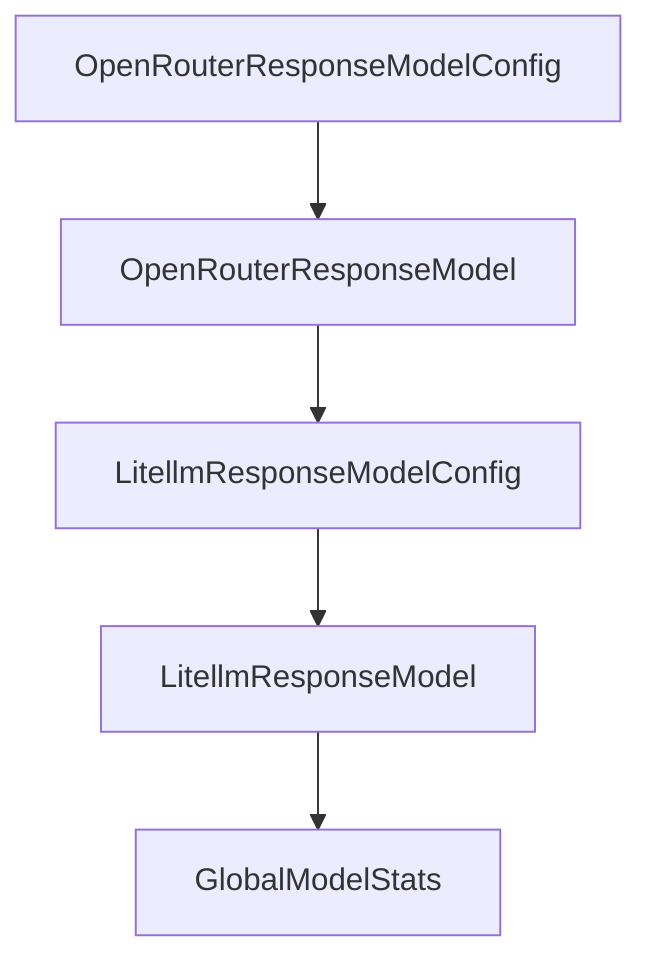

# Chapter 5: Environments, Sandboxing, and Deployment

Welcome to **Chapter 5: Environments, Sandboxing, and Deployment**. In this part of **Mini-SWE-Agent Tutorial: Minimal Autonomous Code Agent Design at Benchmark Scale**, you will build an intuitive mental model first, then move into concrete implementation details and practical production tradeoffs.


This chapter covers safe execution strategies across local and containerized environments.

## Learning Goals

- choose local vs containerized execution
- manage environment boundaries and permissions
- deploy with reproducible runtime assumptions
- reduce risk from arbitrary command execution

## Environment Strategy

- local environment for fast iteration
- containerized runtimes for isolation and reproducibility
- explicit filesystem and network policies in production-like runs

## Source References

- [Environments Guide](https://mini-swe-agent.com/latest/advanced/environments/)
- [FAQ: Shell Session Design Notes](https://mini-swe-agent.com/latest/faq/)
- [Security Guidance](https://github.com/SWE-agent/mini-swe-agent/blob/main/docs/SECURITY.md)

## Summary

You now have a safer deployment baseline for mini-swe-agent tasks.

Next: [Chapter 6: Benchmarking and SWE-bench Practices](06-benchmarking-and-swe-bench-practices.md)

## Source Code Walkthrough

### `src/minisweagent/models/openrouter_response_model.py`

The `OpenRouterResponseModelConfig` class in [`src/minisweagent/models/openrouter_response_model.py`](https://github.com/SWE-agent/mini-swe-agent/blob/HEAD/src/minisweagent/models/openrouter_response_model.py) handles a key part of this chapter's functionality:

```py


class OpenRouterResponseModelConfig(OpenRouterModelConfig):
    pass


class OpenRouterResponseModel(OpenRouterModel):
    """OpenRouter model using the Responses API with native tool calling.

    Note: OpenRouter's Responses API is stateless - each request must include
    the full conversation history. previous_response_id is not supported.
    See: https://openrouter.ai/docs/api/reference/responses/overview
    """

    def __init__(self, **kwargs):
        super().__init__(**kwargs)
        self.config = OpenRouterResponseModelConfig(**kwargs)
        self._api_url = "https://openrouter.ai/api/v1/responses"

    def _query(self, messages: list[dict[str, str]], **kwargs):
        headers = {
            "Authorization": f"Bearer {self._api_key}",
            "Content-Type": "application/json",
        }
        payload = {
            "model": self.config.model_name,
            "input": messages,
            "tools": [BASH_TOOL_RESPONSE_API],
            **(self.config.model_kwargs | kwargs),
        }
        try:
            response = requests.post(self._api_url, headers=headers, data=json.dumps(payload), timeout=60)
```

This class is important because it defines how Mini-SWE-Agent Tutorial: Minimal Autonomous Code Agent Design at Benchmark Scale implements the patterns covered in this chapter.

### `src/minisweagent/models/openrouter_response_model.py`

The `OpenRouterResponseModel` class in [`src/minisweagent/models/openrouter_response_model.py`](https://github.com/SWE-agent/mini-swe-agent/blob/HEAD/src/minisweagent/models/openrouter_response_model.py) handles a key part of this chapter's functionality:

```py


class OpenRouterResponseModelConfig(OpenRouterModelConfig):
    pass


class OpenRouterResponseModel(OpenRouterModel):
    """OpenRouter model using the Responses API with native tool calling.

    Note: OpenRouter's Responses API is stateless - each request must include
    the full conversation history. previous_response_id is not supported.
    See: https://openrouter.ai/docs/api/reference/responses/overview
    """

    def __init__(self, **kwargs):
        super().__init__(**kwargs)
        self.config = OpenRouterResponseModelConfig(**kwargs)
        self._api_url = "https://openrouter.ai/api/v1/responses"

    def _query(self, messages: list[dict[str, str]], **kwargs):
        headers = {
            "Authorization": f"Bearer {self._api_key}",
            "Content-Type": "application/json",
        }
        payload = {
            "model": self.config.model_name,
            "input": messages,
            "tools": [BASH_TOOL_RESPONSE_API],
            **(self.config.model_kwargs | kwargs),
        }
        try:
            response = requests.post(self._api_url, headers=headers, data=json.dumps(payload), timeout=60)
```

This class is important because it defines how Mini-SWE-Agent Tutorial: Minimal Autonomous Code Agent Design at Benchmark Scale implements the patterns covered in this chapter.

### `src/minisweagent/models/litellm_response_model.py`

The `LitellmResponseModelConfig` class in [`src/minisweagent/models/litellm_response_model.py`](https://github.com/SWE-agent/mini-swe-agent/blob/HEAD/src/minisweagent/models/litellm_response_model.py) handles a key part of this chapter's functionality:

```py


class LitellmResponseModelConfig(LitellmModelConfig):
    pass


class LitellmResponseModel(LitellmModel):
    def __init__(self, *, config_class: Callable = LitellmResponseModelConfig, **kwargs):
        super().__init__(config_class=config_class, **kwargs)

    def _prepare_messages_for_api(self, messages: list[dict]) -> list[dict]:
        """Flatten response objects into their output items for stateless API calls."""
        result = []
        for msg in messages:
            if msg.get("object") == "response":
                for item in msg.get("output", []):
                    result.append({k: v for k, v in item.items() if k != "extra"})
            else:
                result.append({k: v for k, v in msg.items() if k != "extra"})
        return result

    def _query(self, messages: list[dict[str, str]], **kwargs):
        try:
            return litellm.responses(
                model=self.config.model_name,
                input=messages,
                tools=[BASH_TOOL_RESPONSE_API],
                **(self.config.model_kwargs | kwargs),
            )
        except litellm.exceptions.AuthenticationError as e:
            e.message += " You can permanently set your API key with `mini-extra config set KEY VALUE`."
            raise e
```

This class is important because it defines how Mini-SWE-Agent Tutorial: Minimal Autonomous Code Agent Design at Benchmark Scale implements the patterns covered in this chapter.

### `src/minisweagent/models/litellm_response_model.py`

The `LitellmResponseModel` class in [`src/minisweagent/models/litellm_response_model.py`](https://github.com/SWE-agent/mini-swe-agent/blob/HEAD/src/minisweagent/models/litellm_response_model.py) handles a key part of this chapter's functionality:

```py


class LitellmResponseModelConfig(LitellmModelConfig):
    pass


class LitellmResponseModel(LitellmModel):
    def __init__(self, *, config_class: Callable = LitellmResponseModelConfig, **kwargs):
        super().__init__(config_class=config_class, **kwargs)

    def _prepare_messages_for_api(self, messages: list[dict]) -> list[dict]:
        """Flatten response objects into their output items for stateless API calls."""
        result = []
        for msg in messages:
            if msg.get("object") == "response":
                for item in msg.get("output", []):
                    result.append({k: v for k, v in item.items() if k != "extra"})
            else:
                result.append({k: v for k, v in msg.items() if k != "extra"})
        return result

    def _query(self, messages: list[dict[str, str]], **kwargs):
        try:
            return litellm.responses(
                model=self.config.model_name,
                input=messages,
                tools=[BASH_TOOL_RESPONSE_API],
                **(self.config.model_kwargs | kwargs),
            )
        except litellm.exceptions.AuthenticationError as e:
            e.message += " You can permanently set your API key with `mini-extra config set KEY VALUE`."
            raise e
```

This class is important because it defines how Mini-SWE-Agent Tutorial: Minimal Autonomous Code Agent Design at Benchmark Scale implements the patterns covered in this chapter.


## How These Components Connect


