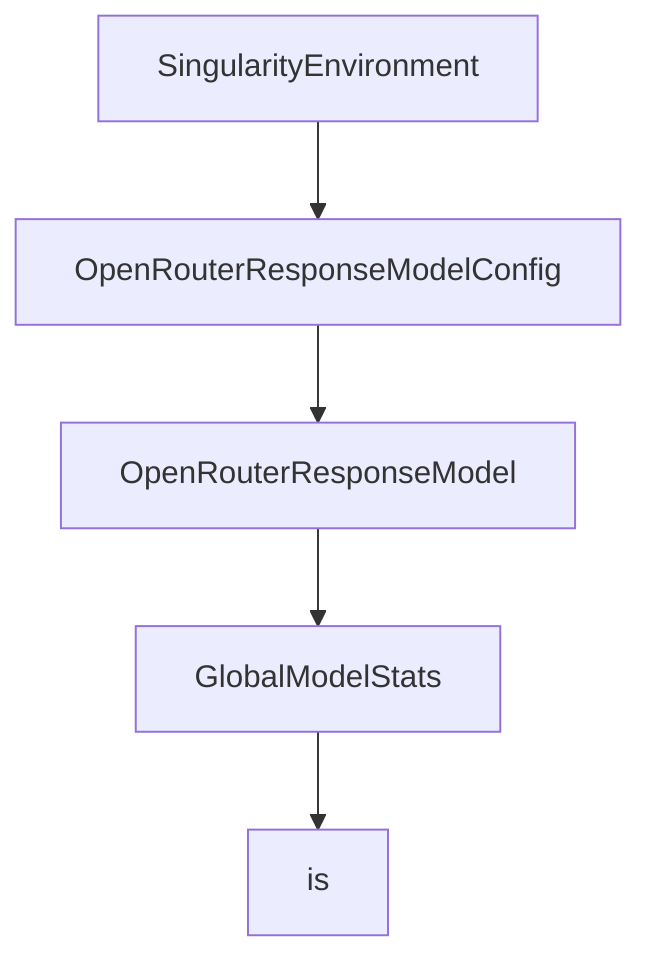

# Chapter 6: Benchmarking and SWE-bench Practices

Welcome to **Chapter 6: Benchmarking and SWE-bench Practices**. In this part of **Mini-SWE-Agent Tutorial: Minimal Autonomous Code Agent Design at Benchmark Scale**, you will build an intuitive mental model first, then move into concrete implementation details and practical production tradeoffs.


This chapter focuses on benchmark discipline and experiment quality.

## Learning Goals

- run consistent swebench evaluations
- compare model variants fairly
- capture trajectory evidence for analysis
- prevent false conclusions from uncontrolled settings

## Evaluation Checklist

- pin dataset slice and model version per run
- log config and environment metadata
- review trajectory artifacts for failure modes
- run repeat trials before ranking changes

## Source References

- [SWE-bench Usage Guide](https://mini-swe-agent.com/latest/usage/swebench/)
- [SWE-bench Website](https://www.swebench.com/)
- [Mini-SWE-Agent README](https://github.com/SWE-agent/mini-swe-agent/blob/main/README.md)

## Summary

You now have a benchmark workflow that is both rigorous and reproducible.

Next: [Chapter 7: Cookbook Extensions and Python Bindings](07-cookbook-extensions-and-python-bindings.md)

## Depth Expansion Playbook

## Source Code Walkthrough

### `src/minisweagent/environments/singularity.py`

The `SingularityEnvironment` class in [`src/minisweagent/environments/singularity.py`](https://github.com/SWE-agent/mini-swe-agent/blob/HEAD/src/minisweagent/environments/singularity.py) handles a key part of this chapter's functionality:

```py


class SingularityEnvironmentConfig(BaseModel):
    image: str
    cwd: str = "/"
    env: dict[str, str] = {}
    """Environment variables to set in the container."""
    forward_env: list[str] = []
    """Environment variables to forward to the container."""
    timeout: int = 30
    """Timeout for executing commands in the container."""
    executable: str = os.getenv("MSWEA_SINGULARITY_EXECUTABLE", "singularity")
    """Path to the singularity executable."""
    sandbox_build_retries: int = 3
    """Number of retries for building the sandbox if an error occurs."""
    global_args: list[str] = ["--quiet"]
    """Global arguments passed before the subcommand (e.g., --quiet, --debug)."""
    exec_args: list[str] = ["--contain", "--cleanenv", "--fakeroot"]
    """Arguments passed to `singularity exec`."""


class SingularityEnvironment:
    def __init__(
        self, *, config_class: type = SingularityEnvironmentConfig, logger: logging.Logger | None = None, **kwargs
    ):
        """Singularity environment. See `SingularityEnvironmentConfig` for kwargs."""
        self.logger = logger or logging.getLogger("minisweagent.environment")
        self.config = config_class(**kwargs)
        self.sandbox_dir = self._build_sandbox()

    def _build_sandbox(self) -> Path:
        # Building the sandbox can fail (very rarely), so we retry it
```

This class is important because it defines how Mini-SWE-Agent Tutorial: Minimal Autonomous Code Agent Design at Benchmark Scale implements the patterns covered in this chapter.

### `src/minisweagent/models/openrouter_response_model.py`

The `OpenRouterResponseModelConfig` class in [`src/minisweagent/models/openrouter_response_model.py`](https://github.com/SWE-agent/mini-swe-agent/blob/HEAD/src/minisweagent/models/openrouter_response_model.py) handles a key part of this chapter's functionality:

```py


class OpenRouterResponseModelConfig(OpenRouterModelConfig):
    pass


class OpenRouterResponseModel(OpenRouterModel):
    """OpenRouter model using the Responses API with native tool calling.

    Note: OpenRouter's Responses API is stateless - each request must include
    the full conversation history. previous_response_id is not supported.
    See: https://openrouter.ai/docs/api/reference/responses/overview
    """

    def __init__(self, **kwargs):
        super().__init__(**kwargs)
        self.config = OpenRouterResponseModelConfig(**kwargs)
        self._api_url = "https://openrouter.ai/api/v1/responses"

    def _query(self, messages: list[dict[str, str]], **kwargs):
        headers = {
            "Authorization": f"Bearer {self._api_key}",
            "Content-Type": "application/json",
        }
        payload = {
            "model": self.config.model_name,
            "input": messages,
            "tools": [BASH_TOOL_RESPONSE_API],
            **(self.config.model_kwargs | kwargs),
        }
        try:
            response = requests.post(self._api_url, headers=headers, data=json.dumps(payload), timeout=60)
```

This class is important because it defines how Mini-SWE-Agent Tutorial: Minimal Autonomous Code Agent Design at Benchmark Scale implements the patterns covered in this chapter.

### `src/minisweagent/models/openrouter_response_model.py`

The `OpenRouterResponseModel` class in [`src/minisweagent/models/openrouter_response_model.py`](https://github.com/SWE-agent/mini-swe-agent/blob/HEAD/src/minisweagent/models/openrouter_response_model.py) handles a key part of this chapter's functionality:

```py


class OpenRouterResponseModelConfig(OpenRouterModelConfig):
    pass


class OpenRouterResponseModel(OpenRouterModel):
    """OpenRouter model using the Responses API with native tool calling.

    Note: OpenRouter's Responses API is stateless - each request must include
    the full conversation history. previous_response_id is not supported.
    See: https://openrouter.ai/docs/api/reference/responses/overview
    """

    def __init__(self, **kwargs):
        super().__init__(**kwargs)
        self.config = OpenRouterResponseModelConfig(**kwargs)
        self._api_url = "https://openrouter.ai/api/v1/responses"

    def _query(self, messages: list[dict[str, str]], **kwargs):
        headers = {
            "Authorization": f"Bearer {self._api_key}",
            "Content-Type": "application/json",
        }
        payload = {
            "model": self.config.model_name,
            "input": messages,
            "tools": [BASH_TOOL_RESPONSE_API],
            **(self.config.model_kwargs | kwargs),
        }
        try:
            response = requests.post(self._api_url, headers=headers, data=json.dumps(payload), timeout=60)
```

This class is important because it defines how Mini-SWE-Agent Tutorial: Minimal Autonomous Code Agent Design at Benchmark Scale implements the patterns covered in this chapter.

### `src/minisweagent/models/__init__.py`

The `GlobalModelStats` class in [`src/minisweagent/models/__init__.py`](https://github.com/SWE-agent/mini-swe-agent/blob/HEAD/src/minisweagent/models/__init__.py) handles a key part of this chapter's functionality:

```py


class GlobalModelStats:
    """Global model statistics tracker with optional limits."""

    def __init__(self):
        self._cost = 0.0
        self._n_calls = 0
        self._lock = threading.Lock()
        self.cost_limit = float(os.getenv("MSWEA_GLOBAL_COST_LIMIT", "0"))
        self.call_limit = int(os.getenv("MSWEA_GLOBAL_CALL_LIMIT", "0"))
        if (self.cost_limit > 0 or self.call_limit > 0) and not os.getenv("MSWEA_SILENT_STARTUP"):
            print(f"Global cost/call limit: ${self.cost_limit:.4f} / {self.call_limit}")

    def add(self, cost: float) -> None:
        """Add a model call with its cost, checking limits."""
        with self._lock:
            self._cost += cost
            self._n_calls += 1
        if 0 < self.cost_limit < self._cost or 0 < self.call_limit < self._n_calls + 1:
            raise RuntimeError(f"Global cost/call limit exceeded: ${self._cost:.4f} / {self._n_calls}")

    @property
    def cost(self) -> float:
        return self._cost

    @property
    def n_calls(self) -> int:
        return self._n_calls


GLOBAL_MODEL_STATS = GlobalModelStats()
```

This class is important because it defines how Mini-SWE-Agent Tutorial: Minimal Autonomous Code Agent Design at Benchmark Scale implements the patterns covered in this chapter.


## How These Components Connect


