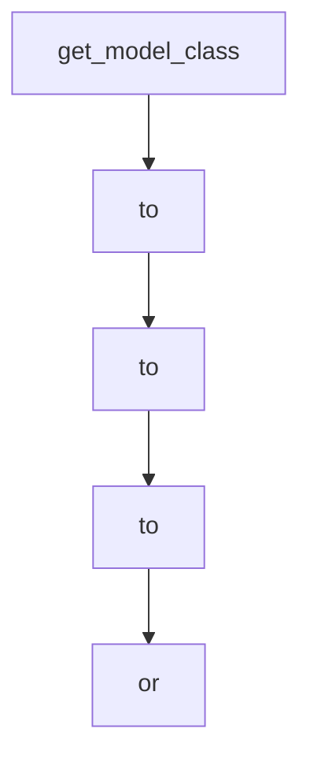

# Chapter 7: Cookbook Extensions and Python Bindings

Welcome to **Chapter 7: Cookbook Extensions and Python Bindings**. In this part of **Mini-SWE-Agent Tutorial: Minimal Autonomous Code Agent Design at Benchmark Scale**, you will build an intuitive mental model first, then move into concrete implementation details and practical production tradeoffs.


This chapter shows how to extend behavior without bloating the core.

## Learning Goals

- use cookbook patterns for custom components
- extend agents/environments/models with minimal coupling
- keep custom scripts maintainable
- preserve simplicity during extension work

## Extension Strategy

- prefer composable component overrides
- avoid adding broad knobs to core components
- keep custom logic in focused run scripts or extra modules

## Source References

- [Cookbook](https://mini-swe-agent.com/latest/advanced/cookbook/)
- [Python Bindings Usage](https://mini-swe-agent.com/latest/usage/python_bindings/)
- [Project Source Tree](https://github.com/SWE-agent/mini-swe-agent/tree/main/src/minisweagent)

## Summary

You now have a path to custom behavior while preserving the minimal architecture.

Next: [Chapter 8: Contribution Workflow and Governance](08-contribution-workflow-and-governance.md)

## Depth Expansion Playbook

## Source Code Walkthrough

### `src/minisweagent/models/__init__.py`

The `get_model_class` function in [`src/minisweagent/models/__init__.py`](https://github.com/SWE-agent/mini-swe-agent/blob/HEAD/src/minisweagent/models/__init__.py) handles a key part of this chapter's functionality:

```py
    config["model_name"] = resolved_model_name

    model_class = get_model_class(resolved_model_name, config.pop("model_class", ""))

    if (
        any(s in resolved_model_name.lower() for s in ["anthropic", "sonnet", "opus", "claude"])
        and "set_cache_control" not in config
    ):
        # Select cache control for Anthropic models by default
        config["set_cache_control"] = "default_end"

    return model_class(**config)


def get_model_name(input_model_name: str | None = None, config: dict | None = None) -> str:
    """Get a model name from any kind of user input or settings."""
    if config is None:
        config = {}
    if input_model_name:
        return input_model_name
    if from_config := config.get("model_name"):
        return from_config
    if from_env := os.getenv("MSWEA_MODEL_NAME"):
        return from_env
    raise ValueError("No default model set. Please run `mini-extra config setup` to set one.")


_MODEL_CLASS_MAPPING = {
    "litellm": "minisweagent.models.litellm_model.LitellmModel",
    "litellm_textbased": "minisweagent.models.litellm_textbased_model.LitellmTextbasedModel",
    "litellm_response": "minisweagent.models.litellm_response_model.LitellmResponseModel",
    "openrouter": "minisweagent.models.openrouter_model.OpenRouterModel",
```

This function is important because it defines how Mini-SWE-Agent Tutorial: Minimal Autonomous Code Agent Design at Benchmark Scale implements the patterns covered in this chapter.

### `src/minisweagent/run/mini.py`

The `to` class in [`src/minisweagent/run/mini.py`](https://github.com/SWE-agent/mini-swe-agent/blob/HEAD/src/minisweagent/run/mini.py) handles a key part of this chapter's functionality:

```py
"""

_CONFIG_SPEC_HELP_TEXT = """Path to config files, filenames, or key-value pairs.

[bold red]IMPORTANT:[/bold red] [red]If you set this option, the default config file will not be used.[/red]
So you need to explicitly set it e.g., with [bold green]-c mini.yaml <other options>[/bold green]

Multiple configs will be recursively merged.

Examples:

[bold red]-c model.model_kwargs.temperature=0[/bold red] [red]You forgot to add the default config file! See above.[/red]

[bold green]-c mini.yaml -c model.model_kwargs.temperature=0.5[/bold green]

[bold green]-c swebench.yaml agent.mode=yolo[/bold green]
"""

console = Console(highlight=False)
app = typer.Typer(rich_markup_mode="rich")


# fmt: off
@app.command(help=_HELP_TEXT)
def main(
    model_name: str | None = typer.Option(None, "-m", "--model", help="Model to use",),
    model_class: str | None = typer.Option(None, "--model-class", help="Model class to use (e.g., 'litellm' or 'minisweagent.models.litellm_model.LitellmModel')", rich_help_panel="Advanced"),
    agent_class: str | None = typer.Option(None, "--agent-class", help="Agent class to use (e.g., 'interactive' or 'minisweagent.agents.interactive.InteractiveAgent')", rich_help_panel="Advanced"),
    environment_class: str | None = typer.Option(None, "--environment-class", help="Environment class to use (e.g., 'local' or 'minisweagent.environments.local.LocalEnvironment')", rich_help_panel="Advanced"),
    task: str | None = typer.Option(None, "-t", "--task", help="Task/problem statement", show_default=False),
    yolo: bool = typer.Option(False, "-y", "--yolo", help="Run without confirmation"),
    cost_limit: float | None = typer.Option(None, "-l", "--cost-limit", help="Cost limit. Set to 0 to disable."),
```

This class is important because it defines how Mini-SWE-Agent Tutorial: Minimal Autonomous Code Agent Design at Benchmark Scale implements the patterns covered in this chapter.

### `src/minisweagent/run/mini.py`

The `to` class in [`src/minisweagent/run/mini.py`](https://github.com/SWE-agent/mini-swe-agent/blob/HEAD/src/minisweagent/run/mini.py) handles a key part of this chapter's functionality:

```py
"""

_CONFIG_SPEC_HELP_TEXT = """Path to config files, filenames, or key-value pairs.

[bold red]IMPORTANT:[/bold red] [red]If you set this option, the default config file will not be used.[/red]
So you need to explicitly set it e.g., with [bold green]-c mini.yaml <other options>[/bold green]

Multiple configs will be recursively merged.

Examples:

[bold red]-c model.model_kwargs.temperature=0[/bold red] [red]You forgot to add the default config file! See above.[/red]

[bold green]-c mini.yaml -c model.model_kwargs.temperature=0.5[/bold green]

[bold green]-c swebench.yaml agent.mode=yolo[/bold green]
"""

console = Console(highlight=False)
app = typer.Typer(rich_markup_mode="rich")


# fmt: off
@app.command(help=_HELP_TEXT)
def main(
    model_name: str | None = typer.Option(None, "-m", "--model", help="Model to use",),
    model_class: str | None = typer.Option(None, "--model-class", help="Model class to use (e.g., 'litellm' or 'minisweagent.models.litellm_model.LitellmModel')", rich_help_panel="Advanced"),
    agent_class: str | None = typer.Option(None, "--agent-class", help="Agent class to use (e.g., 'interactive' or 'minisweagent.agents.interactive.InteractiveAgent')", rich_help_panel="Advanced"),
    environment_class: str | None = typer.Option(None, "--environment-class", help="Environment class to use (e.g., 'local' or 'minisweagent.environments.local.LocalEnvironment')", rich_help_panel="Advanced"),
    task: str | None = typer.Option(None, "-t", "--task", help="Task/problem statement", show_default=False),
    yolo: bool = typer.Option(False, "-y", "--yolo", help="Run without confirmation"),
    cost_limit: float | None = typer.Option(None, "-l", "--cost-limit", help="Cost limit. Set to 0 to disable."),
```

This class is important because it defines how Mini-SWE-Agent Tutorial: Minimal Autonomous Code Agent Design at Benchmark Scale implements the patterns covered in this chapter.

### `src/minisweagent/run/mini.py`

The `to` class in [`src/minisweagent/run/mini.py`](https://github.com/SWE-agent/mini-swe-agent/blob/HEAD/src/minisweagent/run/mini.py) handles a key part of this chapter's functionality:

```py
"""

_CONFIG_SPEC_HELP_TEXT = """Path to config files, filenames, or key-value pairs.

[bold red]IMPORTANT:[/bold red] [red]If you set this option, the default config file will not be used.[/red]
So you need to explicitly set it e.g., with [bold green]-c mini.yaml <other options>[/bold green]

Multiple configs will be recursively merged.

Examples:

[bold red]-c model.model_kwargs.temperature=0[/bold red] [red]You forgot to add the default config file! See above.[/red]

[bold green]-c mini.yaml -c model.model_kwargs.temperature=0.5[/bold green]

[bold green]-c swebench.yaml agent.mode=yolo[/bold green]
"""

console = Console(highlight=False)
app = typer.Typer(rich_markup_mode="rich")


# fmt: off
@app.command(help=_HELP_TEXT)
def main(
    model_name: str | None = typer.Option(None, "-m", "--model", help="Model to use",),
    model_class: str | None = typer.Option(None, "--model-class", help="Model class to use (e.g., 'litellm' or 'minisweagent.models.litellm_model.LitellmModel')", rich_help_panel="Advanced"),
    agent_class: str | None = typer.Option(None, "--agent-class", help="Agent class to use (e.g., 'interactive' or 'minisweagent.agents.interactive.InteractiveAgent')", rich_help_panel="Advanced"),
    environment_class: str | None = typer.Option(None, "--environment-class", help="Environment class to use (e.g., 'local' or 'minisweagent.environments.local.LocalEnvironment')", rich_help_panel="Advanced"),
    task: str | None = typer.Option(None, "-t", "--task", help="Task/problem statement", show_default=False),
    yolo: bool = typer.Option(False, "-y", "--yolo", help="Run without confirmation"),
    cost_limit: float | None = typer.Option(None, "-l", "--cost-limit", help="Cost limit. Set to 0 to disable."),
```

This class is important because it defines how Mini-SWE-Agent Tutorial: Minimal Autonomous Code Agent Design at Benchmark Scale implements the patterns covered in this chapter.


## How These Components Connect


