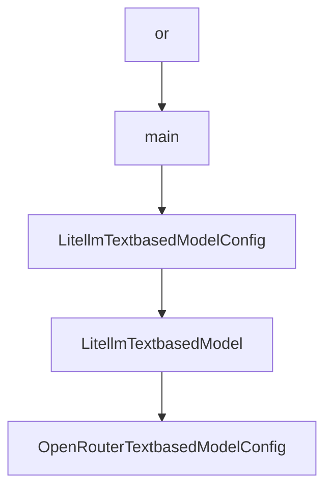

# Chapter 7: Cookbook Extensions and Python Bindings

Welcome to **Chapter 7: Cookbook Extensions and Python Bindings**. In this part of **Mini-SWE-Agent Tutorial: Minimal Autonomous Code Agent Design at Benchmark Scale**, you will build an intuitive mental model first, then move into concrete implementation details and practical production tradeoffs.


This chapter shows how to extend behavior without bloating the core.

## Learning Goals

- use cookbook patterns for custom components
- extend agents/environments/models with minimal coupling
- keep custom scripts maintainable
- preserve simplicity during extension work

## Extension Strategy

- prefer composable component overrides
- avoid adding broad knobs to core components
- keep custom logic in focused run scripts or extra modules

## Source References

- [Cookbook](https://mini-swe-agent.com/latest/advanced/cookbook/)
- [Python Bindings Usage](https://mini-swe-agent.com/latest/usage/python_bindings/)
- [Project Source Tree](https://github.com/SWE-agent/mini-swe-agent/tree/main/src/minisweagent)

## Summary

You now have a path to custom behavior while preserving the minimal architecture.

Next: [Chapter 8: Contribution Workflow and Governance](08-contribution-workflow-and-governance.md)

## Source Code Walkthrough

### `src/minisweagent/run/mini.py`

The `or` class in [`src/minisweagent/run/mini.py`](https://github.com/SWE-agent/mini-swe-agent/blob/HEAD/src/minisweagent/run/mini.py) handles a key part of this chapter's functionality:

```py
# Read this first: https://mini-swe-agent.com/latest/usage/mini/  (usage)

import os
from pathlib import Path
from typing import Any

import typer
from rich.console import Console

from minisweagent import global_config_dir
from minisweagent.agents import get_agent
from minisweagent.agents.utils.prompt_user import _multiline_prompt
from minisweagent.config import builtin_config_dir, get_config_from_spec
from minisweagent.environments import get_environment
from minisweagent.models import get_model
from minisweagent.run.utilities.config import configure_if_first_time
from minisweagent.utils.serialize import UNSET, recursive_merge

DEFAULT_CONFIG_FILE = Path(os.getenv("MSWEA_MINI_CONFIG_PATH", builtin_config_dir / "mini.yaml"))
DEFAULT_OUTPUT_FILE = global_config_dir / "last_mini_run.traj.json"


_HELP_TEXT = """Run mini-SWE-agent in your local environment.

[not dim]
More information about the usage: [bold green]https://mini-swe-agent.com/latest/usage/mini/[/bold green]
[/not dim]
"""

_CONFIG_SPEC_HELP_TEXT = """Path to config files, filenames, or key-value pairs.

[bold red]IMPORTANT:[/bold red] [red]If you set this option, the default config file will not be used.[/red]
```

This class is important because it defines how Mini-SWE-Agent Tutorial: Minimal Autonomous Code Agent Design at Benchmark Scale implements the patterns covered in this chapter.

### `src/minisweagent/run/mini.py`

The `main` function in [`src/minisweagent/run/mini.py`](https://github.com/SWE-agent/mini-swe-agent/blob/HEAD/src/minisweagent/run/mini.py) handles a key part of this chapter's functionality:

```py
# fmt: off
@app.command(help=_HELP_TEXT)
def main(
    model_name: str | None = typer.Option(None, "-m", "--model", help="Model to use",),
    model_class: str | None = typer.Option(None, "--model-class", help="Model class to use (e.g., 'litellm' or 'minisweagent.models.litellm_model.LitellmModel')", rich_help_panel="Advanced"),
    agent_class: str | None = typer.Option(None, "--agent-class", help="Agent class to use (e.g., 'interactive' or 'minisweagent.agents.interactive.InteractiveAgent')", rich_help_panel="Advanced"),
    environment_class: str | None = typer.Option(None, "--environment-class", help="Environment class to use (e.g., 'local' or 'minisweagent.environments.local.LocalEnvironment')", rich_help_panel="Advanced"),
    task: str | None = typer.Option(None, "-t", "--task", help="Task/problem statement", show_default=False),
    yolo: bool = typer.Option(False, "-y", "--yolo", help="Run without confirmation"),
    cost_limit: float | None = typer.Option(None, "-l", "--cost-limit", help="Cost limit. Set to 0 to disable."),
    config_spec: list[str] = typer.Option([str(DEFAULT_CONFIG_FILE)], "-c", "--config", help=_CONFIG_SPEC_HELP_TEXT),
    output: Path | None = typer.Option(DEFAULT_OUTPUT_FILE, "-o", "--output", help="Output trajectory file"),
    exit_immediately: bool = typer.Option(False, "--exit-immediately", help="Exit immediately when the agent wants to finish instead of prompting.", rich_help_panel="Advanced"),
) -> Any:
    # fmt: on
    configure_if_first_time()

    # Build the config from the command line arguments
    console.print(f"Building agent config from specs: [bold green]{config_spec}[/bold green]")
    configs = [get_config_from_spec(spec) for spec in config_spec]
    configs.append({
        "run": {
            "task": task or UNSET,
        },
        "agent": {
            "agent_class": agent_class or UNSET,
            "mode": "yolo" if yolo else UNSET,
            "cost_limit": cost_limit or UNSET,
            "confirm_exit": False if exit_immediately else UNSET,
            "output_path": output or UNSET,
        },
        "model": {
```

This function is important because it defines how Mini-SWE-Agent Tutorial: Minimal Autonomous Code Agent Design at Benchmark Scale implements the patterns covered in this chapter.

### `src/minisweagent/models/litellm_textbased_model.py`

The `LitellmTextbasedModelConfig` class in [`src/minisweagent/models/litellm_textbased_model.py`](https://github.com/SWE-agent/mini-swe-agent/blob/HEAD/src/minisweagent/models/litellm_textbased_model.py) handles a key part of this chapter's functionality:

```py


class LitellmTextbasedModelConfig(LitellmModelConfig):
    action_regex: str = r"```mswea_bash_command\s*\n(.*?)\n```"
    """Regex to extract the action from the LM's output."""
    format_error_template: str = (
        "Please always provide EXACTLY ONE action in triple backticks, found {{actions|length}} actions."
    )
    """Template used when the LM's output is not in the expected format."""


class LitellmTextbasedModel(LitellmModel):
    def __init__(self, **kwargs):
        super().__init__(config_class=LitellmTextbasedModelConfig, **kwargs)

    def _query(self, messages: list[dict[str, str]], **kwargs):
        try:
            return litellm.completion(
                model=self.config.model_name, messages=messages, **(self.config.model_kwargs | kwargs)
            )
        except litellm.exceptions.AuthenticationError as e:
            e.message += " You can permanently set your API key with `mini-extra config set KEY VALUE`."
            raise e

    def _parse_actions(self, response: dict) -> list[dict]:
        """Parse actions from the model response. Raises FormatError if not exactly one action."""
        content = response.choices[0].message.content or ""
        return parse_regex_actions(
            content, action_regex=self.config.action_regex, format_error_template=self.config.format_error_template
        )

    def format_observation_messages(
```

This class is important because it defines how Mini-SWE-Agent Tutorial: Minimal Autonomous Code Agent Design at Benchmark Scale implements the patterns covered in this chapter.

### `src/minisweagent/models/litellm_textbased_model.py`

The `LitellmTextbasedModel` class in [`src/minisweagent/models/litellm_textbased_model.py`](https://github.com/SWE-agent/mini-swe-agent/blob/HEAD/src/minisweagent/models/litellm_textbased_model.py) handles a key part of this chapter's functionality:

```py


class LitellmTextbasedModelConfig(LitellmModelConfig):
    action_regex: str = r"```mswea_bash_command\s*\n(.*?)\n```"
    """Regex to extract the action from the LM's output."""
    format_error_template: str = (
        "Please always provide EXACTLY ONE action in triple backticks, found {{actions|length}} actions."
    )
    """Template used when the LM's output is not in the expected format."""


class LitellmTextbasedModel(LitellmModel):
    def __init__(self, **kwargs):
        super().__init__(config_class=LitellmTextbasedModelConfig, **kwargs)

    def _query(self, messages: list[dict[str, str]], **kwargs):
        try:
            return litellm.completion(
                model=self.config.model_name, messages=messages, **(self.config.model_kwargs | kwargs)
            )
        except litellm.exceptions.AuthenticationError as e:
            e.message += " You can permanently set your API key with `mini-extra config set KEY VALUE`."
            raise e

    def _parse_actions(self, response: dict) -> list[dict]:
        """Parse actions from the model response. Raises FormatError if not exactly one action."""
        content = response.choices[0].message.content or ""
        return parse_regex_actions(
            content, action_regex=self.config.action_regex, format_error_template=self.config.format_error_template
        )

    def format_observation_messages(
```

This class is important because it defines how Mini-SWE-Agent Tutorial: Minimal Autonomous Code Agent Design at Benchmark Scale implements the patterns covered in this chapter.


## How These Components Connect


