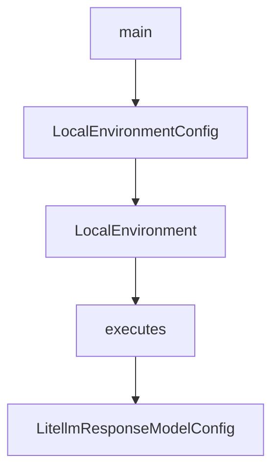

# Chapter 8: Contribution Workflow and Governance

Welcome to **Chapter 8: Contribution Workflow and Governance**. In this part of **Mini-SWE-Agent Tutorial: Minimal Autonomous Code Agent Design at Benchmark Scale**, you will build an intuitive mental model first, then move into concrete implementation details and practical production tradeoffs.


This chapter covers contribution practices aligned with the project's minimal design goals.

## Learning Goals

- follow contribution etiquette and issue workflow
- maintain code quality and readability standards
- align changes with architecture principles
- enforce governance in team deployments

## Governance Priorities

- keep PRs focused and architecture-consistent
- use pre-commit and tests before submission
- preserve minimalism in new features
- document operational controls for production users

## Source References

- [Mini-SWE-Agent Contributing Docs](https://mini-swe-agent.com/latest/contributing/)
- [Mini-SWE-Agent Contribution Source](https://github.com/SWE-agent/mini-swe-agent/blob/main/docs/contributing.md)
- [Mini-SWE-Agent Issues](https://github.com/SWE-agent/mini-swe-agent/issues)

## Summary

You now have a full mini-swe-agent track from first run to sustainable contribution.

Next tutorial: [Qwen-Agent Tutorial](../qwen-agent-tutorial/)

## Depth Expansion Playbook

## Source Code Walkthrough

### `src/minisweagent/run/mini.py`

The `main` function in [`src/minisweagent/run/mini.py`](https://github.com/SWE-agent/mini-swe-agent/blob/HEAD/src/minisweagent/run/mini.py) handles a key part of this chapter's functionality:

```py
# fmt: off
@app.command(help=_HELP_TEXT)
def main(
    model_name: str | None = typer.Option(None, "-m", "--model", help="Model to use",),
    model_class: str | None = typer.Option(None, "--model-class", help="Model class to use (e.g., 'litellm' or 'minisweagent.models.litellm_model.LitellmModel')", rich_help_panel="Advanced"),
    agent_class: str | None = typer.Option(None, "--agent-class", help="Agent class to use (e.g., 'interactive' or 'minisweagent.agents.interactive.InteractiveAgent')", rich_help_panel="Advanced"),
    environment_class: str | None = typer.Option(None, "--environment-class", help="Environment class to use (e.g., 'local' or 'minisweagent.environments.local.LocalEnvironment')", rich_help_panel="Advanced"),
    task: str | None = typer.Option(None, "-t", "--task", help="Task/problem statement", show_default=False),
    yolo: bool = typer.Option(False, "-y", "--yolo", help="Run without confirmation"),
    cost_limit: float | None = typer.Option(None, "-l", "--cost-limit", help="Cost limit. Set to 0 to disable."),
    config_spec: list[str] = typer.Option([str(DEFAULT_CONFIG_FILE)], "-c", "--config", help=_CONFIG_SPEC_HELP_TEXT),
    output: Path | None = typer.Option(DEFAULT_OUTPUT_FILE, "-o", "--output", help="Output trajectory file"),
    exit_immediately: bool = typer.Option(False, "--exit-immediately", help="Exit immediately when the agent wants to finish instead of prompting.", rich_help_panel="Advanced"),
) -> Any:
    # fmt: on
    configure_if_first_time()

    # Build the config from the command line arguments
    console.print(f"Building agent config from specs: [bold green]{config_spec}[/bold green]")
    configs = [get_config_from_spec(spec) for spec in config_spec]
    configs.append({
        "run": {
            "task": task or UNSET,
        },
        "agent": {
            "agent_class": agent_class or UNSET,
            "mode": "yolo" if yolo else UNSET,
            "cost_limit": cost_limit or UNSET,
            "confirm_exit": False if exit_immediately else UNSET,
            "output_path": output or UNSET,
        },
        "model": {
```

This function is important because it defines how Mini-SWE-Agent Tutorial: Minimal Autonomous Code Agent Design at Benchmark Scale implements the patterns covered in this chapter.

### `src/minisweagent/environments/local.py`

The `LocalEnvironmentConfig` class in [`src/minisweagent/environments/local.py`](https://github.com/SWE-agent/mini-swe-agent/blob/HEAD/src/minisweagent/environments/local.py) handles a key part of this chapter's functionality:

```py


class LocalEnvironmentConfig(BaseModel):
    cwd: str = ""
    env: dict[str, str] = {}
    timeout: int = 30


class LocalEnvironment:
    def __init__(self, *, config_class: type = LocalEnvironmentConfig, **kwargs):
        """This class executes bash commands directly on the local machine."""
        self.config = config_class(**kwargs)

    def execute(self, action: dict, cwd: str = "", *, timeout: int | None = None) -> dict[str, Any]:
        """Execute a command in the local environment and return the result as a dict."""
        command = action.get("command", "")
        cwd = cwd or self.config.cwd or os.getcwd()
        try:
            result = subprocess.run(
                command,
                shell=True,
                text=True,
                cwd=cwd,
                env=os.environ | self.config.env,
                timeout=timeout or self.config.timeout,
                encoding="utf-8",
                errors="replace",
                stdout=subprocess.PIPE,
                stderr=subprocess.STDOUT,
            )
            output = {"output": result.stdout, "returncode": result.returncode, "exception_info": ""}
        except Exception as e:
```

This class is important because it defines how Mini-SWE-Agent Tutorial: Minimal Autonomous Code Agent Design at Benchmark Scale implements the patterns covered in this chapter.

### `src/minisweagent/environments/local.py`

The `LocalEnvironment` class in [`src/minisweagent/environments/local.py`](https://github.com/SWE-agent/mini-swe-agent/blob/HEAD/src/minisweagent/environments/local.py) handles a key part of this chapter's functionality:

```py


class LocalEnvironmentConfig(BaseModel):
    cwd: str = ""
    env: dict[str, str] = {}
    timeout: int = 30


class LocalEnvironment:
    def __init__(self, *, config_class: type = LocalEnvironmentConfig, **kwargs):
        """This class executes bash commands directly on the local machine."""
        self.config = config_class(**kwargs)

    def execute(self, action: dict, cwd: str = "", *, timeout: int | None = None) -> dict[str, Any]:
        """Execute a command in the local environment and return the result as a dict."""
        command = action.get("command", "")
        cwd = cwd or self.config.cwd or os.getcwd()
        try:
            result = subprocess.run(
                command,
                shell=True,
                text=True,
                cwd=cwd,
                env=os.environ | self.config.env,
                timeout=timeout or self.config.timeout,
                encoding="utf-8",
                errors="replace",
                stdout=subprocess.PIPE,
                stderr=subprocess.STDOUT,
            )
            output = {"output": result.stdout, "returncode": result.returncode, "exception_info": ""}
        except Exception as e:
```

This class is important because it defines how Mini-SWE-Agent Tutorial: Minimal Autonomous Code Agent Design at Benchmark Scale implements the patterns covered in this chapter.

### `src/minisweagent/environments/local.py`

The `executes` class in [`src/minisweagent/environments/local.py`](https://github.com/SWE-agent/mini-swe-agent/blob/HEAD/src/minisweagent/environments/local.py) handles a key part of this chapter's functionality:

```py
class LocalEnvironment:
    def __init__(self, *, config_class: type = LocalEnvironmentConfig, **kwargs):
        """This class executes bash commands directly on the local machine."""
        self.config = config_class(**kwargs)

    def execute(self, action: dict, cwd: str = "", *, timeout: int | None = None) -> dict[str, Any]:
        """Execute a command in the local environment and return the result as a dict."""
        command = action.get("command", "")
        cwd = cwd or self.config.cwd or os.getcwd()
        try:
            result = subprocess.run(
                command,
                shell=True,
                text=True,
                cwd=cwd,
                env=os.environ | self.config.env,
                timeout=timeout or self.config.timeout,
                encoding="utf-8",
                errors="replace",
                stdout=subprocess.PIPE,
                stderr=subprocess.STDOUT,
            )
            output = {"output": result.stdout, "returncode": result.returncode, "exception_info": ""}
        except Exception as e:
            raw_output = getattr(e, "output", None)
            raw_output = (
                raw_output.decode("utf-8", errors="replace") if isinstance(raw_output, bytes) else (raw_output or "")
            )
            output = {
                "output": raw_output,
                "returncode": -1,
                "exception_info": f"An error occurred while executing the command: {e}",
```

This class is important because it defines how Mini-SWE-Agent Tutorial: Minimal Autonomous Code Agent Design at Benchmark Scale implements the patterns covered in this chapter.


## How These Components Connect


