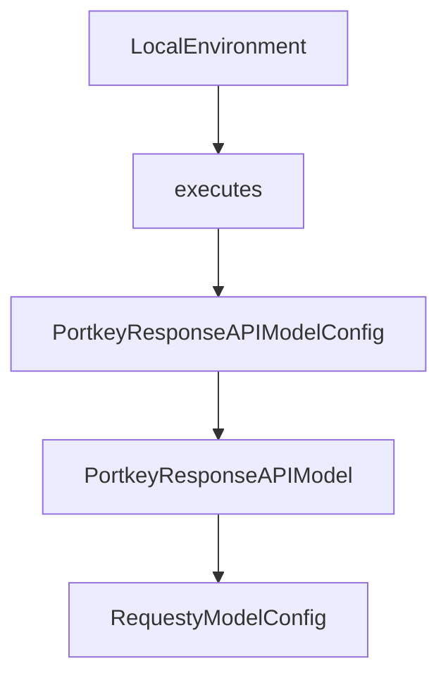

# Chapter 8: Contribution Workflow and Governance

Welcome to **Chapter 8: Contribution Workflow and Governance**. In this part of **Mini-SWE-Agent Tutorial: Minimal Autonomous Code Agent Design at Benchmark Scale**, you will build an intuitive mental model first, then move into concrete implementation details and practical production tradeoffs.


This chapter covers contribution practices aligned with the project's minimal design goals.

## Learning Goals

- follow contribution etiquette and issue workflow
- maintain code quality and readability standards
- align changes with architecture principles
- enforce governance in team deployments

## Governance Priorities

- keep PRs focused and architecture-consistent
- use pre-commit and tests before submission
- preserve minimalism in new features
- document operational controls for production users

## Source References

- [Mini-SWE-Agent Contributing Docs](https://mini-swe-agent.com/latest/contributing/)
- [Mini-SWE-Agent Contribution Source](https://github.com/SWE-agent/mini-swe-agent/blob/main/docs/contributing.md)
- [Mini-SWE-Agent Issues](https://github.com/SWE-agent/mini-swe-agent/issues)

## Summary

You now have a full mini-swe-agent track from first run to sustainable contribution.

Next tutorial: [Qwen-Agent Tutorial](../qwen-agent-tutorial/)

## Source Code Walkthrough

### `src/minisweagent/environments/local.py`

The `LocalEnvironment` class in [`src/minisweagent/environments/local.py`](https://github.com/SWE-agent/mini-swe-agent/blob/HEAD/src/minisweagent/environments/local.py) handles a key part of this chapter's functionality:

```py


class LocalEnvironmentConfig(BaseModel):
    cwd: str = ""
    env: dict[str, str] = {}
    timeout: int = 30


class LocalEnvironment:
    def __init__(self, *, config_class: type = LocalEnvironmentConfig, **kwargs):
        """This class executes bash commands directly on the local machine."""
        self.config = config_class(**kwargs)

    def execute(self, action: dict, cwd: str = "", *, timeout: int | None = None) -> dict[str, Any]:
        """Execute a command in the local environment and return the result as a dict."""
        command = action.get("command", "")
        cwd = cwd or self.config.cwd or os.getcwd()
        try:
            result = subprocess.run(
                command,
                shell=True,
                text=True,
                cwd=cwd,
                env=os.environ | self.config.env,
                timeout=timeout or self.config.timeout,
                encoding="utf-8",
                errors="replace",
                stdout=subprocess.PIPE,
                stderr=subprocess.STDOUT,
            )
            output = {"output": result.stdout, "returncode": result.returncode, "exception_info": ""}
        except Exception as e:
```

This class is important because it defines how Mini-SWE-Agent Tutorial: Minimal Autonomous Code Agent Design at Benchmark Scale implements the patterns covered in this chapter.

### `src/minisweagent/environments/local.py`

The `executes` class in [`src/minisweagent/environments/local.py`](https://github.com/SWE-agent/mini-swe-agent/blob/HEAD/src/minisweagent/environments/local.py) handles a key part of this chapter's functionality:

```py
class LocalEnvironment:
    def __init__(self, *, config_class: type = LocalEnvironmentConfig, **kwargs):
        """This class executes bash commands directly on the local machine."""
        self.config = config_class(**kwargs)

    def execute(self, action: dict, cwd: str = "", *, timeout: int | None = None) -> dict[str, Any]:
        """Execute a command in the local environment and return the result as a dict."""
        command = action.get("command", "")
        cwd = cwd or self.config.cwd or os.getcwd()
        try:
            result = subprocess.run(
                command,
                shell=True,
                text=True,
                cwd=cwd,
                env=os.environ | self.config.env,
                timeout=timeout or self.config.timeout,
                encoding="utf-8",
                errors="replace",
                stdout=subprocess.PIPE,
                stderr=subprocess.STDOUT,
            )
            output = {"output": result.stdout, "returncode": result.returncode, "exception_info": ""}
        except Exception as e:
            raw_output = getattr(e, "output", None)
            raw_output = (
                raw_output.decode("utf-8", errors="replace") if isinstance(raw_output, bytes) else (raw_output or "")
            )
            output = {
                "output": raw_output,
                "returncode": -1,
                "exception_info": f"An error occurred while executing the command: {e}",
```

This class is important because it defines how Mini-SWE-Agent Tutorial: Minimal Autonomous Code Agent Design at Benchmark Scale implements the patterns covered in this chapter.

### `src/minisweagent/models/portkey_response_model.py`

The `PortkeyResponseAPIModelConfig` class in [`src/minisweagent/models/portkey_response_model.py`](https://github.com/SWE-agent/mini-swe-agent/blob/HEAD/src/minisweagent/models/portkey_response_model.py) handles a key part of this chapter's functionality:

```py


class PortkeyResponseAPIModelConfig(BaseModel):
    model_name: str
    model_kwargs: dict[str, Any] = {}
    litellm_model_registry: Path | str | None = os.getenv("LITELLM_MODEL_REGISTRY_PATH")
    litellm_model_name_override: str = ""
    cost_tracking: Literal["default", "ignore_errors"] = os.getenv("MSWEA_COST_TRACKING", "default")
    format_error_template: str = "{{ error }}"
    observation_template: str = (
        "<exception>{{output.exception_info}}</exception>\n"
        "<returncode>{{output.returncode}}</returncode>\n<output>\n{{output.output}}</output>"
    )
    multimodal_regex: str = ""


class PortkeyResponseAPIModel:
    """Portkey model using the Responses API with native tool calling.

    Note: This implementation is stateless - each request must include
    the full conversation history. previous_response_id is not used.
    """

    abort_exceptions: list[type[Exception]] = [KeyboardInterrupt, TypeError, ValueError]

    def __init__(self, **kwargs):
        self.config = PortkeyResponseAPIModelConfig(**kwargs)
        if self.config.litellm_model_registry and Path(self.config.litellm_model_registry).is_file():
            litellm.utils.register_model(json.loads(Path(self.config.litellm_model_registry).read_text()))

        self._api_key = os.getenv("PORTKEY_API_KEY")
        if not self._api_key:
```

This class is important because it defines how Mini-SWE-Agent Tutorial: Minimal Autonomous Code Agent Design at Benchmark Scale implements the patterns covered in this chapter.

### `src/minisweagent/models/portkey_response_model.py`

The `PortkeyResponseAPIModel` class in [`src/minisweagent/models/portkey_response_model.py`](https://github.com/SWE-agent/mini-swe-agent/blob/HEAD/src/minisweagent/models/portkey_response_model.py) handles a key part of this chapter's functionality:

```py
except ImportError:
    raise ImportError(
        "The portkey-ai package is required to use PortkeyResponseAPIModel. Please install it with: pip install portkey-ai"
    )


class PortkeyResponseAPIModelConfig(BaseModel):
    model_name: str
    model_kwargs: dict[str, Any] = {}
    litellm_model_registry: Path | str | None = os.getenv("LITELLM_MODEL_REGISTRY_PATH")
    litellm_model_name_override: str = ""
    cost_tracking: Literal["default", "ignore_errors"] = os.getenv("MSWEA_COST_TRACKING", "default")
    format_error_template: str = "{{ error }}"
    observation_template: str = (
        "<exception>{{output.exception_info}}</exception>\n"
        "<returncode>{{output.returncode}}</returncode>\n<output>\n{{output.output}}</output>"
    )
    multimodal_regex: str = ""


class PortkeyResponseAPIModel:
    """Portkey model using the Responses API with native tool calling.

    Note: This implementation is stateless - each request must include
    the full conversation history. previous_response_id is not used.
    """

    abort_exceptions: list[type[Exception]] = [KeyboardInterrupt, TypeError, ValueError]

    def __init__(self, **kwargs):
        self.config = PortkeyResponseAPIModelConfig(**kwargs)
        if self.config.litellm_model_registry and Path(self.config.litellm_model_registry).is_file():
```

This class is important because it defines how Mini-SWE-Agent Tutorial: Minimal Autonomous Code Agent Design at Benchmark Scale implements the patterns covered in this chapter.


## How These Components Connect


