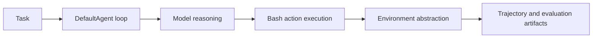

# Mini-SWE-Agent Tutorial: Minimal Autonomous Code Agent Design at Benchmark Scale

> Learn how to use `SWE-agent/mini-swe-agent` to run compact, high-performing software-engineering agent workflows with minimal scaffolding and strong reproducibility.

## Why This Track Matters

Mini-SWE-Agent distills coding-agent design to a compact core while still delivering strong benchmark performance, making it valuable for both research and production-minded engineering.

This track focuses on:

- shipping a first minimal agent run quickly
- understanding the small-core architecture tradeoffs
- configuring global and YAML-based behavior controls
- scaling to benchmark and sandboxed execution workflows

## Current Snapshot (auto-updated)

- repository: [`SWE-agent/mini-swe-agent`](https://github.com/SWE-agent/mini-swe-agent)
- stars: about **2.9k**
- latest release: [`v2.0.0`](https://github.com/SWE-agent/mini-swe-agent/releases/tag/v2.0.0)
- recent activity: updates on **February 11, 2026**
- project positioning: minimal, hackable SWE agent with strong benchmark orientation

## Mental Model

## Chapter Guide

| Chapter | Key Question | Outcome |
|:--------|:-------------|:--------|
| [01 - Getting Started](01-getting-started.md) | How do I run mini-swe-agent quickly? | Working baseline |
| [02 - Core Architecture and Minimal Design](02-core-architecture-and-minimal-design.md) | Why does this tiny architecture still perform well? | Strong architecture intuition |
| [03 - CLI, Batch, and Inspector Workflows](03-cli-batch-and-inspector-workflows.md) | How do I operate single-task and benchmark flows? | Better workflow control |
| [04 - Global and YAML Configuration Strategy](04-global-and-yaml-configuration-strategy.md) | How do I configure behavior cleanly and reproducibly? | Reliable config model |
| [05 - Environments, Sandboxing, and Deployment](05-environments-sandboxing-and-deployment.md) | How do I execute safely across environments? | Safer runtime operations |
| [06 - Benchmarking and SWE-bench Practices](06-benchmarking-and-swe-bench-practices.md) | How do I evaluate and compare runs rigorously? | Evaluation discipline |
| [07 - Cookbook Extensions and Python Bindings](07-cookbook-extensions-and-python-bindings.md) | How do I customize components without bloat? | Extensibility baseline |
| [08 - Contribution Workflow and Governance](08-contribution-workflow-and-governance.md) | How do I contribute while preserving minimalism? | Contributor readiness |

## What You Will Learn

- how to run a compact coding agent with clear control flow
- how to configure models, environments, and run policies safely
- how to evaluate at benchmark scale without over-complication
- how to extend mini-swe-agent while preserving design intent

## Source References

- [Mini-SWE-Agent Repository](https://github.com/SWE-agent/mini-swe-agent)
- [Mini-SWE-Agent README](https://github.com/SWE-agent/mini-swe-agent/blob/main/README.md)
- [Mini-SWE-Agent Docs](https://mini-swe-agent.com/latest/)
- [Quickstart](https://mini-swe-agent.com/latest/quickstart/)
- [YAML Configuration Guide](https://mini-swe-agent.com/latest/advanced/yaml_configuration/)
- [Contributing Guide](https://mini-swe-agent.com/latest/contributing/)

## Related Tutorials

- [SWE-agent Tutorial](../swe-agent-tutorial/)
- [Open SWE Tutorial](../open-swe-tutorial/)
- [Codex CLI Tutorial](../codex-cli-tutorial/)
- [OpenHands Tutorial](../openhands-tutorial/)

---

Start with [Chapter 1: Getting Started](01-getting-started.md).

## Navigation & Backlinks

- [Start Here: Chapter 1: Getting Started](01-getting-started.md)
- [Back to Main Catalog](../../README.md#-tutorial-catalog)
- [Browse A-Z Tutorial Directory](../../discoverability/tutorial-directory.md)
- [Search by Intent](../../discoverability/query-hub.md)
- [Explore Category Hubs](../../README.md#category-hubs)

## Full Chapter Map

1. [Chapter 1: Getting Started](01-getting-started.md)
2. [Chapter 2: Core Architecture and Minimal Design](02-core-architecture-and-minimal-design.md)
3. [Chapter 3: CLI, Batch, and Inspector Workflows](03-cli-batch-and-inspector-workflows.md)
4. [Chapter 4: Global and YAML Configuration Strategy](04-global-and-yaml-configuration-strategy.md)
5. [Chapter 5: Environments, Sandboxing, and Deployment](05-environments-sandboxing-and-deployment.md)
6. [Chapter 6: Benchmarking and SWE-bench Practices](06-benchmarking-and-swe-bench-practices.md)
7. [Chapter 7: Cookbook Extensions and Python Bindings](07-cookbook-extensions-and-python-bindings.md)
8. [Chapter 8: Contribution Workflow and Governance](08-contribution-workflow-and-governance.md)

*Generated by [AI Codebase Knowledge Builder](https://github.com/The-Pocket/Tutorial-Codebase-Knowledge)*
