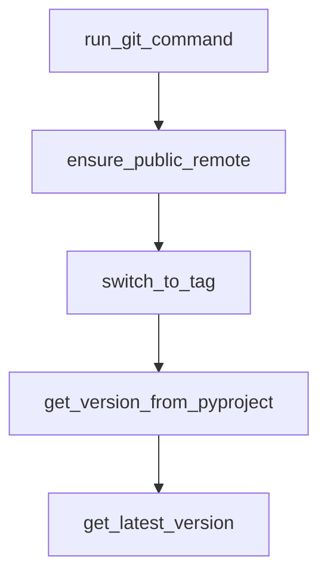

# Chapter 1: Getting Started

Welcome to **Chapter 1: Getting Started**. In this part of **Mistral Vibe Tutorial: Minimal CLI Coding Agent by Mistral**, you will build an intuitive mental model first, then move into concrete implementation details and practical production tradeoffs.


This chapter gets Mistral Vibe installed and running in a project directory.

## Quick Install

```bash
# Linux/macOS
curl -LsSf https://mistral.ai/vibe/install.sh | bash

# Alternative
uv tool install mistral-vibe
```

## First Run

```bash
cd /path/to/project
vibe
```

Vibe bootstraps config on first run and can prompt for API key setup.

## Source References

- [Mistral Vibe README](https://github.com/mistralai/mistral-vibe/blob/main/README.md)

## Summary

You now have Vibe running in interactive mode with project context.

Next: [Chapter 2: Agent Profiles and Trust Model](02-agent-profiles-and-trust-model.md)

## Depth Expansion Playbook

## Source Code Walkthrough

### `scripts/prepare_release.py`

The `run_git_command` function in [`scripts/prepare_release.py`](https://github.com/mistralai/mistral-vibe/blob/HEAD/scripts/prepare_release.py) handles a key part of this chapter's functionality:

```py


def run_git_command(
    *args: str, check: bool = True, capture_output: bool = False
) -> subprocess.CompletedProcess[str]:
    """Run a git command and return the result."""
    result = subprocess.run(
        ["git"] + list(args), check=check, capture_output=capture_output, text=True
    )
    return result


def ensure_public_remote() -> None:
    result = run_git_command("remote", "-v", capture_output=True, check=False)
    remotes = result.stdout

    public_remote_url = "git@github.com:mistralai/mistral-vibe.git"
    if public_remote_url in remotes:
        print("Public remote already exists with correct URL")
        return

    print(f"Creating public remote: {public_remote_url}")
    run_git_command("remote", "add", "public", public_remote_url)
    print("Public remote created successfully")


def switch_to_tag(version: str) -> None:
    tag = f"v{version}"
    print(f"Switching to tag {tag}...")

    result = run_git_command(
        "rev-parse", "--verify", tag, capture_output=True, check=False
```

This function is important because it defines how Mistral Vibe Tutorial: Minimal CLI Coding Agent by Mistral implements the patterns covered in this chapter.

### `scripts/prepare_release.py`

The `ensure_public_remote` function in [`scripts/prepare_release.py`](https://github.com/mistralai/mistral-vibe/blob/HEAD/scripts/prepare_release.py) handles a key part of this chapter's functionality:

```py


def ensure_public_remote() -> None:
    result = run_git_command("remote", "-v", capture_output=True, check=False)
    remotes = result.stdout

    public_remote_url = "git@github.com:mistralai/mistral-vibe.git"
    if public_remote_url in remotes:
        print("Public remote already exists with correct URL")
        return

    print(f"Creating public remote: {public_remote_url}")
    run_git_command("remote", "add", "public", public_remote_url)
    print("Public remote created successfully")


def switch_to_tag(version: str) -> None:
    tag = f"v{version}"
    print(f"Switching to tag {tag}...")

    result = run_git_command(
        "rev-parse", "--verify", tag, capture_output=True, check=False
    )
    if result.returncode != 0:
        raise ValueError(f"Tag {tag} does not exist")

    run_git_command("switch", "--detach", tag)
    print(f"Successfully switched to tag {tag}")


def get_version_from_pyproject() -> str:
    pyproject_path = Path("pyproject.toml")
```

This function is important because it defines how Mistral Vibe Tutorial: Minimal CLI Coding Agent by Mistral implements the patterns covered in this chapter.

### `scripts/prepare_release.py`

The `switch_to_tag` function in [`scripts/prepare_release.py`](https://github.com/mistralai/mistral-vibe/blob/HEAD/scripts/prepare_release.py) handles a key part of this chapter's functionality:

```py


def switch_to_tag(version: str) -> None:
    tag = f"v{version}"
    print(f"Switching to tag {tag}...")

    result = run_git_command(
        "rev-parse", "--verify", tag, capture_output=True, check=False
    )
    if result.returncode != 0:
        raise ValueError(f"Tag {tag} does not exist")

    run_git_command("switch", "--detach", tag)
    print(f"Successfully switched to tag {tag}")


def get_version_from_pyproject() -> str:
    pyproject_path = Path("pyproject.toml")
    if not pyproject_path.exists():
        raise FileNotFoundError("pyproject.toml not found in current directory")

    content = pyproject_path.read_text()
    version_match = re.search(r'^version = "([^"]+)"$', content, re.MULTILINE)
    if not version_match:
        raise ValueError("Version not found in pyproject.toml")

    return version_match.group(1)


def get_latest_version() -> str:
    result = run_git_command("ls-remote", "--tags", "public", capture_output=True)
    remote_tags_output = (
```

This function is important because it defines how Mistral Vibe Tutorial: Minimal CLI Coding Agent by Mistral implements the patterns covered in this chapter.

### `scripts/prepare_release.py`

The `get_version_from_pyproject` function in [`scripts/prepare_release.py`](https://github.com/mistralai/mistral-vibe/blob/HEAD/scripts/prepare_release.py) handles a key part of this chapter's functionality:

```py


def get_version_from_pyproject() -> str:
    pyproject_path = Path("pyproject.toml")
    if not pyproject_path.exists():
        raise FileNotFoundError("pyproject.toml not found in current directory")

    content = pyproject_path.read_text()
    version_match = re.search(r'^version = "([^"]+)"$', content, re.MULTILINE)
    if not version_match:
        raise ValueError("Version not found in pyproject.toml")

    return version_match.group(1)


def get_latest_version() -> str:
    result = run_git_command("ls-remote", "--tags", "public", capture_output=True)
    remote_tags_output = (
        result.stdout.strip().split("\n") if result.stdout.strip() else []
    )

    if not remote_tags_output:
        raise ValueError("No version tags found on public remote")

    versions: list[tuple[int, int, int, str]] = []
    MIN_PARTS_IN_LS_REMOTE_LINE = 2  # hash and ref
    for line in remote_tags_output:
        parts = line.split()
        if len(parts) < MIN_PARTS_IN_LS_REMOTE_LINE:
            continue

        _hash, tag_ref = parts[0], parts[1]
```

This function is important because it defines how Mistral Vibe Tutorial: Minimal CLI Coding Agent by Mistral implements the patterns covered in this chapter.


## How These Components Connect


