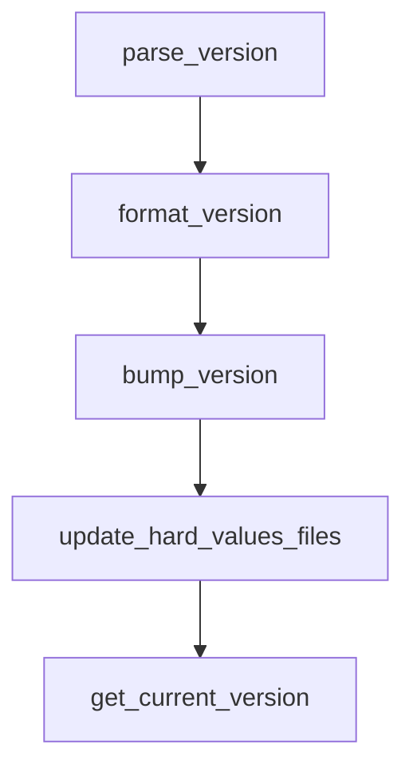

# Chapter 1: Getting Started

Welcome to **Chapter 1: Getting Started**. In this part of **Mistral Vibe Tutorial: Minimal CLI Coding Agent by Mistral**, you will build an intuitive mental model first, then move into concrete implementation details and practical production tradeoffs.


This chapter gets Mistral Vibe installed and running in a project directory.

## Quick Install

```bash
# Linux/macOS
curl -LsSf https://mistral.ai/vibe/install.sh | bash

# Alternative
uv tool install mistral-vibe
```

## First Run

```bash
cd /path/to/project
vibe
```

Vibe bootstraps config on first run and can prompt for API key setup.

## Source References

- [Mistral Vibe README](https://github.com/mistralai/mistral-vibe/blob/main/README.md)

## Summary

You now have Vibe running in interactive mode with project context.

Next: [Chapter 2: Agent Profiles and Trust Model](02-agent-profiles-and-trust-model.md)

## Source Code Walkthrough

### `scripts/bump_version.py`

The `parse_version` function in [`scripts/bump_version.py`](https://github.com/mistralai/mistral-vibe/blob/HEAD/scripts/bump_version.py) handles a key part of this chapter's functionality:

```py


def parse_version(version_str: str) -> tuple[int, int, int]:
    match = re.match(r"^(\d+)\.(\d+)\.(\d+)$", version_str.strip())
    if not match:
        raise ValueError(f"Invalid version format: {version_str}")

    return int(match.group(1)), int(match.group(2)), int(match.group(3))


def format_version(major: int, minor: int, patch: int) -> str:
    return f"{major}.{minor}.{patch}"


def bump_version(version: str, bump_type: BumpType) -> str:
    major, minor, patch = parse_version(version)

    match bump_type:
        case "major":
            return format_version(major + 1, 0, 0)
        case "minor":
            return format_version(major, minor + 1, 0)
        case "micro" | "patch":
            return format_version(major, minor, patch + 1)


def update_hard_values_files(filepath: str, patterns: list[tuple[str, str]]) -> None:
    path = Path(filepath)

    if not path.exists():
        raise FileNotFoundError(f"{filepath} not found in current directory")

```

This function is important because it defines how Mistral Vibe Tutorial: Minimal CLI Coding Agent by Mistral implements the patterns covered in this chapter.

### `scripts/bump_version.py`

The `format_version` function in [`scripts/bump_version.py`](https://github.com/mistralai/mistral-vibe/blob/HEAD/scripts/bump_version.py) handles a key part of this chapter's functionality:

```py


def format_version(major: int, minor: int, patch: int) -> str:
    return f"{major}.{minor}.{patch}"


def bump_version(version: str, bump_type: BumpType) -> str:
    major, minor, patch = parse_version(version)

    match bump_type:
        case "major":
            return format_version(major + 1, 0, 0)
        case "minor":
            return format_version(major, minor + 1, 0)
        case "micro" | "patch":
            return format_version(major, minor, patch + 1)


def update_hard_values_files(filepath: str, patterns: list[tuple[str, str]]) -> None:
    path = Path(filepath)

    if not path.exists():
        raise FileNotFoundError(f"{filepath} not found in current directory")

    for pattern, replacement in patterns:
        content = path.read_text()
        updated_content = re.sub(pattern, replacement, content, flags=re.MULTILINE)

        if updated_content == content:
            raise ValueError(f"pattern {pattern} not found in {filepath}")

        path.write_text(updated_content)
```

This function is important because it defines how Mistral Vibe Tutorial: Minimal CLI Coding Agent by Mistral implements the patterns covered in this chapter.

### `scripts/bump_version.py`

The `bump_version` function in [`scripts/bump_version.py`](https://github.com/mistralai/mistral-vibe/blob/HEAD/scripts/bump_version.py) handles a key part of this chapter's functionality:

```py


def bump_version(version: str, bump_type: BumpType) -> str:
    major, minor, patch = parse_version(version)

    match bump_type:
        case "major":
            return format_version(major + 1, 0, 0)
        case "minor":
            return format_version(major, minor + 1, 0)
        case "micro" | "patch":
            return format_version(major, minor, patch + 1)


def update_hard_values_files(filepath: str, patterns: list[tuple[str, str]]) -> None:
    path = Path(filepath)

    if not path.exists():
        raise FileNotFoundError(f"{filepath} not found in current directory")

    for pattern, replacement in patterns:
        content = path.read_text()
        updated_content = re.sub(pattern, replacement, content, flags=re.MULTILINE)

        if updated_content == content:
            raise ValueError(f"pattern {pattern} not found in {filepath}")

        path.write_text(updated_content)

    print(f"Updated version in {filepath}")


```

This function is important because it defines how Mistral Vibe Tutorial: Minimal CLI Coding Agent by Mistral implements the patterns covered in this chapter.

### `scripts/bump_version.py`

The `update_hard_values_files` function in [`scripts/bump_version.py`](https://github.com/mistralai/mistral-vibe/blob/HEAD/scripts/bump_version.py) handles a key part of this chapter's functionality:

```py


def update_hard_values_files(filepath: str, patterns: list[tuple[str, str]]) -> None:
    path = Path(filepath)

    if not path.exists():
        raise FileNotFoundError(f"{filepath} not found in current directory")

    for pattern, replacement in patterns:
        content = path.read_text()
        updated_content = re.sub(pattern, replacement, content, flags=re.MULTILINE)

        if updated_content == content:
            raise ValueError(f"pattern {pattern} not found in {filepath}")

        path.write_text(updated_content)

    print(f"Updated version in {filepath}")


def get_current_version() -> str:
    pyproject_path = Path("pyproject.toml")

    if not pyproject_path.exists():
        raise FileNotFoundError("pyproject.toml not found in current directory")

    content = pyproject_path.read_text()

    version_match = re.search(r'^version = "([^"]+)"$', content, re.MULTILINE)
    if not version_match:
        raise ValueError("Version not found in pyproject.toml")

```

This function is important because it defines how Mistral Vibe Tutorial: Minimal CLI Coding Agent by Mistral implements the patterns covered in this chapter.


## How These Components Connect


