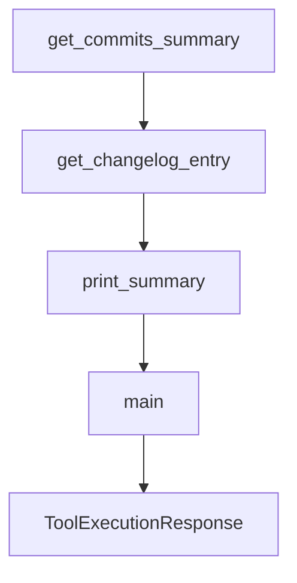

# Chapter 2: Agent Profiles and Trust Model

Welcome to **Chapter 2: Agent Profiles and Trust Model**. In this part of **Mistral Vibe Tutorial: Minimal CLI Coding Agent by Mistral**, you will build an intuitive mental model first, then move into concrete implementation details and practical production tradeoffs.


Vibe provides multiple built-in agent profiles and a trust-folder mechanism to reduce accidental unsafe execution.

## Built-In Agent Profiles

| Agent | Intended Use |
|:------|:-------------|
| `default` | standard prompts with approval checks |
| `plan` | read-focused planning/exploration |
| `accept-edits` | auto-approve edit tools only |
| `auto-approve` | broad automation mode, highest risk |

## Trust Folder Behavior

Vibe maintains trusted-folder state to prevent unintentional execution in unknown directories.

## Source References

- [Mistral Vibe README: built-in agents](https://github.com/mistralai/mistral-vibe/blob/main/README.md)
- [Mistral Vibe README: trust folder system](https://github.com/mistralai/mistral-vibe/blob/main/README.md)

## Summary

You now understand how to pick agent profiles and use trust controls safely.

Next: [Chapter 3: Tooling and Approval Workflow](03-tooling-and-approval-workflow.md)

## Source Code Walkthrough

### `scripts/prepare_release.py`

The `get_commits_summary` function in [`scripts/prepare_release.py`](https://github.com/mistralai/mistral-vibe/blob/HEAD/scripts/prepare_release.py) handles a key part of this chapter's functionality:

```py


def get_commits_summary(previous_version: str, current_version: str) -> str:
    previous_tag = f"v{previous_version}-private"
    current_tag = f"v{current_version}-private"

    result = run_git_command(
        "log", f"{previous_tag}..{current_tag}", "--oneline", capture_output=True
    )
    return result.stdout.strip()


def get_changelog_entry(version: str) -> str:
    changelog_path = Path("CHANGELOG.md")
    if not changelog_path.exists():
        return "CHANGELOG.md not found"

    content = changelog_path.read_text()

    pattern = rf"^## \[{re.escape(version)}\] - .+?(?=^## \[|\Z)"
    match = re.search(pattern, content, re.MULTILINE | re.DOTALL)

    if not match:
        return f"No changelog entry found for version {version}"

    return match.group(0).strip()


def print_summary(
    current_version: str,
    previous_version: str,
    commits_summary: str,
```

This function is important because it defines how Mistral Vibe Tutorial: Minimal CLI Coding Agent by Mistral implements the patterns covered in this chapter.

### `scripts/prepare_release.py`

The `get_changelog_entry` function in [`scripts/prepare_release.py`](https://github.com/mistralai/mistral-vibe/blob/HEAD/scripts/prepare_release.py) handles a key part of this chapter's functionality:

```py


def get_changelog_entry(version: str) -> str:
    changelog_path = Path("CHANGELOG.md")
    if not changelog_path.exists():
        return "CHANGELOG.md not found"

    content = changelog_path.read_text()

    pattern = rf"^## \[{re.escape(version)}\] - .+?(?=^## \[|\Z)"
    match = re.search(pattern, content, re.MULTILINE | re.DOTALL)

    if not match:
        return f"No changelog entry found for version {version}"

    return match.group(0).strip()


def print_summary(
    current_version: str,
    previous_version: str,
    commits_summary: str,
    changelog_entry: str,
    squash: bool,
) -> None:
    print("\n" + "=" * 80)
    print("RELEASE PREPARATION SUMMARY")
    print("=" * 80)
    print(f"\nVersion: {current_version}")
    print(f"Previous version: {previous_version}")
    print(f"Release branch: release/v{current_version}")

```

This function is important because it defines how Mistral Vibe Tutorial: Minimal CLI Coding Agent by Mistral implements the patterns covered in this chapter.

### `scripts/prepare_release.py`

The `print_summary` function in [`scripts/prepare_release.py`](https://github.com/mistralai/mistral-vibe/blob/HEAD/scripts/prepare_release.py) handles a key part of this chapter's functionality:

```py


def print_summary(
    current_version: str,
    previous_version: str,
    commits_summary: str,
    changelog_entry: str,
    squash: bool,
) -> None:
    print("\n" + "=" * 80)
    print("RELEASE PREPARATION SUMMARY")
    print("=" * 80)
    print(f"\nVersion: {current_version}")
    print(f"Previous version: {previous_version}")
    print(f"Release branch: release/v{current_version}")

    print("\n" + "-" * 80)
    print("COMMITS IN THIS RELEASE")
    print("-" * 80)
    if commits_summary:
        print(commits_summary)
    else:
        print("No commits found")

    print("\n" + "-" * 80)
    print("CHANGELOG ENTRY")
    print("-" * 80)
    print(changelog_entry)

    print("\n" + "-" * 80)
    if not squash:
        print("NEXT STEPS")
```

This function is important because it defines how Mistral Vibe Tutorial: Minimal CLI Coding Agent by Mistral implements the patterns covered in this chapter.

### `scripts/prepare_release.py`

The `main` function in [`scripts/prepare_release.py`](https://github.com/mistralai/mistral-vibe/blob/HEAD/scripts/prepare_release.py) handles a key part of this chapter's functionality:

```py
    print(
        "  ✓ Review and update the changelog if needed "
        "(should be made in the private main branch)"
    )
    print("\n" + "=" * 80)


def main() -> None:
    parser = argparse.ArgumentParser(
        description="Prepare a release branch by cherry-picking from private tags",
        formatter_class=argparse.RawDescriptionHelpFormatter,
    )

    parser.add_argument("version", help="Version to prepare release for (e.g., 1.1.3)")
    parser.add_argument(
        "--no-squash",
        action="store_false",
        dest="squash",
        default=True,
        help="Disable squashing of commits into a single release commit",
    )

    args = parser.parse_args()
    current_version = args.version
    squash = args.squash

    try:
        # Step 1: Ensure public remote exists
        ensure_public_remote()

        # Step 2: Fetch all remotes
        print("Fetching all remotes...")
```

This function is important because it defines how Mistral Vibe Tutorial: Minimal CLI Coding Agent by Mistral implements the patterns covered in this chapter.


## How These Components Connect


