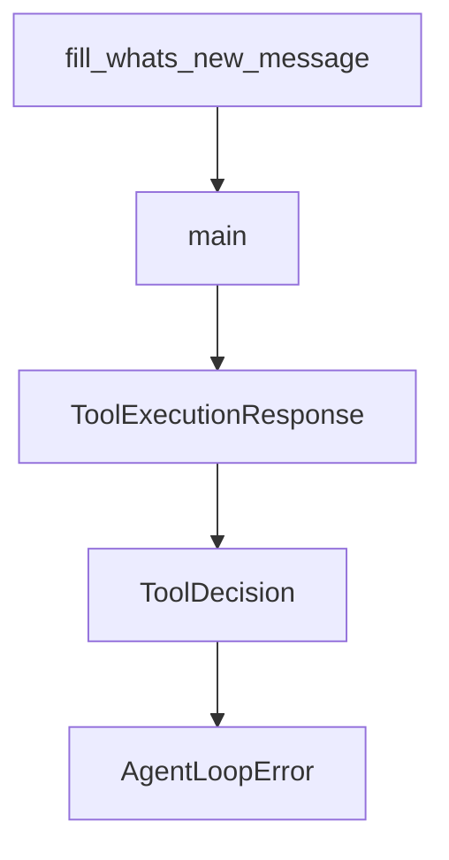

# Chapter 2: Agent Profiles and Trust Model

Welcome to **Chapter 2: Agent Profiles and Trust Model**. In this part of **Mistral Vibe Tutorial: Minimal CLI Coding Agent by Mistral**, you will build an intuitive mental model first, then move into concrete implementation details and practical production tradeoffs.


Vibe provides multiple built-in agent profiles and a trust-folder mechanism to reduce accidental unsafe execution.

## Built-In Agent Profiles

| Agent | Intended Use |
|:------|:-------------|
| `default` | standard prompts with approval checks |
| `plan` | read-focused planning/exploration |
| `accept-edits` | auto-approve edit tools only |
| `auto-approve` | broad automation mode, highest risk |

## Trust Folder Behavior

Vibe maintains trusted-folder state to prevent unintentional execution in unknown directories.

## Source References

- [Mistral Vibe README: built-in agents](https://github.com/mistralai/mistral-vibe/blob/main/README.md)
- [Mistral Vibe README: trust folder system](https://github.com/mistralai/mistral-vibe/blob/main/README.md)

## Summary

You now understand how to pick agent profiles and use trust controls safely.

Next: [Chapter 3: Tooling and Approval Workflow](03-tooling-and-approval-workflow.md)

## Depth Expansion Playbook

## Source Code Walkthrough

### `scripts/bump_version.py`

The `fill_whats_new_message` function in [`scripts/bump_version.py`](https://github.com/mistralai/mistral-vibe/blob/HEAD/scripts/bump_version.py) handles a key part of this chapter's functionality:

```py


def fill_whats_new_message(new_version: str) -> None:
    whats_new_path = Path("vibe/whats_new.md")
    if not whats_new_path.exists():
        raise FileNotFoundError("whats_new.md not found in current directory")

    whats_new_path.write_text("")

    print("Filling whats_new.md...")
    prompt = f"""Fill vibe/whats_new.md using only the CHANGELOG.md section for version {new_version}.

Rules:
- Include only the most important user-facing changes: visible CLI/UI behavior, new commands or key bindings, UX improvements. Exclude internal refactors, API-only changes, and dev/tooling updates.
- If there are no such changes, write nothing (empty file).
- Otherwise: first line must be "# What's new in v{new_version}" (no extra heading). Then one bullet per item, format: "- **Feature**: short summary" (e.g. - **Interactive resume**: Added a /resume command to choose which session to resume). One line per bullet, concise.
- Do not copy the full changelog; summarize only what matters to someone reading "what's new" in the app."""
    try:
        result = subprocess.run(
            ["vibe", "-p", prompt], stdout=subprocess.DEVNULL, stderr=subprocess.DEVNULL
        )
        if result.returncode != 0:
            raise RuntimeError("Failed to auto-fill whats_new.md")
    except Exception:
        print(
            "Warning: failed to auto-fill whats_new.md, please fill it manually.",
            file=sys.stderr,
        )


def main() -> None:
    os.chdir(Path(__file__).parent.parent)
```

This function is important because it defines how Mistral Vibe Tutorial: Minimal CLI Coding Agent by Mistral implements the patterns covered in this chapter.

### `scripts/bump_version.py`

The `main` function in [`scripts/bump_version.py`](https://github.com/mistralai/mistral-vibe/blob/HEAD/scripts/bump_version.py) handles a key part of this chapter's functionality:

```py


def main() -> None:
    os.chdir(Path(__file__).parent.parent)

    parser = argparse.ArgumentParser(
        description="Bump semver version in pyproject.toml",
        formatter_class=argparse.RawDescriptionHelpFormatter,
        epilog="""
Examples:
  uv run scripts/bump_version.py major    # 1.0.0 -> 2.0.0
  uv run scripts/bump_version.py minor    # 1.0.0 -> 1.1.0
  uv run scripts/bump_version.py micro    # 1.0.0 -> 1.0.1
  uv run scripts/bump_version.py patch    # 1.0.0 -> 1.0.1
        """,
    )

    parser.add_argument(
        "bump_type", choices=BUMP_TYPES, help="Type of version bump to perform"
    )

    args = parser.parse_args()

    try:
        # Get current version
        current_version = get_current_version()
        print(f"Current version: {current_version}")

        # Calculate new version
        new_version = bump_version(current_version, args.bump_type)
        print(f"New version: {new_version}\n")

```

This function is important because it defines how Mistral Vibe Tutorial: Minimal CLI Coding Agent by Mistral implements the patterns covered in this chapter.

### `vibe/core/agent_loop.py`

The `ToolExecutionResponse` class in [`vibe/core/agent_loop.py`](https://github.com/mistralai/mistral-vibe/blob/HEAD/vibe/core/agent_loop.py) handles a key part of this chapter's functionality:

```py


class ToolExecutionResponse(StrEnum):
    SKIP = auto()
    EXECUTE = auto()


class ToolDecision(BaseModel):
    verdict: ToolExecutionResponse
    approval_type: ToolPermission
    feedback: str | None = None


class AgentLoopError(Exception):
    """Base exception for AgentLoop errors."""


class AgentLoopStateError(AgentLoopError):
    """Raised when agent loop is in an invalid state."""


class AgentLoopLLMResponseError(AgentLoopError):
    """Raised when LLM response is malformed or missing expected data."""


class TeleportError(AgentLoopError):
    """Raised when teleport to Vibe Nuage fails."""


def _should_raise_rate_limit_error(e: Exception) -> bool:
    return isinstance(e, BackendError) and e.status == HTTPStatus.TOO_MANY_REQUESTS

```

This class is important because it defines how Mistral Vibe Tutorial: Minimal CLI Coding Agent by Mistral implements the patterns covered in this chapter.

### `vibe/core/agent_loop.py`

The `ToolDecision` class in [`vibe/core/agent_loop.py`](https://github.com/mistralai/mistral-vibe/blob/HEAD/vibe/core/agent_loop.py) handles a key part of this chapter's functionality:

```py


class ToolDecision(BaseModel):
    verdict: ToolExecutionResponse
    approval_type: ToolPermission
    feedback: str | None = None


class AgentLoopError(Exception):
    """Base exception for AgentLoop errors."""


class AgentLoopStateError(AgentLoopError):
    """Raised when agent loop is in an invalid state."""


class AgentLoopLLMResponseError(AgentLoopError):
    """Raised when LLM response is malformed or missing expected data."""


class TeleportError(AgentLoopError):
    """Raised when teleport to Vibe Nuage fails."""


def _should_raise_rate_limit_error(e: Exception) -> bool:
    return isinstance(e, BackendError) and e.status == HTTPStatus.TOO_MANY_REQUESTS


class AgentLoop:
    def __init__(
        self,
        config: VibeConfig,
```

This class is important because it defines how Mistral Vibe Tutorial: Minimal CLI Coding Agent by Mistral implements the patterns covered in this chapter.


## How These Components Connect


