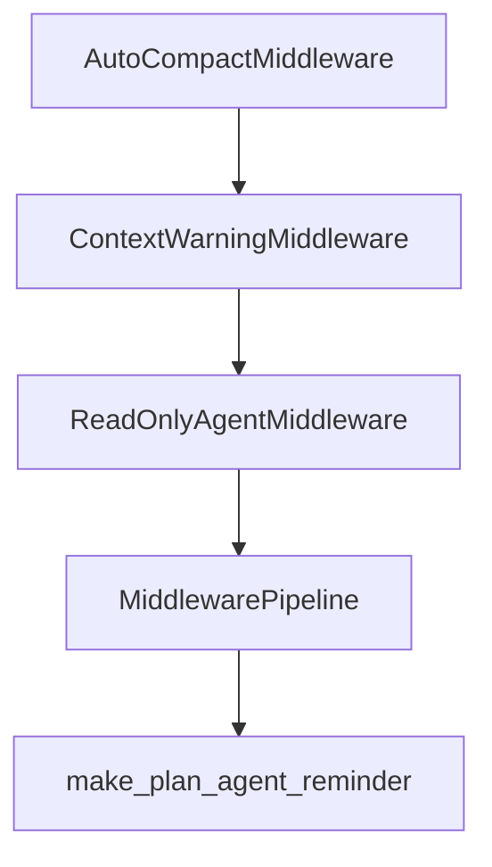

# Chapter 3: Tooling and Approval Workflow

Welcome to **Chapter 3: Tooling and Approval Workflow**. In this part of **Mistral Vibe Tutorial: Minimal CLI Coding Agent by Mistral**, you will build an intuitive mental model first, then move into concrete implementation details and practical production tradeoffs.


Vibe uses a tool-driven workflow for file operations, search, shell execution, and user interaction.

## Core Tool Classes

| Tool Class | Example Capabilities |
|:-----------|:---------------------|
| file tools | read/write/patch files |
| shell tools | command execution in terminal context |
| search tools | grep and project search |
| coordination tools | todo tracking and user questions |

## Approval Model

Default interactive mode is approval-aware, while auto-approve settings should be constrained to trusted contexts.

## Source References

- [Mistral Vibe README: toolset overview](https://github.com/mistralai/mistral-vibe/blob/main/README.md)

## Summary

You now understand how Vibe turns prompts into controlled tool execution loops.

Next: [Chapter 4: Skills and Slash Command Extensions](04-skills-and-slash-command-extensions.md)

## Depth Expansion Playbook

## Source Code Walkthrough

### `vibe/core/middleware.py`

The `AutoCompactMiddleware` class in [`vibe/core/middleware.py`](https://github.com/mistralai/mistral-vibe/blob/HEAD/vibe/core/middleware.py) handles a key part of this chapter's functionality:

```py


class AutoCompactMiddleware:
    async def before_turn(self, context: ConversationContext) -> MiddlewareResult:
        threshold = context.config.get_active_model().auto_compact_threshold
        if threshold > 0 and context.stats.context_tokens >= threshold:
            return MiddlewareResult(
                action=MiddlewareAction.COMPACT,
                metadata={
                    "old_tokens": context.stats.context_tokens,
                    "threshold": threshold,
                },
            )
        return MiddlewareResult()

    def reset(self, reset_reason: ResetReason = ResetReason.STOP) -> None:
        pass


class ContextWarningMiddleware:
    def __init__(self, threshold_percent: float = 0.5) -> None:
        self.threshold_percent = threshold_percent
        self.has_warned = False

    async def before_turn(self, context: ConversationContext) -> MiddlewareResult:
        if self.has_warned:
            return MiddlewareResult()

        max_context = context.config.get_active_model().auto_compact_threshold
        if max_context <= 0:
            return MiddlewareResult()

```

This class is important because it defines how Mistral Vibe Tutorial: Minimal CLI Coding Agent by Mistral implements the patterns covered in this chapter.

### `vibe/core/middleware.py`

The `ContextWarningMiddleware` class in [`vibe/core/middleware.py`](https://github.com/mistralai/mistral-vibe/blob/HEAD/vibe/core/middleware.py) handles a key part of this chapter's functionality:

```py


class ContextWarningMiddleware:
    def __init__(self, threshold_percent: float = 0.5) -> None:
        self.threshold_percent = threshold_percent
        self.has_warned = False

    async def before_turn(self, context: ConversationContext) -> MiddlewareResult:
        if self.has_warned:
            return MiddlewareResult()

        max_context = context.config.get_active_model().auto_compact_threshold
        if max_context <= 0:
            return MiddlewareResult()

        if context.stats.context_tokens >= max_context * self.threshold_percent:
            self.has_warned = True

            percentage_used = (context.stats.context_tokens / max_context) * 100
            warning_msg = f"<{VIBE_WARNING_TAG}>You have used {percentage_used:.0f}% of your total context ({context.stats.context_tokens:,}/{max_context:,} tokens)</{VIBE_WARNING_TAG}>"

            return MiddlewareResult(
                action=MiddlewareAction.INJECT_MESSAGE, message=warning_msg
            )

        return MiddlewareResult()

    def reset(self, reset_reason: ResetReason = ResetReason.STOP) -> None:
        self.has_warned = False


def make_plan_agent_reminder(plan_file_path: str) -> str:
```

This class is important because it defines how Mistral Vibe Tutorial: Minimal CLI Coding Agent by Mistral implements the patterns covered in this chapter.

### `vibe/core/middleware.py`

The `ReadOnlyAgentMiddleware` class in [`vibe/core/middleware.py`](https://github.com/mistralai/mistral-vibe/blob/HEAD/vibe/core/middleware.py) handles a key part of this chapter's functionality:

```py


class ReadOnlyAgentMiddleware:
    def __init__(
        self,
        profile_getter: Callable[[], AgentProfile],
        agent_name: str,
        reminder: str | Callable[[], str],
        exit_message: str,
    ) -> None:
        self._profile_getter = profile_getter
        self._agent_name = agent_name
        self._reminder = reminder
        self.exit_message = exit_message
        self._was_active = False

    @property
    def reminder(self) -> str:
        return self._reminder() if callable(self._reminder) else self._reminder

    def _is_active(self) -> bool:
        return self._profile_getter().name == self._agent_name

    async def before_turn(self, context: ConversationContext) -> MiddlewareResult:
        is_active = self._is_active()
        was_active = self._was_active

        if was_active and not is_active:
            self._was_active = False
            return MiddlewareResult(
                action=MiddlewareAction.INJECT_MESSAGE, message=self.exit_message
            )
```

This class is important because it defines how Mistral Vibe Tutorial: Minimal CLI Coding Agent by Mistral implements the patterns covered in this chapter.

### `vibe/core/middleware.py`

The `MiddlewarePipeline` class in [`vibe/core/middleware.py`](https://github.com/mistralai/mistral-vibe/blob/HEAD/vibe/core/middleware.py) handles a key part of this chapter's functionality:

```py


class MiddlewarePipeline:
    def __init__(self) -> None:
        self.middlewares: list[ConversationMiddleware] = []

    def add(self, middleware: ConversationMiddleware) -> MiddlewarePipeline:
        self.middlewares.append(middleware)
        return self

    def clear(self) -> None:
        self.middlewares.clear()

    def reset(self, reset_reason: ResetReason = ResetReason.STOP) -> None:
        for mw in self.middlewares:
            mw.reset(reset_reason)

    async def run_before_turn(self, context: ConversationContext) -> MiddlewareResult:
        messages_to_inject = []

        for mw in self.middlewares:
            result = await mw.before_turn(context)
            if result.action == MiddlewareAction.INJECT_MESSAGE and result.message:
                messages_to_inject.append(result.message)
            elif result.action in {MiddlewareAction.STOP, MiddlewareAction.COMPACT}:
                return result
        if messages_to_inject:
            combined_message = "\n\n".join(messages_to_inject)
            return MiddlewareResult(
                action=MiddlewareAction.INJECT_MESSAGE, message=combined_message
            )

```

This class is important because it defines how Mistral Vibe Tutorial: Minimal CLI Coding Agent by Mistral implements the patterns covered in this chapter.


## How These Components Connect


